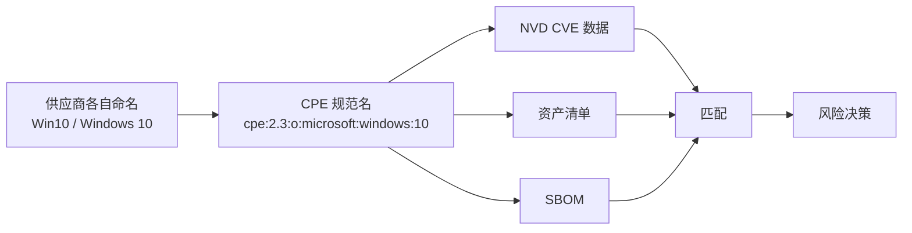

# 📋 什么是 CPE？

**通用平台枚举（CPE，Common Platform Enumeration）** 是一种用于标识 IT 产品——软件、硬件和操作系统——的结构化命名方案，由**美国国家标准与技术研究院（NIST）**维护，作为 *NVD*（国家漏洞数据库）项目的一部分发布。CPE 名称是一种规范的、与供应商无关的标识符，使一个系统能说出 "Apache 2.4.58"，而其他每个系统都能理解指的是同一个产品。

## 为什么需要 CPE

漏洞数据库、资产清单和 SBOM 各自用自己的措辞描述产品——"Microsoft Windows 10"、"Win10 x64"、"Microsoft Corporation Windows 10 Pro"。如果没有一个共同的键，把 CVE 与已安装的包关联起来就变成了一场模糊的字符串匹配练习。CPE 提供了这个键。



## 三种 part 类型

每个 CPE 都声明一个 `part`，用于划分产品类别：

| Part | 简称 | 含义     | 示例                             |
|------|------|----------|----------------------------------|
| `a`  | app  | 软件应用 | `cpe:2.3:a:google:chrome:120`    |
| `o`  | os   | 操作系统 | `cpe:2.3:o:microsoft:windows:10` |
| `h`  | hw   | 硬件设备 | `cpe:2.3:h:cisco:rv340`          |

## CPE 的用途

- **CVE 匹配** —— NVD 为每个 CVE 记录受影响的 CPE 列表；把你的清单与这些 CPE 匹配，就能判断是否暴露。
- **SBOM** —— CycloneDX 和 SPDX 组件可以携带 CPE，下游消费者据此交叉引用漏洞数据。
- **供应链安全** —— 扫描器在 CPE 与 Package URL（PURL）之间互转，桥接 NVD 世界与包管理器世界。

## cpe-skills 如何简化

手工处理 CPE 意味着解析两种语法（2.2 URI 与 2.3 格式化字符串）、处理特殊逻辑值、为比较而绑定名称——这些都还没开始匹配。`cpe-skills` 把这些封装为一个统一的 Go API：

```go
package main

import (
    "fmt"
    "github.com/scagogogo/cpe-skills"
)

func main() {
    // MustParse 同时接受 CPE 2.2 URI 和 2.3 格式化字符串
    cpe, err := cpeskills.ParseCpe23("cpe:2.3:a:apache:http_server:2.4.58:*:*:*:*:*:*:*")
    if err != nil {
        panic(err)
    }
    fmt.Println(cpe.Part.LongName, cpe.Vendor, cpe.ProductName, cpe.Version)
    // Output: Application apache http_server 2.4.58
}
```

`MustParse` 是便捷函数，遇到非法输入会 panic——适合测试和字面量。从解析出的 `CPE` 出发，可以构建用于匹配的 Well-Formed Name、转换为 PURL，或把名称挂到 SBOM 组件上。

## CPE 2.3 名称的结构

一个 2.3 格式化字符串有 13 个冒号分隔的字段。通常只前五个（part、vendor、product、version、update）被填充，其余默认为通配符 `*`（ANY）：

```
cpe:2.3:<part>:<vendor>:<product>:<version>:<update>:<edition>:<language>:<sw_edition>:<target_sw>:<target_hw>:<other>
```

2.2 URI 形式把同一批逻辑字段塞进更少的槽位；映射关系见 [CPE 2.2 与 2.3](./cpe-22-vs-23.md)。

## 谁维护 CPE

CPE 是 NIST 拥有的规范。官方字典——被接受的 CPE 名清单——由 NVD 与 CVE 数据一同发布。每条 CVE 记录都列出它所影响的 CPE 名，这正是 CPE 成为"我有什么"与"什么坏了"之间天然连接键的原因。

## 与各模块的关系

- [CPE](../api/modules/cpe.md) —— `CPE` 结构体、`MatchCPE`、`FormatURI`。
- [Parser 2.2](../api/modules/parser-2.2.md) / [Parser 2.3](../api/modules/parser-2.3.md) —— 两种官方语法。
- [WFN](../api/modules/wfn.md) —— 用于匹配的逻辑名表示。

## 小结

CPE 是漏洞管理中产品标识的通用语言。理解它的三种 part 类型、两种语法，以及它作为 NVD 与你资产清单之间连接键的角色，是 `cpe-skills` 所有其他功能的基础。
