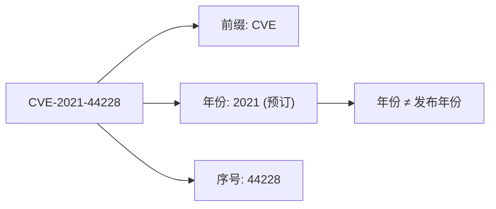
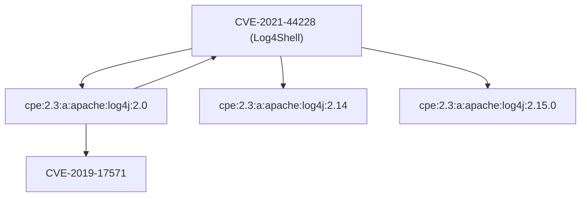
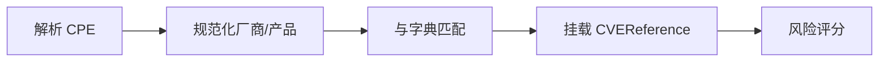

# 🐛 CVE 命名规范

**CVE**（Common Vulnerabilities and Exposures，通用漏洞与暴露）是为公开发布的网络安全漏洞分配的全局唯一标识符。CVE 是一种通用语言，让工具、数据库和安全人员能够无歧义地讨论*同一个*漏洞。本页讲解 CVE 命名规则、谁来分配 ID、CVE 与 CPE 的关系，以及 cpe-skills 如何在代码中建模一个 CVE。

## CVE-YYYY-NNNN 格式

每个 CVE ID 都遵循 `CVE-YYYY-NNNNNNN` 模式：

- `CVE` — 固定前缀。
- `YYYY` — CVE ID 被*预订*的年份（不一定是公开发布的年份）。
- `NNNNNNN` — 顺序编号，至少 4 位，可按需扩展（近年常用 5 位以上）。

例如 `CVE-2021-44228` 即著名的 Log4Shell 漏洞。年份 `2021` 表示 ID 预订年份；`44228` 只是当年的顺序计数。同一个标识符被 NVD、OSV、厂商和安全团队全球通用。



cpe-skills 用 [`ValidateCVE`](/zh/api/modules/cve) 校验该格式，`NewCVEReference` 则通过底层 `cve` 库对输入做规范化，接受已规范或略带瑕疵的输入：

```go
package main

import (
    "fmt"
    "github.com/scagogogo/cpe-skills"
)

func main() {
    // NewCVEReference 自动规范化 ID
    ref := cpeskills.NewCVEReference("CVE-2021-44228")
    fmt.Println(ref.CVEID) // CVE-2021-44228

    // Validate 检查标准格式
    fmt.Println(cpeskills.ValidateCVE("CVE-2021-44228")) // true
    fmt.Println(cpeskills.ValidateCVE("2021-44228"))     // false
}
```

## CNA — 谁来分配 CVE ID

CVE ID 并非由单一中央机构分配，而是通过 **CNA**（CVE Numbering Authority，CVE 编号机构）去中心化运作：

| 角色 | 示例 | 职责 |
|------|------|------|
| 顶级 Root | MITRE | 统筹项目，向各 CNA 分配编号区间 |
| Root CNA | CISA、GitHub | 向子 CNA 再分配区间 |
| CNA（厂商） | Apache、Microsoft、Google | 为自家产品分配 CVE |
| CNA-LR | 研究人员 | 为其研究的第三方产品分配 CVE |

由于同一漏洞可能被多方报告，*最先*预订 ID 的 CNA 胜出。这就是为何有时会同时看到厂商公告与 MITRE 记录针对同一问题——它们应引用同一个 CVE ID。

## CVE ↔ CPE 关系

CVE 回答的是*“漏洞是什么”*，CPE 回答的是*“受影响的产品是什么”*。一个 CVE 通常影响**多个** CPE（多个版本、版本族甚至多个产品），而一个 CPE 在其生命周期里也可能被**多个** CVE 影响。



这种多对多映射是漏洞扫描的骨架：给定产品（CPE）找出所有已知 CVE；给定 CVE 找出所有受影响产品（CPE）。

## cpe-skills 如何建模 CVE

[`CVEReference`](/zh/api/modules/cve) 结构体是本库对单个 CVE 的内存模型，承载你期望的元数据（描述、日期、CVSS 分数）以及受影响 CPE URI 列表：

```go
ref := cpeskills.NewCVEReference("CVE-2021-44228")
ref.Description = "Log4j远程代码执行漏洞"
ref.SetSeverity(10.0) // 同时设置 CVSSScore 与 Severity 字符串
ref.AddAffectedCPE("cpe:2.3:a:apache:log4j:2.0:*:*:*:*:*:*:*")
ref.AddAffectedCPE("cpe:2.3:a:apache:log4j:2.14:*:*:*:*:*:*:*")
ref.AddReference("https://logging.apache.org/log4j/2.x/security.html")
```

以下辅助函数对 `CVEReference` 切片操作：

| 函数 | 用途 |
|------|------|
| `QueryByCVE` | 返回某 CVE ID 影响的 CPE |
| `GetCVEInfo` | 按 ID 查询 `CVEReference` |
| `ExtractCVEsFromText` | 从自由文本中提取 CVE ID |
| `GroupCVEsByYear` | 按年份分桶 |
| `RemoveDuplicateCVEs` | 去重 |

## 与本项目的关系

cpe-skills 把 CVE 视为**一等公民**，连接 CPE 匹配与漏洞数据。下图展示 CVE 建模在流水线中的位置：



## 小结

- CVE ID 遵循 `CVE-YYYY-NNNNNNN`，年份为*预订*年份。
- CNA 去中心化网络分配 ID，故同一问题可能经多渠道浮现。
- 一个 CVE 映射多个 CPE，反之亦然——这种多对多关系驱动扫描器逻辑。
- 在 cpe-skills 中，`CVEReference` 配合 `ValidateCVE`、`QueryByCVE` 等辅助函数端到端建模该概念。完整 API 见 [cve 模块](/zh/api/modules/cve)。
