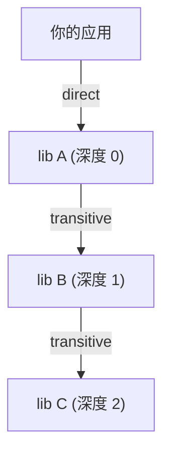
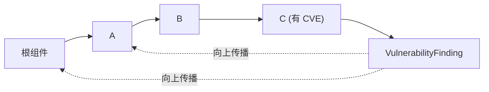
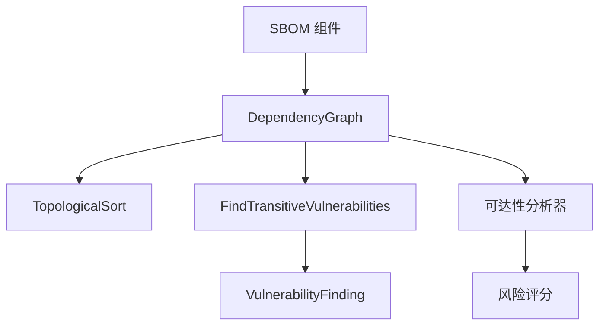

# 🕸️ 依赖图与传递依赖

现代软件不是一张扁平的包列表——它是一张图。你的应用依赖库 A，A 依赖 B，B 依赖 C。C 中的漏洞就是*你的*漏洞，哪怕你从未直接引用 C。cpe-skills 的 [`dependency-graph`](/zh/api/modules/dependency-graph) 包建模该结构，使你能计算传递依赖、遍历依赖路径并在链路上传播漏洞。

## 直接依赖 vs 传递依赖

| 术语 | 含义 | 深度 |
|------|------|------|
| 直接依赖 | 你在 manifest 中声明的 | 0 |
| 传递依赖 | 由直接依赖拉入的 | ≥ 1 |

`DependencyNode` 结构同时记录两者：一个 `Depth` 整数（直接为 0）和一个 `Direct` 布尔。`AddComponent` 把组件自身标记为直接（深度 0）、把每个声明依赖标记为传递（深度 1）；更深层级由 `ComputeDepths` 经 BFS 计算。



## 拓扑排序

依赖图是有向无环图（DAG），故存在**拓扑序**——一个线性序列，其中每个依赖都先于其依赖者出现。`TopologicalSort` 返回此序；若存在环则报错，因为环依赖对 SBOM 无效。

```go
graph := cpeskills.NewDependencyGraph()
graph.AddComponent(appComponent, []*cpeskills.SBOMComponent{libA})
// ...添加更多节点/边...
order, err := graph.TopologicalSort() // 构建/安装顺序
```

拓扑序使确定性构建成为可能：按此序处理依赖，就绝不会先构建依赖项的后置物。

## 传递漏洞传播

`FindTransitiveVulnerabilities` 是杀手锏：给定图与 `NVDCPEData` 快照，它遍历整张图并收集从任意节点可达的全部 `VulnerabilityFinding`——不只是直接的。这就是深层嵌套库里的 CVE 会浮现在你报告中的原因。



你也可以直接查询图结构：

| 方法 | 返回 |
|------|------|
| `GetDependencies(nodeID)` | 该节点依赖的节点 |
| `GetDependents(nodeID)` | 依赖该节点的节点 |
| `GetDependencyPath(from, to)` | 两节点间的路径 |
| `SubGraph(rootID)` | 以某节点为根的子图 |
| `GetDirectDependencies` / `GetTransitiveDependencies` | 过滤后的节点列表 |

## 为何可达性影响优先级

传递漏洞若你的代码从不触及脆弱代码路径，仍可能**不可达**。[`reachability`](/zh/api/modules/reachability) 分析器遍历图（用 `Depth` 作调用距离代理），将每个发现标注为 `direct`、`transitive`、`conditional`、`not_reachable` 或 `unknown`。`not_reachable` 的发现仍会报告，但风险评分器对其降权。故图一身二任：既传播漏洞，又调节其紧迫性。

## 与本项目的关系

依赖图是连接 SBOM 组件、漏洞数据与可达性的骨架：



## 小结

- 依赖图区分直接（深度 0）与传递（深度 ≥1）依赖。
- `TopologicalSort` 给出合法构建序并检测环。
- `FindTransitiveVulnerabilities` 把深层节点的 CVE 向上传播到你的组件。
- 同一张图也供给可达性分析器，这正是传递深度改变优先级的原因。完整 API 见 [dependency-graph](/zh/api/modules/dependency-graph) 与 [reachability](/zh/api/modules/reachability) 模块。
