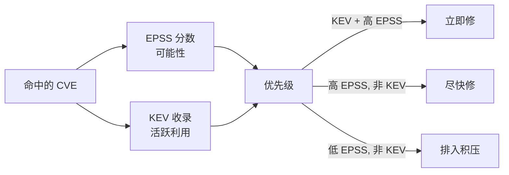

# ⚡ EPSS 与 CISA KEV

两个公开数据源把一份扁平的命中 CVE 清单变成*优先级排序*清单：**EPSS** 告诉你某漏洞被利用的概率，**CISA KEV** 告诉你它已经*正在*被利用。两者合起来回答每个防守者首先面临的问题："这么多 CVE 里，今晚先修哪个？"

## EPSS —— 漏洞利用预测评分系统

[EPSS](https://www.first.org/epss) 由 **FIRST.org** 运营。对每个已发布的 CVE 它产出：

- **EPSS 分数** —— 一个 `[0, 1]` 区间的概率，表示该漏洞未来 30 天内在野外被利用的概率。
- **百分位（Percentile）** —— 该分数在所有 CVE 中的相对位置，同样 `[0, 1]`。

EPSS `0.94`、百分位 `0.99` 的 CVE 几乎肯定会被攻击；EPSS `0.0005` 的在概率上属于噪声。EPSS 纯数据驱动（它对真实野外利用遥测建模），这使它远比单看 CVSS 严重性更适合分诊——CVSS 量度的是*若被利用的影响*，而非*被利用的可能性*。

## CISA KEV —— 已知被利用漏洞

[CISA KEV 目录](https://www.cisa.gov/kev) 是 CISA 已确认在野外被利用的漏洞的权威清单。每条记录携带：

- `cveID`、`vendorProject`、`product`
- `dateAdded`、`dueDate` —— 入目日期与联邦修复截止日
- `requiredAction` —— CISA 期望运营者采取的行动
- `knownRansomwareCampaignUse` —— 勒索软件团伙是否在用

KEV 列表上的漏洞不是理论风险，而是活跃威胁。联邦机构受 KEV 截止日约束，该列表在私营部门也被广泛用作必修基线。

## 为何两者对优先级排序关键



- **KEV + 高 EPSS** → 立即修；正在被武器化。
- **高 EPSS，非 KEV** → 尽快修；利用很可能迫在眉睫。
- **低 EPSS，非 KEV** → 可等；风险是理论的。

## 查询数据

```go
package main

import (
    "fmt"
    "github.com/scagogogo/cpe-skills"
)

func main() {
    epss := cpeskills.NewEPSSClient()
    entry, err := epss.GetScore("CVE-2021-44228")
    if err != nil { panic(err) }
    fmt.Printf("EPSS=%.4f percentile=%.4f\n", entry.EPSSScore, entry.Percentile)

    kev := cpeskills.NewKEVClient()
    listed, err := kev.IsListed("CVE-2021-44228")
    if err != nil { panic(err) }
    if listed {
        k, _ := kev.GetEntry("CVE-2021-44228")
        fmt.Println("due:", k.DueDate, "ransomware:", k.KnownRansomwareCampaignUse)
    }
}
```

`GetScores` 一次取多个 CVE 的 EPSS；`KEVClient.GetAll` 返回整个目录。两个客户端都缓存响应，并暴露 `EnrichVulnerabilityFindings` 把分数/KEV 状态直接盖到一份 finding 列表上，使匹配后的优先级排序成为一次调用。

## 从分数到风险权重

`EPSSScoreToRiskFactor` 把 EPSS 分数映射为数值风险乘数；`KEVSeverityBoost` 在 CVE 入选 KEV 时升级 CVSS 严重性字符串——在喂给复合风险评分时有用。

## 数据源

- **EPSS**：`https://api.first.org/data/v1/epss`（库的 `DefaultEPSSBaseURL`），FIRST.org 运营，每日更新。
- **KEV**：`https://www.cisa.gov/sites/default/files/feeds/known_exploited_vulnerabilities.json`（`DefaultKEVBaseURL`），CISA 发布，随新利用确认而更新。

## 与各模块的关系

- [EPSS](../api/modules/epss.md) —— `EPSSClient`、`EPSSEntry`、`GetScore`、`EPSSScoreToRiskFactor`。
- [KEV](../api/modules/kev.md) —— `KEVClient`、`KEVEntry`、`IsListed`、`GetEntry`、`KEVSeverityBoost`。

## 小结

EPSS 量化利用*可能性*；KEV 记录利用*现实性*。把两者叠加在命中的 CVE 清单之上，是漏洞管理中单一最有效的优先级排序动作，而两个公开数据源让任何人都可用。
