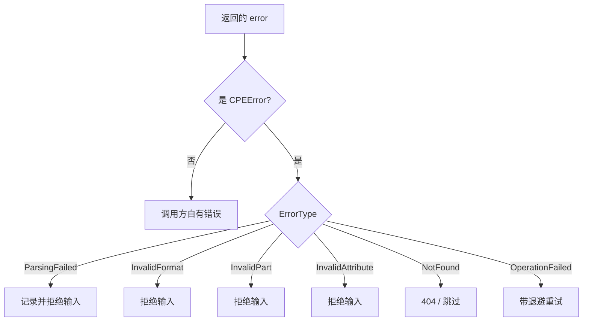

# 🚫 错误处理指南

`cpeskills` SDK 提供结构化的错误模型，调用方可按原因分支，而不必解析消息字符串。所有可能失败的操作都返回 `*CPEError`。

## CPEError 类型

`CPEError` 是整个 SDK 唯一的错误结构体，携带类型化的 `ErrorType`、人类可读消息、相关的 CPE 字符串（若适用），以及可选的被包装 `Err`。

```go
type CPEError struct {
    Type       ErrorType
    Message    string
    CPEString  string
    Err        error
}
```

它通过 `Error()` 实现 `error` 接口，并通过 `Unwrap()`（返回内部 `Err`）支持 `errors.Is` / `errors.As`。源码见 [/zh/api/modules/errors](/zh/api/modules/errors)。

## 六种 ErrorType

| 常量                           | 触发场景                          | 构造函数                    |
|--------------------------------|-----------------------------------|-----------------------------|
| `ErrorTypeParsingFailed`       | CPE 字符串解析失败                | `NewParsingError`           |
| `ErrorTypeInvalidFormat`       | 字符串非合法 CPE 格式             | `NewInvalidFormatError`     |
| `ErrorTypeInvalidPart`         | `part` 字段非 `a`/`o`/`h`         | `NewInvalidPartError`       |
| `ErrorTypeInvalidAttribute`    | 属性值非法                        | `NewInvalidAttributeError`  |
| `ErrorTypeNotFound`            | 请求的资源不存在                  | `NewNotFoundError`          |
| `ErrorTypeOperationFailed`     | 存储或网络操作失败（可重试）      | `NewOperationFailedError`   |

## 用 IsXxx 谓词判别错误

每种类型都有一个谓词，仅当错误是 `*CPEError` 且为该特定类型时返回 `true`。用 `switch` 分支最清晰。

```go
import "github.com/scagogogo/cpe-skills"

c, err := cpeskills.ParseCpe23(input)
if err != nil {
    switch {
    case cpeskills.IsInvalidFormatError(err):
        // 拒绝: 根本不是 CPE 字符串
    case cpeskills.IsInvalidPartError(err):
        // 拒绝: part 必须是 a/o/h
    case cpeskills.IsParsingError(err):
        // 可恢复: 可识别但格式错误
    case cpeskills.IsOperationFailedError(err):
        // 可重试的下游失败
    default:
        // 未知 — 记录并上抛
    }
}
```



## 在自有代码中构造错误

在更高层 API 中包装 SDK 行为时，用 `NewXxxError` 构造，使下游仍看到一致的 `*CPEError`。

```go
if err := storage.StoreCPE(c); err != nil {
    return cpeskills.NewOperationFailedError("store CPE", err)
}
if c == nil {
    return cpeskills.NewNotFoundError("CPE")
}
```

## 解包错误链

由于 `CPEError.Unwrap()` 返回 `Err`，可用 `errors.Unwrap` 获取根因，或用 `errors.Is` 检查哨兵错误。

```go
var opErr *cpeskills.CPEError
if errors.As(err, &opErr) {
    if errors.Is(opErr, sql.ErrConnDone) {
        // 被包装的根因是数据库连接关闭
    }
}
```

## 小结

把 `*CPEError` 与六种 `ErrorType` 当作 SDK 失败的契约。用 `IsParsingError` / `IsInvalidFormatError` / `IsInvalidPartError` / `IsInvalidAttributeError` / `IsNotFoundError` / `IsOperationFailedError` 分支，用对应的 `NewXxxError` 包装，用 `Unwrap` 遍历链。完整参考：[/zh/api/modules/errors](/zh/api/modules/errors)。
