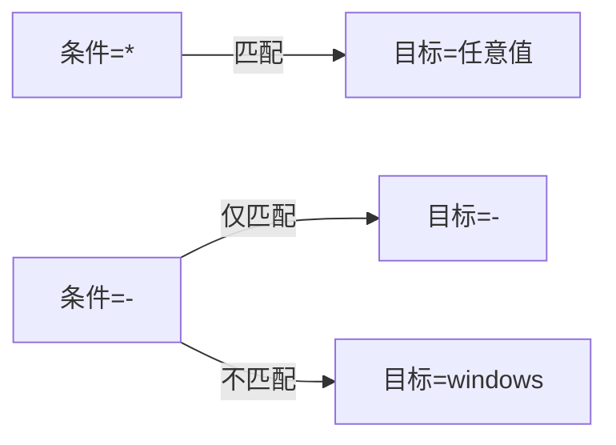

# ❓ 常见问题

关于 `cpeskills` Go SDK 的常见问题。每条都把具体现象与基于真实 API 的修复方案对应起来。

## Q1：CPE 字符串为何解析失败？

**A：** `Parse` 只识别以 `cpe:2.3:`（CPE 2.3 格式化字符串）或 `cpe:/`（CPE 2.2 URI）开头的字符串，其余一律返回 `unable to determine CPE format` 错误。尾部空格、缺少 `2.3` 段、多余的引号都会触发它。需要自动识别用 `Parse`，或直接调用 `ParseCpe23` / `ParseCpe22`。

```go
import "github.com/scagogogo/cpe-skills"

c, err := cpeskills.Parse("cpe:2.3:a:microsoft:windows:10:*:*:*:*:*:*:*")
if err != nil {
    if cpeskills.IsParsingError(err) || cpeskills.IsInvalidFormatError(err) {
        log.Printf("输入错误: %v", err)
    }
    return
}
fmt.Println(c.Vendor, c.ProductName, c.Version)
```

## Q2：ANY（`*`）和 NA（`-`）有什么区别？

**A：** `*` 表示"匹配任意值"——通配符。`-` 表示"不适用"——该属性没有有意义的值。匹配时，`*` 在任一侧即匹配任意值；但 `-` 只与另一个 `-` 匹配。详见 [/zh/api/modules/cpe](/zh/api/modules/cpe)。



## Q3：CPE 2.2 和 2.3 何时用哪个？

**A：** 新场景一律用 2.3——它有 11 个字段（新增 `sw_edition`、`target_sw`、`target_hw`、`other`），是 NVD 发布格式。2.2 仅用于消费遗留数据源。`FormatCpe22` 与 `FormatCpe23` 负责互转。

## Q4：`Match` 返回 `false`，怎么排查？

**A：** `Match` 按顺序短路于第一个不匹配的属性：`Part`、`Vendor`、`Product`、`Version`、`Update`、`Edition`、`Language`、`SoftwareEdition`、`TargetSoftware`、`TargetHardware`、`Other`。逐字段检查即可。注意 `Part` 必须**完全相等**（不支持通配）。可用 `MatchCPE` 并设 `options.IgnoreVersion = true` 忽略版本。

```go
ok, err := cpeskills.QuickMatch(
    "cpe:2.3:a:microsoft:windows:*:*:*:*:*:*:*:*",
    "cpe:2.3:a:microsoft:windows:10:*:*:*:*:*:*:*",
)
```

## Q5：NVD 下载慢或失败怎么办？

**A：** `DefaultNVDFeedOptions()` 默认缓存 24 小时于临时目录、并发限制为 3。把 `CacheDir` 指向持久路径、提高 `CacheMaxAge`、并传入带代理或更长超时的自定义 `HTTPClient` 即可。

```go
opts := cpeskills.DefaultNVDFeedOptions()
opts.CacheDir = "/var/cache/nvd-data"
opts.CacheMaxAge = 168 // 一周
opts.HTTPClient = &http.Client{Timeout: 120 * time.Second}
dict, err := cpeskills.DownloadAndParseCPEDict(opts)
```

## Q6：PURL 转换置信度低怎么办？

**A：** `CPEToPURL` 返回 `[0, 1]` 的置信度分数。偏低通常是因为厂商/产品对未能干净映射到某个包生态，或版本为 `*`/空（置信度乘以 0.8）。可经 `VendorNormalizer` 注册自定义别名，或用 `MapCPEToPURLWithEcosystem` 强制指定生态。

```go
purl, conf, err := cpeskills.CPEToPURL(c)
if conf < 0.7 {
    purl, err = cpeskills.MapCPEToPURLWithEcosystem(c, cpeskills.EcosystemNPM)
}
```

## Q7：`MustParse` 在生产环境 panic 了，该用吗？

**A：** 仅限编译期已知的字面量（包级变量）。对任何运行时输入都应用 `Parse` 并处理错误。

## Q8：如何跨重启持久化 CPE？

**A：** `NewFileStorage(baseDir, useCache)` 落盘存储；`NewMemoryStorage()` 纯内存。两者都实现 `Storage` 接口。

## 小结

绝大多数问题来自字符串格式错误、`*` 与 `-` 混淆、或 NVD 缓存未配置。用 `ValidateCPE` 校验、`NormalizeCPE` 规范化，并务必处理 [/zh/api/modules/errors](/zh/api/modules/errors) 提供的类型化错误。
