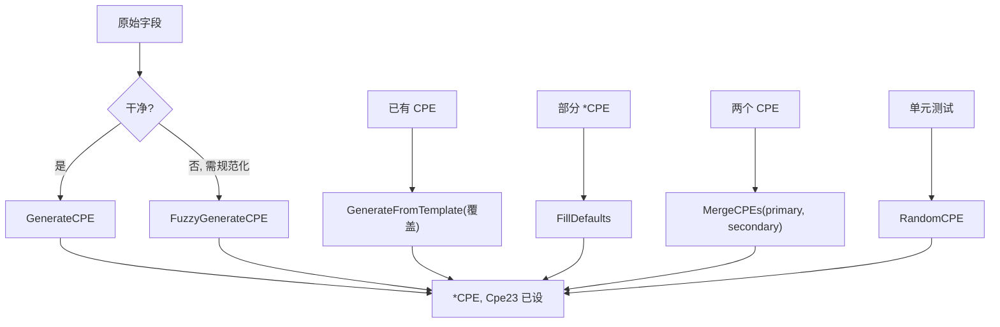

# ✨ CPE 生成示例集

有时你并没有 CPE 字符串——你手里是 SBOM 或包清单里的厂商、产品、版本，需要据此合成一个 CPE。[`generator`](/zh/api/modules/generator) 模块提供五个函数，从严苛的 `GenerateCPE` 到宽容的 `FuzzyGenerateCPE`。本页示范何时用哪个。

## GenerateCPE：严格四参

`GenerateCPE(part, vendor, product, version)` 构建一个 CPE，把其余字段全填 `*`（ANY）。它不做任何规范化——传什么就是什么。

```go
package main

import (
    "fmt"

    "github.com/scagogogo/cpe-skills"
)

func main() {
    cpe := cpeskills.GenerateCPE("a", "apache", "log4j", "2.14.0")
    fmt.Println(cpe.Cpe23)
    // cpe:2.3:a:apache:log4j:2.14.0:*:*:*:*:*:*:*
}
```

## GenerateFromTemplate：覆盖个别字段

当你有一个基础 CPE，想要一个只差一两个字段的新 CPE 时，把基础当模板、传一个覆盖 map：

```go
base := cpeskills.MustParse("cpe:2.3:a:apache:log4j:2.14.0:*:*:*:*:*:*:*")
patched := cpeskills.GenerateFromTemplate(base, map[string]string{
    cpeskills.AttrVersion: "2.17.1",
})
fmt.Println(patched.Cpe23)
// cpe:2.3:a:apache:log4j:2.17.1:*:*:*:*:*:*:*
```

map 的 key 是 WFN 属性常量（`AttrPart`、`AttrVendor`、`AttrProduct`、`AttrVersion` 等）。未设的属性继承自模板。

## FillDefaults：补齐空字段

`FillDefaults` 接收一个部分填充的 `*CPE`，把每个空字段填成 `*`，然后重新生成 `Cpe23` 字符串。它还会把空的 `Part` 默认成 `a`（应用）。

```go
c := &cpeskills.CPE{
    Vendor:      "google",
    ProductName: "chrome",
    Version:     "120.0.6099.109",
}
filled := cpeskills.FillDefaults(c)
fmt.Println(filled.Cpe23)
// cpe:2.3:a:google:chrome:120.0.6099.109:*:*:*:*:*:*:*
```

## MergeCPEs：合并两条记录

`MergeCPEs(primary, secondary)` 保留 `primary` 的所有非空字段，用 `secondary` 填补 `primary` 的空缺。当两个来源意见不一、你更信任其中一个时用它：

```go
// 版本信 SBOM，其余信公告
sbom := cpeskills.GenerateCPE("a", "", "log4j", "2.14.0")
adv := cpeskills.MustParse("cpe:2.3:a:apache:log4j:*:*:*:*:*:*:*:*")
merged := cpeskills.MergeCPEs(adv, sbom)
fmt.Println(merged.Cpe23)
// cpe:2.3:a:apache:log4j:2.14.0:*:*:*:*:*:*:*
```

这里 `primary`（公告）提供厂商和产品；`secondary`（SBOM）提供公告留作 `*` 的版本。

## FuzzyGenerateCPE：容忍脏输入

`FuzzyGenerateCPE` 对每个参数跑 `NormalizeComponent`——转小写、空格替成下划线、去掉后缀——让真实世界里脏乱的字符串也能产出合法 CPE：

```go
c := cpeskills.FuzzyGenerateCPE("Application", "Apache Software Foundation", "Log4j", "2.14.0")
fmt.Println(c.Cpe23)
// cpe:2.3:a:apache_software_foundation:log4j:2.14.0:*:*:*:*:*:*:*
```

对比 `GenerateCPE`，它会把 `Apache Software Foundation` 原样保留（从而产出带空格的非法 CPE）。

## RandomCPE：测试桩

`RandomCPE` 产出一个固定的桩 CPE，用于单元测试。它并非密码学意义上的随机——每次调用都返回同一组测试厂商/产品/版本。

```go
dummy := cpeskills.RandomCPE()
fmt.Println(dummy.Cpe23)
// cpe:2.3:a:test_vendor:test_product:1.0:*:*:*:*:*:*:*
```



## 小结

- `GenerateCPE` —— 严格四参，不规范化；输入已干净时用。
- `FuzzyGenerateCPE` —— 同形，但逐字段规范化；用于 SBOM/清单输入。
- `GenerateFromTemplate` —— 克隆基础 CPE 并覆盖少量 WFN 属性。
- `FillDefaults` —— 给部分 CPE 补 `*` 并重生成 `Cpe23`。
- `MergeCPEs` —— 合并两条记录，优先用 `primary` 的非空字段。
- `RandomCPE` —— 测试用的确定性桩，不是真随机。

完整 API 参考见 [`generator`](/zh/api/modules/generator) 模块页。
