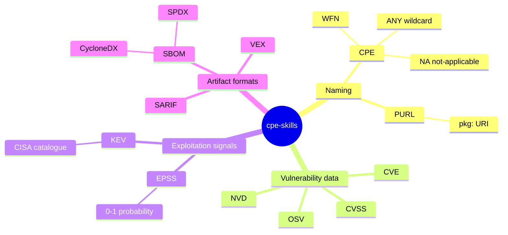

# 📖 术语表

`cpeskills` 文档及更广 CPE / 漏洞管理生态中使用的术语。

| 术语       | 全称                                               | 含义                                                                                          |
|------------|----------------------------------------------------|-----------------------------------------------------------------------------------------------|
| CPE        | Common Platform Enumeration                        | NIST 用于命名 IT 产品（软件、操作系统、硬件）的标准。见 [/zh/concepts/cpe-overview](/zh/concepts/cpe-overview)。 |
| WFN        | Well-Formed Name                                   | CPE 2.2/2.3 字符串所映射到的、基于属性的逻辑表示。见 [/zh/api/modules/wfn](/zh/api/modules/wfn)。 |
| CVE        | Common Vulnerabilities and Exposures               | 公开披露安全漏洞的唯一标识符，形如 `CVE-YYYY-NNNNN`。                                         |
| NVD        | National Vulnerability Database                    | NIST 维护的 CVE 及其受影响 CPE 数据库。见 [/zh/concepts/nvd](/zh/concepts/nvd)。               |
| OSV        | Open Source Vulnerabilities                        | 面向开源漏洞的开放、分布式数据库。见 [/zh/concepts/osv](/zh/concepts/osv)。                    |
| EPSS       | Exploit Prediction Scoring System                  | 某 CVE 在 30 天内被野外利用的概率，取值 0–1。                                                  |
| KEV        | Known Exploited Vulnerabilities                    | CISA 已知被积极利用的漏洞清单，附修复截止日期。                                                |
| SBOM       | Software Bill of Materials                         | 软件产品中组件的机读清单。                                                                     |
| VEX        | Vulnerability Exploitability eXchange              | 声明某产品是否受指定 CVE 影响的文档。见 [/zh/concepts/vex](/zh/concepts/vex)。                  |
| PURL       | Package URL                                        | 以 `pkg:` 标识包的 URI，按 type、namespace、name、version 定位。见 [/zh/concepts/purl](/zh/concepts/purl)。 |
| CycloneDX  | —                                                  | OWASP 的 SBOM 标准（JSON/XML）。`ParseCycloneDXJSON` 读取。                                   |
| SPDX       | Software Package Data Exchange                     | Linux 基金会的 SBOM 标准。`ParseSPDXJSON` 读取。                                              |
| SARIF      | Static Analysis Results Interchange Format         | 用于上报静态分析发现的 JSON 格式，众多扫描器采用。                                              |
| CVSS       | Common Vulnerability Scoring System                | 漏洞严重性评分框架（如 CVSS 3.1 基础分 0–10）。                                                |
| ANY        | —                                                  | CPE 通配符 `*`，比较时匹配任意值。                                                            |
| NA         | Not Applicable                                     | CPE 值 `-`，表示该属性无意义，仅与另一个 `-` 匹配。                                            |
| NISTIR     | NIST Interagency Report                             | NIST 技术报告系列；CPE 规范以 NISTIR 7695/7696 发布。                                          |

## 匹配术语

CPE 名称匹配（NISTIR 7696）定义了两个 CPE 名称之间的关系。这些术语贯穿匹配相关文档。

| 术语       | 含义                                                                      |
|------------|---------------------------------------------------------------------------|
| 超集       | 某 CPE 覆盖范围比另一个更广（`IsSupersetOf`）。                           |
| 子集       | 反之——某 CPE 被包含在另一个范围内（`IsSubsetOf`）。                       |
| 相等       | 两个 CPE 指向同一事物（`IsEqualTo`）。                                    |
| 不相交     | 两个 CPE 无任何重叠（`IsDisjointWith`）。                                 |
| ANY (`*`)  | 通配符——匹配对侧任意值。                                                  |
| NA (`-`)   | 不适用——仅与另一个 NA 匹配。                                              |

完整关系矩阵见 [/zh/concepts/matching-relations](/zh/concepts/matching-relations)。

## 属性字段速记

CPE 2.3 格式化字符串的 11 个字段，按顺序：

`cpe:2.3:<part>:<vendor>:<product>:<version>:<update>:<edition>:<language>:<sw_edition>:<target_sw>:<target_hw>:<other>`

| # | 字段          | WFN 属性              |
|---|---------------|-----------------------|
| 1 | part          | `part`                |
| 2 | vendor        | `vendor`              |
| 3 | product       | `product`             |
| 4 | version       | `version`             |
| 5 | update        | `update`              |
| 6 | edition       | `edition`             |
| 7 | language      | `language`            |
| 8 | sw_edition    | `sw_edition`          |
| 9 | target_sw     | `target_sw`           |
|10 | target_hw     | `target_hw`           |
|11 | other         | `target_hw`/`other`   |

## part 取值

| 短名 | 全称             | 含义       |
|------|------------------|------------|
| `a`  | application      | 软件应用   |
| `o`  | operating system | 操作系统   |
| `h`  | hardware         | 硬件设备   |

## 术语图谱

上述术语可归为四类。下面的思维导图展示它们的关系——命名、漏洞数据、利用信号、制品格式。

## 小结

术语含糊时回到本表。CPE 中需牢记的两个哨兵值是 `*`（ANY，通配）与 `-`（NA，不适用）；二者匹配语义不同，是初学者最常见的坑。
