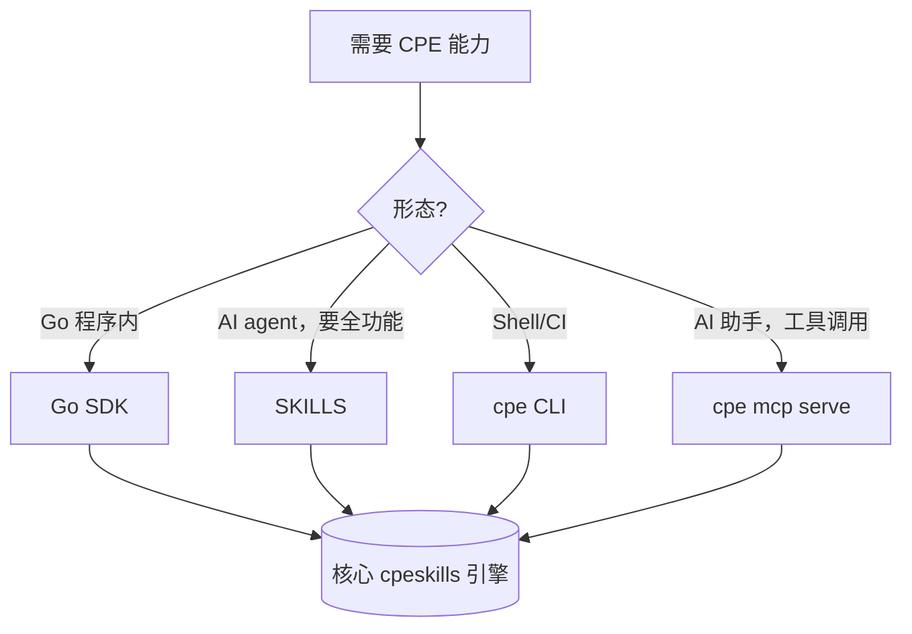

# 🔌 集成路径

`cpe-skills` 提供四条集成路径，暴露同一核心能力——解析、匹配、校验、转换——但在易用性与延迟上各有取舍。

## 一览对比

| 路径        | 入口                                            | 最适合                           | 有状态   | 延迟        |
|-------------|-------------------------------------------------|----------------------------------|----------|-------------|
| SKILLS      | `SKILLS.md` + SDK，嵌入 AI agent                | LLM 驱动的工作流                 | 是       | 受 agent 限制|
| Go SDK      | `import "github.com/scagogogo/cpe-skills"`      | Go 服务、CLI、流水线             | 是       | 进程内      |
| CLI         | `go install .../cmd/cpe@latest` → `cpe`         | 脚本、临时运维、CI 步骤          | 否       | 进程级      |
| MCP server  | `cpe mcp serve`（stdio）                        | AI 助手（Claude 等）             | 否       | IPC         |

## 何时用哪个

- **SKILLS** —— 你在构建一个会推理 CPE 的 agent，想把完整 SDK（存储、NVD、SBOM）作为技能面暴露给模型。
- **Go SDK** —— 你掌控一个 Go 二进制，需要最大控制力、内存缓存、零 IPC 开销。
- **CLI** —— 你在 shell 脚本或 CI 作业里要一行命令搞定，自己不写 Go 代码。
- **MCP server** —— 你希望 AI 助手通过 Model Context Protocol 调用 CPE 工具，免去粘合代码。



## 各入口

### Go SDK

```go
import "github.com/scagogogo/cpe-skills"

c, err := cpeskills.Parse("cpe:2.3:a:microsoft:windows:10:*:*:*:*:*:*:*")
ok := c.Match(cpeskills.MustParse("cpe:2.3:a:microsoft:windows:*:*:*:*:*:*:*:*"))
```

### CLI

```bash
cpe parse "cpe:2.3:a:microsoft:windows:10:*:*:*:*:*:*:*"
cpe match "cpe:2.3:a:microsoft:windows:*" "cpe:2.3:a:microsoft:windows:10"
cpe search "cpe:2.3:a:microsoft:windows:*"
cpe dict parse official-cpe-dictionary.xml
```

### MCP server

```bash
cpe mcp serve   # stdio 传输；由支持 MCP 的客户端连接
```

服务器暴露 `parse_cpe`、`format_cpe`、`match_cpe`、`validate_cpe`、`generate_cpe`、`compare_versions` 工具。见 [/zh/cli/mcp](/zh/cli/mcp)。

### SKILLS

`SKILLS.md` 清单向 agent 运行时描述 SDK 能力。agent 加载清单、决定调用哪个 SDK 函数、直接调用——没有额外的 HTTP 或 IPC 层。

## 按需求选择

| 需求                             | 推荐路径     |
|-----------------------------------|--------------|
| 每夜批量漏洞扫描                  | Go SDK 或 CLI|
| Go 服务中的实时 API               | Go SDK       |
| 在聊天助手里补充 CVE 上下文        | MCP server   |
| 端到端构建 SBOM 的 agent          | SKILLS       |
| 临时查"这个 CPE 合不合法"         | CLI          |

## 小结

按形态选：进程内强控用 Go SDK，shell 脚本用 CLI，AI 助手用 MCP，agent 内嵌全 SDK 工作流用 SKILLS。四者背后是同一核心引擎，行为与匹配语义在各路径完全一致。
