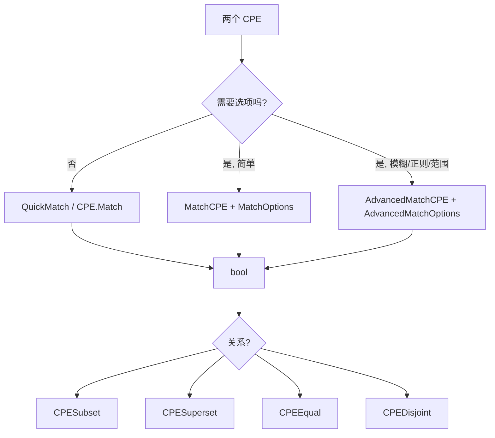

# 🎯 CPE 匹配示例集

匹配回答一个问题：这个 CPE 模式是否覆盖那个 CPE 目标？cpe-skills 提供三档由弱到强的接口——`QuickMatch`、`MatchCPE`、`AdvancedMatchCPE`——外加 [`matching`](/zh/api/modules/matching) 模块里基于集合的关系判定助手。本页逐一示范。

## 用 `QuickMatch` 做精确匹配

`QuickMatch` 接收两个原始字符串，分别解析后返回是否匹配。这是最简的入口——不需要结构体，不需要选项。

```go
package main

import (
    "fmt"
    "log"

    "github.com/scagogogo/cpe-skills"
)

func main() {
    a := "cpe:2.3:a:apache:log4j:2.14.0:*:*:*:*:*:*:*"
    b := "cpe:2.3:a:apache:log4j:2.14.0:*:*:*:*:*:*:*"
    ok, err := cpeskills.QuickMatch(a, b)
    if err != nil {
        log.Fatal(err)
    }
    fmt.Println("精确匹配:", ok) // true
}
```

## ANY 通配

CPE 匹配中，任一方为 `*`（ANY）即视为匹配。`version=*` 的模式覆盖该产品的所有版本：

```go
pattern := "cpe:2.3:a:apache:log4j:*:*:*:*:*:*:*:*"
target := "cpe:2.3:a:apache:log4j:2.14.0:*:*:*:*:*:*:*"
matched, _ := cpeskills.QuickMatch(pattern, target)
fmt.Println("any 版本模式覆盖 2.14.0:", matched) // true

// 产品不同时，即便版本都通配也不匹配
other := "cpe:2.3:a:apache:tomcat:9.0.0:*:*:*:*:*:*:*"
matched, _ = cpeskills.QuickMatch(pattern, other)
fmt.Println("log4j 模式覆盖 tomcat:", matched) // false
```

## subset 与 superset

[`matching`](/zh/api/modules/matching) 模块的关系函数按 NISTIR 7696 分类两个 CPE 之间的关系：

```go
pat, _ := cpeskills.Parse("cpe:2.3:a:microsoft:windows:*:*:*:*:*:*:*:*")
win10, _ := cpeskills.Parse("cpe:2.3:a:microsoft:windows:10:*:*:*:*:*:*:*")

fmt.Println("模式是 win10 的超集:", cpeskills.CPESuperset(pat, win10)) // true
fmt.Println("win10 是模式的子集:", cpeskills.CPESubset(win10, pat))     // true
fmt.Println("相等:", cpeskills.CPEEqual(pat, pat))                      // true
fmt.Println("与 linux 不相交:", cpeskills.CPEDisjoint(win10,
    cpeskills.MustParse("cpe:2.3:o:linux:linux_kernel:5.15:*:*:*:*:*:*:*"))) // true
```

也可以用方法形式：`pat.IsSupersetOf(win10)`。

## 带 `MatchOptions` 的 `MatchCPE`

`MatchCPE` 增加了一个选项结构体，例如只关心厂商+产品时可忽略版本。`MatchOptions` 类型定义在 [`matching`](/zh/api/modules/matching) 模块。

```go
criteria, _ := cpeskills.Parse("cpe:2.3:a:microsoft:windows:*:*:*:*:*:*:*:*")
xp, _ := cpeskills.Parse("cpe:2.3:a:microsoft:windows:xp:*:*:*:*:*:*:*")

// 严格：版本必须匹配 → windows:* 与 windows:xp 不同
fmt.Println(cpeskills.MatchCPE(criteria, xp, &cpeskills.MatchOptions{})) // false

// 忽略版本 → 匹配
opts := &cpeskills.MatchOptions{IgnoreVersion: true}
fmt.Println(cpeskills.MatchCPE(criteria, xp, opts)) // true
```

## 批量匹配

当条件多、目标也多时，先建一个 [`CPEIndex`](/zh/api/modules/cpe-index)，让 `BatchMatchCPEs` 复用它（[`batch`](/zh/api/modules/batch) 模块）：

```go
targets := cpeskills.StringsToCPEs([]string{
    "cpe:2.3:a:apache:log4j:2.14.0:*:*:*:*:*:*:*",
    "cpe:2.3:a:apache:log4j:2.15.0:*:*:*:*:*:*:*",
    "cpe:2.3:a:apache:tomcat:9.0.0:*:*:*:*:*:*:*",
})
criteria := cpeskills.StringsToCPEs([]string{
    "cpe:2.3:a:apache:log4j:*:*:*:*:*:*:*:*", // 所有 log4j
    "cpe:2.3:a:apache:tomcat:*:*:*:*:*:*:*:*", // 所有 tomcat
})
results := cpeskills.BatchMatchCPEs(criteria, targets)
for _, r := range results {
    fmt.Printf("%s 匹配 %d 个\n", r.Criteria.ProductName, r.Count)
}
```

## 高级模糊匹配

`AdvancedMatchCPE`（来自 [`advanced-matching`](/zh/api/modules/advanced-matching) 模块）支持正则、忽略大小写、版本范围和相似度阈值：

```go
crit, _ := cpeskills.Parse("cpe:2.3:a:apache:log4j:*:*:*:*:*:*:*:*")
opts := cpeskills.NewAdvancedMatchOptions()
opts.MatchMode = "exact"
opts.IgnoreCase = true
opts.VersionCompareMode = "range"
opts.VersionLower = "2.0.0"
opts.VersionUpper = "2.17.0"

target, _ := cpeskills.Parse("cpe:2.3:a:apache:log4j:2.14.0:*:*:*:*:*:*:*")
fmt.Println("高级匹配:", cpeskills.AdvancedMatchCPE(crit, target, opts)) // true
```



## 小结

- `QuickMatch` —— 两个字符串进，一个 bool 出，适合一次性判断。
- `MatchCPE` —— 用 `MatchOptions{IgnoreVersion:true,...}` 做只看厂商/产品的逻辑。
- `AdvancedMatchCPE` —— 正则、忽略大小写、版本范围、相似度评分。
- `CPESubset`/`CPESuperset`/`CPEEqual`/`CPEDisjoint` —— NISTIR 7696 关系判定。
- `BatchMatchCPEs` —— 通过索引扩展到成千上万的条件/目标。

完整 API 参考见 [`matching`](/zh/api/modules/matching)、[`advanced-matching`](/zh/api/modules/advanced-matching) 和 [`batch`](/zh/api/modules/batch) 模块页。
