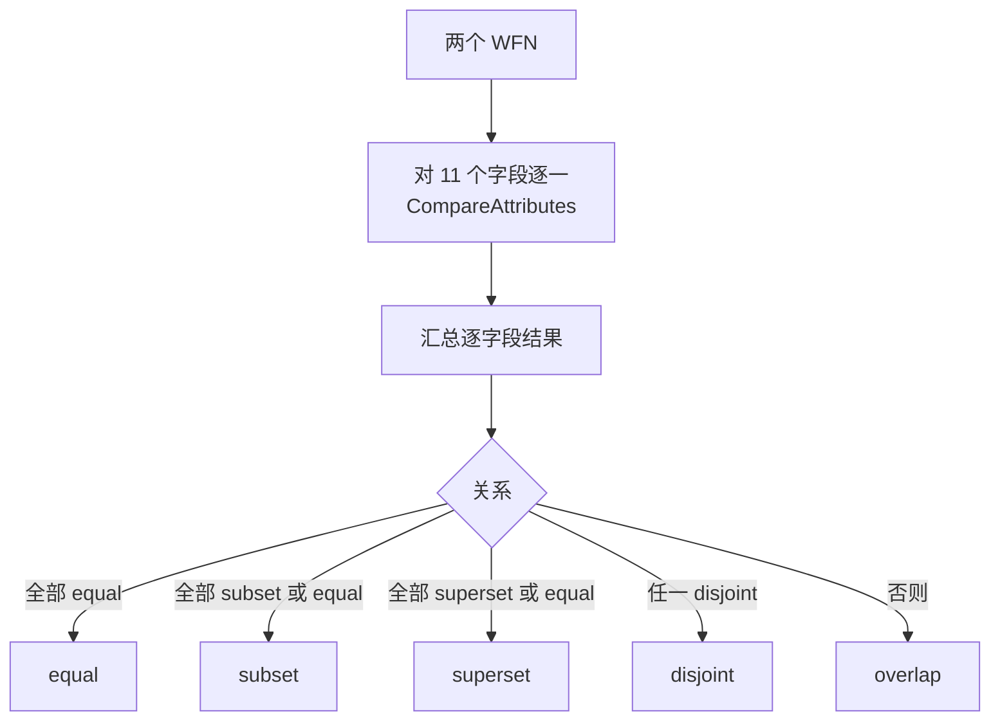

# 🎯 CPE 匹配关系

CPE 匹配不是布尔"相等与否"。按 **NISTIR 7696**，两个 Well-Formed Name 之间的关系是若干*关系*之一——equal、subset、superset、disjoint 或 overlap——由逐属性比较得出。`cpe-skills` 直接实现了这套关系逻辑。

## 五种关系

| 关系       | 含义                                                 |
|------------|------------------------------------------------------|
| `equal`    | 两个 WFN 每个属性都完全匹配                          |
| `subset`   | source 更具体；target 的 ANY 覆盖它                  |
| `superset` | source 更一般（更多 ANY）；它覆盖 target             |
| `disjoint` | 无重叠——至少一个属性冲突                             |
| `overlap`  | 混合；不能干净地归入上述任一                         |

在漏洞扫描意义上，`subset` 或 `superset` 仍是*匹配*：如果 CVE 列出的是一个宽泛 CPE（带 ANY），而你的清单是具体的，则宽结名是你那个的超集，漏洞适用。

## 逐属性比较

`CompareAttributes(source, target)` 返回一个 `int`，描述单个属性的关系：

| 返回值 | 含义     | 示例（source → target）           |
|--------|----------|-----------------------------------|
| `1`    | superset | source `*`（ANY），target `2.4`   |
| `0`    | equal    | 两者都 `2.4.58`，或都 `*`         |
| `-1`   | subset   | source `2.4`，target `*`          |
| `-2`   | disjoint | source `2.4`，target `2.5`        |

`ANY` 通配符是 superset/subset 得以成立的关键：`*` 匹配一切，所以 ANY 的 source 是任何具体 target 的超集，而 ANY 的 target 使任何具体 source 成为子集。



## 聚合关系

`CompareWFNs` 对所有属性运行 `CompareAttributes`，返回逐属性映射；`CompareWFNRelation` 把该映射归约为单个 `Relation`。归约规则：

- 若**任一**属性 disjoint（`-2`），整体关系为 `disjoint`。
- 否则，若每个属性都 equal（`0`），关系为 `equal`。
- 若每个属性都是 subset 或 equal，关系为 `subset`。
- 若每个属性都是 superset 或 equal，关系为 `superset`。
- 否则为 `overlap`。

## 便捷谓词

对于常见的"这俩匹配吗"问题，`cpe-skills` 暴露了四个包装关系的谓词：

```go
package main

import (
    "fmt"
    "github.com/scagogogo/cpe-skills"
)

func main() {
    broad, _ := cpeskills.ParseCpe23("cpe:2.3:a:apache:http_server:*:*:*:*:*:*:*:*")
    specific, _ := cpeskills.ParseCpe23("cpe:2.3:a:apache:http_server:2.4.58:*:*:*:*:*:*:*")

    fmt.Println(cpeskills.CPEEqual(broad, specific))    // false
    fmt.Println(cpeskills.CPESuperset(broad, specific)) // true  — broad 覆盖 specific
    fmt.Println(cpeskills.CPESubset(specific, broad))   // true
    fmt.Println(cpeskills.CPEDisjoint(broad, specific)) // false
}
```

`CPEEqual`、`CPESubset`、`CPESuperset`、`CPEDisjoint` 各自通过比较底层 WFN 返回一个 bool。

## ANY 通配符的实践含义

因为 `ANY` 是 superset/subset 的来源，实践规则是：**ANY 字段越多的 CPE 越宽泛**。CVE 条目通常列出宽结名（版本为 ANY）以便匹配所有受影响版本；你的清单携带具体版本。匹配器正确地报告 CVE 名是你组件的超集。

## 与各模块的关系

- [Matching](../api/modules/matching.md) —— `CompareAttributes`、`CompareWFNs`、`CompareWFNRelation`、四个谓词。
- [Advanced Matching](../api/modules/advanced-matching.md) —— 带扩展选项的 `AdvancedMatchCPE`。

## 小结

CPE 匹配是一种关系，而非相等。四种有意义的结局——equal、subset、superset、disjoint——源于比较 WFN 属性，其中 `ANY` 作为通配符使 subset/superset 成为可能。日常检查用谓词函数，需要知道两个名*如何*关联时用关系函数。
