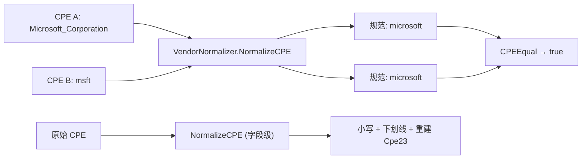

# 🧹 CPE 规范化示例集

来自不同订阅源的 CPE 字符串很少在大小写、分隔符或厂商拼写上一致。存储或匹配前先规范化，否则会漏掉真实漏洞。cpe-skills 提供两层：[`validation`](/zh/api/modules/validation) 模块的字段级规范化，以及 [`vendor-normalization`](/zh/api/modules/vendor-normalization) 模块的厂商/产品别名解析。

## NormalizeCPE：字段级清洗

`NormalizeCPE` 把每个字段转小写、空格替成下划线，并重新生成 `Cpe23`。原对象不会被修改——返回的是新的 `*CPE`。

```go
package main

import (
    "fmt"

    "github.com/scagogogo/cpe-skills"
)

func main() {
    raw := &cpeskills.CPE{
        Part:        *cpeskills.PartApplication,
        Vendor:      "Microsoft",
        ProductName: "Windows 10",
        Version:     "10.0.19041",
    }
    n := cpeskills.NormalizeCPE(raw)
    fmt.Println(n.Vendor)      // microsoft
    fmt.Println(n.ProductName) // windows_10
    fmt.Println(n.Cpe23)       // cpe:2.3:a:microsoft:windows_10:10.0.19041:*:*:*:*:*:*:*
}
```

如果只想清洗单个字符串，底层助手是 `NormalizeComponent`。

## 包级厂商规范化器

`NormalizeVendorName` 和 `NormalizeProductName` 是对包级全局 `VendorNormalizer`（`GlobalVendorNormalizer`）的便捷封装，后者预装了主流厂商的别名表：

```go
fmt.Println(cpeskills.NormalizeVendorName("Microsoft Corporation")) // microsoft
fmt.Println(cpeskills.NormalizeVendorName("msft"))                  // microsoft
fmt.Println(cpeskills.NormalizeProductName("microsoft", "Windows 10")) // windows_10
```

`NormalizeCPEVendorProduct` 同时规范化整个 CPE 的厂商和产品，并重建 `Cpe23`。

## VendorNormalizer：注册自定义别名

`NewVendorNormalizer()` 返回一个独立的规范化器，自带内置别名表。`RegisterVendorAlias` 把任意数量的别名映射到一个规范名；`RegisterProductAlias` 对产品做同样的事。

```go
n := cpeskills.NewVendorNormalizer()
n.RegisterVendorAlias("mycompany", "my_company", "my company", "my-company", "MyCompany Inc.")
n.RegisterProductAlias("mycompany", "myapp", "my_app", "my-app")

fmt.Println(n.NormalizeVendor("MyCompany Inc."))        // mycompany
fmt.Println(n.NormalizeProduct("mycompany", "my-app"))  // myapp
fmt.Println(n.HasVendor("my-company"))                  // true
fmt.Println(n.VendorCount())                            // 内置 + 你的别名
```

所有比较都忽略大小写和分隔符，所以 `Microsoft Corp` 与 `microsoft_corp` 归约到同一个 key。

## AreSameVendor：不规范化直接比较

`AreSameVendor` 和 `AreSameProduct` 回答"这两个是否指同一实体？"，不必先显式规范化两边：

```go
n := cpeskills.NewVendorNormalizer()
fmt.Println(n.AreSameVendor("microsoft_corporation", "msft"))         // true
fmt.Println(n.AreSameProduct("microsoft", "windows_10", "windows"))   // true
fmt.Println(n.AreSameVendor("oracle", "google"))                      // false
```

## 在 VendorNormalizer 上规范化整个 CPE

`(n *VendorNormalizer).NormalizeCPE` 克隆 CPE、把厂商和产品规范化为规范形、重建 `Cpe23`——这是匹配或存储前该做的一步：

```go
raw := cpeskills.MustParse("cpe:2.3:a:Microsoft_Corporation:Windows_10:10:*:*:*:*:*:*:*")
n := cpeskills.NewVendorNormalizer()
clean := n.NormalizeCPE(raw)
fmt.Println(clean.Vendor)      // microsoft
fmt.Println(clean.ProductName) // windows_10
fmt.Println(clean.Cpe23)       // cpe:2.3:a:microsoft:windows_10:10:*:*:*:*:*:*:*
```

## 匹配前先规范化

[`matching`](/zh/api/modules/matching) 模块按字面比较属性；一边写 `apache`、另一边写 `apache_software_foundation` 时，`CPESubset` 会返回 `Disjoint`，从而静默丢掉一个真实漏洞。先把两边规范化到同一规范 key：

```go
a := cpeskills.MustParse("cpe:2.3:a:apache:log4j:2.14.0:*:*:*:*:*:*:*")
b := cpeskills.MustParse("cpe:2.3:a:apache_software_foundation:log4j:2.14.0:*:*:*:*:*:*:*")
n := cpeskills.NewVendorNormalizer()
na, nb := n.NormalizeCPE(a), n.NormalizeCPE(b)
fmt.Println(cpeskills.CPEEqual(na, nb)) // true
```



## 小结

- `NormalizeCPE`（validation）—— 字段级：转小写、下划线、重建 `Cpe23`。不改原对象。
- `NormalizeVendorName` / `NormalizeProductName` / `NormalizeCPEVendorProduct` —— 基于 `GlobalVendorNormalizer` 的包级便捷函数。
- `NewVendorNormalizer()` —— 独立规范化器；用 `RegisterVendorAlias` / `RegisterProductAlias` 扩展。
- `AreSameVendor` / `AreSameProduct` —— 不必显式规范化即可比较。
- 匹配或存储前务必规范化，免得拼写漂移破坏关系判定。

完整 API 参考见 [`validation`](/zh/api/modules/validation) 和 [`vendor-normalization`](/zh/api/modules/vendor-normalization) 模块页。
