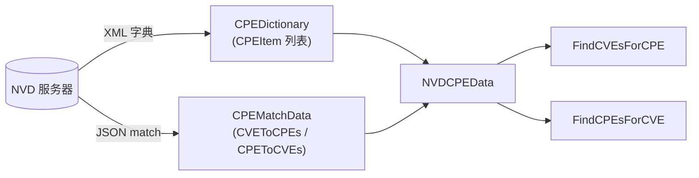
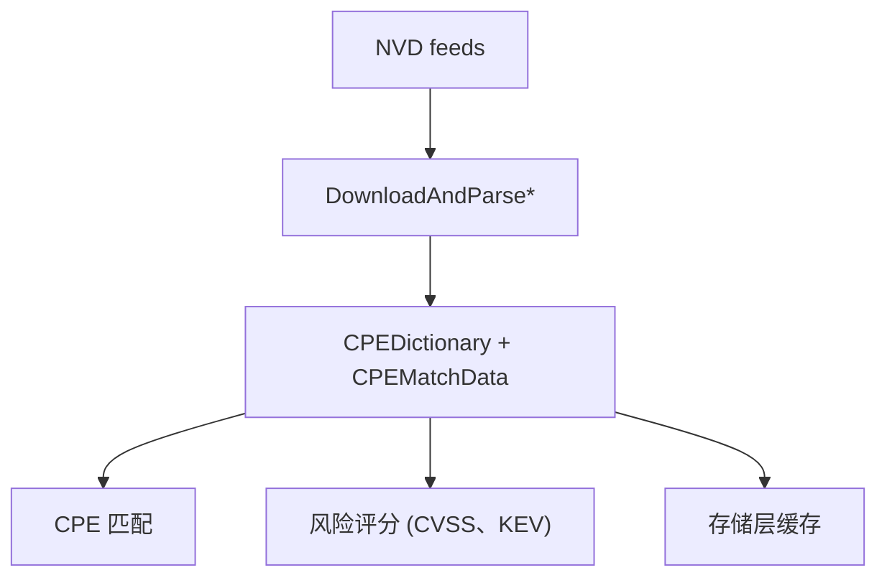

# 🏛️ NVD (National vulnerability Database)

**NVD** 是美国政府基于标准的漏洞管理数据仓库，由 NIST 运营。对 CPE 生态而言，它是最重要的数据源：托管**官方 CPE 字典**、**CPE Match** 订阅（CVE↔CPE 映射）以及丰富的漏洞元数据（CVSS、参考链接、日期）。cpe-skills 用一组下载-解析函数封装了这三者。

## NVD 提供什么

| Feed | 内容 | cpe-skills 入口 |
|------|------|-----------------|
| CPE 字典 | 所有正式注册的 CPE 条目，含标题与参考链接 | `DownloadAndParseCPEDict` |
| CPE Match | CVE↔CPE 双向映射（`CVEToCPEs`、`CPEToCVEs`） | `DownloadAndParseCPEMatch` |
| 合并 | 字典 + match 数据 + 下载时间戳，一个结构 | `DownloadAllNVDData` |

合并结构 `NVDCPEData` 是大多数用户想要的——它携带 `CPEDictionary` 指针、`CPEMatchData` 指针和 `DownloadTime`，并暴露最常用的两个查询：

```go
data, err := cpeskills.DownloadAllNVDData(cpeskills.DefaultNVDFeedOptions())
if err != nil {
    log.Fatal(err)
}
// 某 CPE 受哪些 CVE 影响？
cves := data.FindCVEsForCPE(cpe)
// 某 CVE 影响哪些 CPE？
cpes := data.FindCPEsForCVE("CVE-2021-44228")
```

## Feed 格式

NVD 以 XML 发布 CPE 数据。cpe-skills 将该 XML 解析为 [`CPEDictionary`](/zh/api/modules/dictionary) 结构，其中存放 `CPEItem` 条目——每个条目把一个 `CPE` 与人类可读标题及 `Reference` 链接配对。Match feed 以 JSON 消费，归约为上文两份 `map[string][]string` 查找表。



## 下载与本地化

NVD feed 体积大（光字典就数十 MB）。每次运行都重新下载既浪费又易触发限流。`NVDFeedOptions` 控制缓存与并发：

| 字段 | 默认值 | 作用 |
|------|--------|------|
| `CacheDir` | 系统临时目录 + `cpe-cache` | 跨运行保留解析后的 feed |
| `CacheMaxAge` | 24 小时 | 过期前复用缓存 |
| `MaxConcurrentDownloads` | 3 | 避免猛击 NVD |
| `HTTPClient` | 60 秒超时 | 设置代理或自定义传输 |
| `ShowProgress` | true | 长时间下载时显示进度 |

从 `DefaultNVDFeedOptions()` 起步，只改你需要的字段：

```go
opts := cpeskills.DefaultNVDFeedOptions()
opts.CacheDir = "/var/cache/nvd-data" // 持久化到稳定位置
opts.CacheMaxAge = 12                 // 每天刷新两次
dict, err := cpeskills.DownloadAndParseCPEDict(opts)
```

由于解析结果是普通内存结构，你可以通过存储层进一步*本地化*——例如用 [`FileStorage.StoreDictionary`](/zh/api/modules/file-storage) 把字典序列化为磁盘 JSON，后续进程即可瞬间重载而无需访问 NVD。

## 查询字典

拿到 `CPEDictionary` 后，可直接在其上查询，无需回访 NVD：

```go
// 按标题字符串查找条目
item := dict.FindItemByName("Apache Log4j 2.0")

// 在给定选项下找出所有匹配某 CPE 的字典条目
items := dict.FindItemsByCriteria(criteriaCPE, matchOpts)
```

这正是离线扫描的基础：下载一次，多次查询。

## 与本项目的关系

NVD 是 cpe-skills 依赖的上游事实来源。下图展示新 feed 在库中的流向：



## 小结

- NVD 提供权威 CPE 字典、CVE↔CPE match feed 及漏洞元数据。
- `DownloadAllNVDData` 是一步到位的入口；`NVDFeedOptions` 控制缓存与并发。
- `NVDCPEData.FindCVEsForCPE` / `FindCPEsForCVE` 是最常用的两个查询。
- 通过 [storage](/zh/api/modules/storage) 层持久化解析后的 feed 以实现完全离线。完整 API 见 [nvd](/zh/api/modules/nvd) 与 [dictionary](/zh/api/modules/dictionary) 模块。
