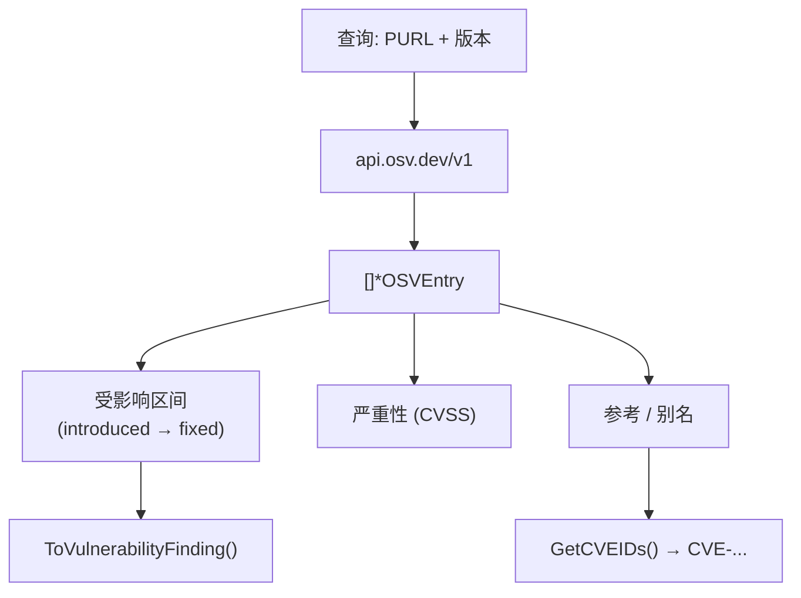
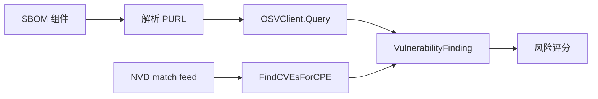

# 🌐 OSV (Open Source Vulnerabilities)

**OSV** 是 Google 维护的分布式漏洞数据库与 API，源自 [Open Source Vulnerability 格式](https://ossf.github.io/osv-schema/)。NVD 侧重以 CVE 为中心、以 CPE 为键的数据，而 OSV 是 **PURL 驱动**（Package URL）的，将众多独立的生态数据库（PyPI、npm、crates.io、Go、Rust 等）聚合成一个可查询的 API。对开源依赖扫描而言，OSV 往往比 NVD 更及时。

## 为何 OSV 与 NVD 互补

| 维度 | NVD | OSV |
|------|-----|-----|
| 主键 | CVE ID + CPE | Package URL / 生态+名称+版本 |
| 覆盖 | 精选、CVE 强制 | 合并多个生态专属库 |
| 时效 | 人工策展较慢 | 上游 OSS 修复往往更快 |
| 修复信息 | 间接 | 一等公民的 `introduced`/`fixed` 区间 |
| 非 CVE | 否 | 是（如 `PYSEC-`、`GHSA-`、`RUSTSEC-`） |

两者**互补**：NVD 给你以 CPE 为中心的视图，OSV 给你以包为中心的视图。cpe-skills 同时暴露两者，便于交叉引用。

## PURL 驱动查询

每次 OSV 查询都以包身份为锚点。cpe-skills 的 [`OSVClient`](/zh/api/modules/osv) 可按 `PackageURL`、按生态+名称+版本或按 commit 哈希查询：

```go
client := cpeskills.NewOSVClient()

// 按 Package URL 查询（SBOM 驱动扫描的首选）
purl, _ := cpeskills.ParsePURL("pkg:golang/github.com/apache/log4j@2.14")
entries, err := client.Query(purl)

// 或按生态坐标查询
entries, err = client.QueryByEcosystem("Go", "github.com/apache/log4j", "2.14")
```

由于 OSV 结果可能携带也可能不携带 CVE ID，`OSVEntry` 暴露辅助方法桥接回 CVE 世界：

| 方法 | 返回 |
|------|------|
| `GetCVEIDs` | 与本条目关联的 CVE ID（可能为空） |
| `HasCVE` | 是否附带任何 CVE |
| `GetFixedVersion` | 修复该 bug 的版本 |
| `GetIntroducedVersion` | 受影响区间起点 |
| `GetMaxCVSSScore` | 跨所有严重性记录的最佳 CVSS |
| `GetSeverityLevel` | 规范化的严重性字符串 |

## OSV 数据模型

`OSVEntry` 描述 OSV 中记录的一个漏洞。其受影响区间是相对 NVD 扁平 CVE 列表的关键优势——它告诉你*确切*哪些版本受影响、修复落在何处。



`ToVulnerabilityFinding()` 方法把 OSV 条目转换为 cpe-skills 内部的 `VulnerabilityFinding`，使 OSV 数据能流入与 NVD 数据相同的风险评分流水线。

## 批量查询与限流

扫描真实 SBOM 意味着查询成百上千个包。`QueryOSVBatch`（或客户端的 `QueryBatch`）在一次请求中提交多个 PURL，`OSVClient` 强制请求间最小间隔（`minRequestInterval: 100ms`）以对公共 API 保持礼貌：

```go
purls := []*cpeskills.PackageURL{p1, p2, p3}
results, err := cpeskills.QueryOSVBatch(purls)
for purl, entries := range results {
    fmt.Printf("%s: %d 个漏洞\n", purl, len(entries))
}
```

对于需要镜像或自定义超时的环境，`NewOSVClientWithOptions(baseURL, timeout, retryCount)` 允许指向替代端点。

## 与本项目的关系

OSV 与 NVD 并列作为第二漏洞源，通过通用的 `VulnerabilityFinding` 类型统一：



## 小结

- OSV 是 PURL 驱动、生态感知的漏洞数据库，与以 CPE 为中心的 NVD 互补。
- `OSVClient` 可按 PURL、生态+名称+版本或 commit 查询；批量查询让 SBOM 级扫描保持高效。
- `OSVEntry` 暴露修复区间（`GetFixedVersion`/`GetIntroducedVersion`），并通过 `GetCVEIDs` 桥接到 CVE。
- `ToVulnerabilityFinding()` 将 OSV 数据与 NVD 数据统一以供下游评分。完整 API 见 [osv 模块](/zh/api/modules/osv)。
