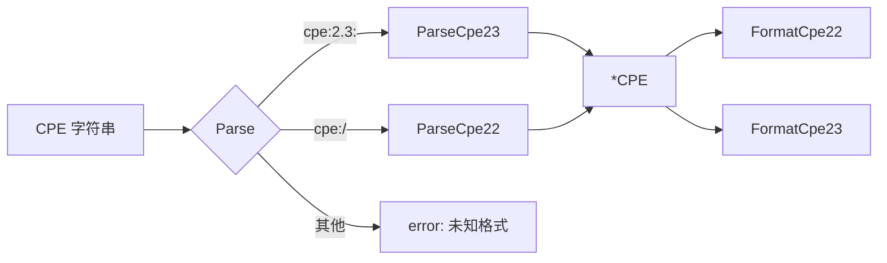

# 📝 CPE 解析示例集

解析是几乎所有 cpe-skills 流程的入口：你从 NVD 订阅源、SBOM 或安全公告里拿到一个 CPE 字符串，把它转成 `*CPE` 结构体，才能去匹配、存储和规范化。本页汇集了来自 [`parser-2.2`](/zh/api/modules/parser-2.2)、[`parser-2.3`](/zh/api/modules/parser-2.3) 和 [`convenience`](/zh/api/modules/convenience) 模块的真实解析示例。

## 用 `Parse` 解析任意格式

`Parse` 按前缀（`cpe:2.3:` 或 `cpe:/`）自动判别 2.3 与 2.2 并分发到对应解析器，因此对于来源不可信的输入，它是最安全的默认选择。

```go
package main

import (
    "fmt"
    "log"

    "github.com/scagogogo/cpe-skills"
)

func main() {
    // 2.3 格式（13 个冒号分隔字段）
    win, err := cpeskills.Parse("cpe:2.3:a:microsoft:windows:10:*:*:*:*:*:*:*")
    if err != nil {
        log.Fatal(err)
    }
    fmt.Printf("part=%s vendor=%s product=%s version=%s\n",
        win.Part.ShortName, win.Vendor, win.ProductName, win.Version)

    // 2.2 旧式 URI 格式
    tomcat, err := cpeskills.Parse("cpe:/a:apache:tomcat:8.5.0")
    if err != nil {
        log.Fatal(err)
    }
    fmt.Printf("vendor=%s product=%s version=%s\n",
        tomcat.Vendor, tomcat.ProductName, tomcat.Version)
}
```

## 十个真实字符串

下表列出在真实 NVD/CVE 记录里出现的字符串，每个都能用 `Parse` 或 `ParseCpe23` 顺利解析。

| # | CPE 字符串 | Part | 说明 |
|---|-----------|------|------|
| 1 | `cpe:2.3:a:microsoft:windows:10:*:*:*:*:*:*:*` | a | 桌面系统作为应用 |
| 2 | `cpe:2.3:o:linux:linux_kernel:5.15.0:*:*:*:*:*:*:*` | o | 操作系统 |
| 3 | `cpe:2.3:h:intel:core_i7:10700k:*:*:*:*:*:*:*` | h | 硬件设备 |
| 4 | `cpe:2.3:a:apache:log4j:2.14.0:*:*:*:*:*:*:*` | a | Log4Shell 那个版本 |
| 5 | `cpe:2.3:a:google:chrome:120.0.6099.109:*:*:*:*:*:*:*` | a | 带很多点的长版本号 |
| 6 | `cpe:2.3:o:redhat:enterprise_linux:8.2:*:*:*:*:*:*:*` | o | 名称里带下划线 |
| 7 | `cpe:2.3:a:oracle:java_se:17.0.1:*:*:*:*:*:*:*` | a | JDK 属于应用 |
| 8 | `cpe:2.3:a:openssh:openssh:8.4:p1:*:*:*:*:*:*` | a | 带有 `update` 字段（`p1`） |
| 9 | `cpe:2.3:*:*:*:*:*:*:*:*:*:*` | * | 全字段通配（ANY） |
| 10 | `cpe:2.3:a:adobe:acrobat_reader:2021.001.20150:*:*:*:*:*:*:*` | a | Acrobat Reader DC |

```go
samples := []string{
    "cpe:2.3:a:microsoft:windows:10:*:*:*:*:*:*:*",
    "cpe:2.3:o:linux:linux_kernel:5.15.0:*:*:*:*:*:*:*",
    "cpe:2.3:h:intel:core_i7:10700k:*:*:*:*:*:*:*",
    "cpe:2.3:a:apache:log4j:2.14.0:*:*:*:*:*:*:*",
    "cpe:2.3:a:google:chrome:120.0.6099.109:*:*:*:*:*:*:*",
    "cpe:2.3:o:redhat:enterprise_linux:8.2:*:*:*:*:*:*:*",
    "cpe:2.3:a:oracle:java_se:17.0.1:*:*:*:*:*:*:*",
    "cpe:2.3:a:openssh:openssh:8.4:p1:*:*:*:*:*:*",
    "cpe:2.3:*:*:*:*:*:*:*:*:*:*",
    "cpe:2.3:a:adobe:acrobat_reader:2021.001.20150:*:*:*:*:*:*:*",
}
for _, s := range samples {
    c, err := cpeskills.Parse(s)
    if err != nil {
        fmt.Printf("失败 %s: %v\n", s, err)
        continue
    }
    fmt.Printf("OK   part=%s vendor=%s product=%s\n",
        c.Part.ShortName, c.Vendor, c.ProductName)
}
```

## 2.2 与 2.3 互转

`ParseCpe22` 返回的 `*CPE` 已经填充了 `Cpe23` 字段，因此可以直接把旧式 URI 转成现代格式。反向转换则用 `FormatCpe22`：

```go
// 2.2（旧式）→ 2.3
c, _ := cpeskills.ParseCpe22("cpe:/a:mysql:mysql:5.7.12:::~~~enterprise~~")
fmt.Println(c.Cpe23)
// cpe:2.3:a:mysql:mysql:5.7.12:*:*:*:enterprise:*:*

// 2.3 → 2.2
c2, _ := cpeskills.ParseCpe23("cpe:2.3:a:apache:tomcat:8.5.0:*:*:*:*:*:*:*")
fmt.Println(cpeskills.FormatCpe22(c2))
// cpe:/a:apache:tomcat:8.5.0

// FormatCPE 按你给的版本输出
s, _ := cpeskills.FormatCPE(c2, "2.2") // → 2.2 字符串
s, _ = cpeskills.FormatCPE(c2, "2.3")  // → 2.3 字符串
```

## 用 `MustParse` 做静态初始化

当 CPE 是编译期常量时，`MustParse` 在字符串畸形时直接 panic，让 bug 暴露在启动阶段。`ParseOr` 是宽容版本——出错时返回兜底值而非报错：

```go
var defaultWin = cpeskills.MustParse("cpe:2.3:a:microsoft:windows:10:*:*:*:*:*:*:*")
fallback := cpeskills.MustParse("cpe:2.3:*:*:*:*:*:*:*:*:*:*")
c := cpeskills.ParseOr(untrustedInput, fallback) // 永不报错
```

## 错误输入处理

`Parse` 返回来自 [`errors`](/zh/api/modules/errors) 模块的类型化错误。前缀或字段数不对时触发格式错误；part 不是 `a`/`h`/`o`/`*` 时触发 part 错误。

```go
bad := []string{
    "not a cpe",                                   // 根本不是 CPE
    "cpe:2.3:a:microsoft:windows:10",              // 字段太少（需要 13 个）
    "cpe:2.3:z:microsoft:windows:10:*:*:*:*:*:*:*", // part 'z' 非法
}
for _, s := range bad {
    _, err := cpeskills.Parse(s)
    if err != nil {
        fmt.Printf("拒绝 %q: %v\n", s, err)
    }
}
```

两个助手 `IsCPE23String` / `IsCPE22String` 做廉价的前缀检查。`CPEsToStrings` / `StringsToCPEs` 在字符串切片与 `[]*CPE` 间互转（后者静默丢弃无法解析的项）。



## 小结

- 来源版本不可控时优先用 `Parse`，它能自动判别 2.2/2.3。已知格式且需严格校验时直接用 `ParseCpe22`/`ParseCpe23`。
- 包级 `var` 里用 `MustParse`；坏字符串需降级用 `ParseOr`；格式互转用 `FormatCpe22`/`FormatCpe23`/`FormatCPE`。
完整 API 参考见 [`parser-2.2`](/zh/api/modules/parser-2.2)、[`parser-2.3`](/zh/api/modules/parser-2.3) 和 [`convenience`](/zh/api/modules/convenience) 模块页。
