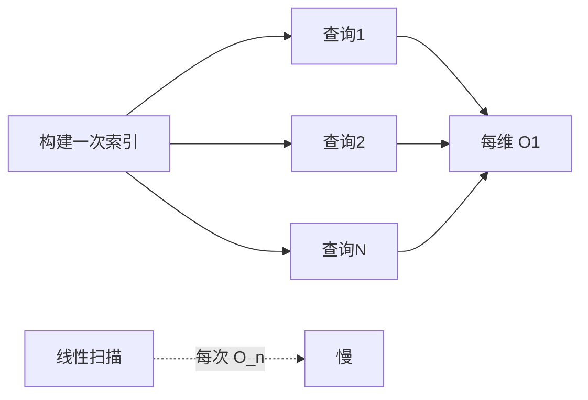

# ⚡ 性能考量

随着 CPE 语料与扫描量增长，如何让 `cpeskills` 保持快。

## CPEIndex 查找 vs 线性扫描

最大的性能杠杆。`CPEIndex` 按厂商、产品、part 构建查找映射，`Lookup` 每维近似 `O(1)`。在循环里对切片逐个 `Match` 是每次 `O(n)`，上千条就开始明显拖慢。

```go
idx := cpeskills.NewCPEIndex(cpes)        // 构建一次
hits := idx.Lookup(criteria)              // 快速、可重复
_ = idx.LookupByPURL(purl)               // 同样走索引
```



## BatchScanner 并发

`BatchScanner` 以 `concurrency` 参数指定大小的 worker 池扫描 `SBOMComponent` 切片。取 CPU 与数据源限速二者中较慢者即可。每个 worker 调用 `scanComponent`，并发超过数据源数量后收益递减。

```go
bs := cpeskills.NewBatchScanner(idx, 8)
bs.SetDataSources(sources)
results, err := bs.Scan(components)
```

纯内存 CPE 匹配（无漏洞数据）可用 `BatchMatchCPEs`，一次性返回结果矩阵。

## MemoryStorage vs FileStorage

| 后端          | 构造                                | 速度   | 持久化 | 适用场景                            |
|---------------|-------------------------------------|--------|--------|-------------------------------------|
| `MemoryStorage`| `NewMemoryStorage()`               | 最快   | 无     | 短生命周期任务、单测、缓存          |
| `FileStorage` | `NewFileStorage(dir, useCache)`     | 受磁盘限制 | 是  | 长运行服务、缓存                    |

`FileStorage` 设 `useCache=true` 时在磁盘存储之上保留内存热层，读快且写能跨重启。

## NVD 数据本地化

NVD 数据源数百 MB 且有限速。`DefaultNVDFeedOptions()` 下载一次后缓存 24 小时于临时目录。生产环境建议：

```go
opts := cpeskills.DefaultNVDFeedOptions()
opts.CacheDir = "/var/cache/nvd"   // 跨重启持久
opts.CacheMaxAge = 168             // 一周
opts.MaxConcurrentDownloads = 3    // 保持礼貌
```

`DownloadAllNVDData` 一次拉取字典、匹配数据与 CVE 数据源，之后 `FindCVEsForCPE` 在内存结果上离线查询，零网络开销。

## 缓存策略

- **EPSS / KEV** —— 两个客户端都有内存缓存。`EnrichVulnerabilityFindings` 批量调用，每批只一次往返，而非逐条。
- **StorageManager** —— 用 `MemoryStorage`（缓存）包 `FileStorage`（主存），经 `SetCache` 装配；写时用 `InvalidateCache` 淘汰。
- **CPEIndex** —— 进程生命周期内保留一个实例；`Add` / `Remove` 增量变更。

## 用 CPESet 做重复集合运算

对同一语料反复做过滤、并集、交集时，`CPESet` 内部维护映射，使 `Contains`、`Intersection`、`Union` 在常见情况下低于线性。构建一次后即可链式操作。

```go
set := cpeskills.NewCPESet("assets", "生产清单")
for _, c := range cpes {
    set.Add(c)
}
subset := set.Filter(criteria, cpeskills.DefaultMatchOptions())
```

## 避免在热路径里重复解析

`Parse` 便宜但并非零成本。若某字符串被读取上千次，解析一次后存 `*CPE` 复用。`CPEsToStrings` / `StringsToCPEs` 助你在边界批量转换。

```go
// 构建一次
cpes := cpeskills.StringsToCPEs(rawStrs)
// 热路径复用 —— 不再重复解析
idx := cpeskills.NewCPEIndex(cpes)
```

## 小结

为重复查找建索引、把 `BatchScanner` 并发限到瓶颈、临时用 `MemoryStorage`/持久用 `FileStorage`、并设较长 `CacheMaxAge` 本地化 NVD。综合起来，即使规模很大，SDK 也能把每次查询控制在毫秒级。
