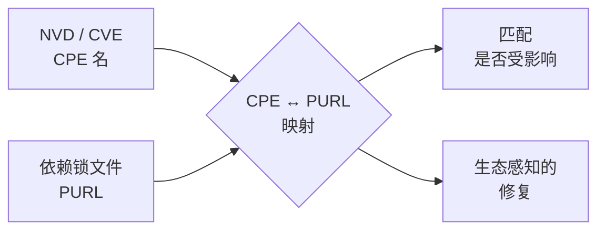

# 📦 Package URL (PURL)

**Package URL（PURL）** 是一种紧凑的、生态原生的软件包标识符，由 [package-url 项目](https://github.com/package-url) 规范。CPE 围绕供应商与产品名为 NVD 世界设计，而 PURL 围绕包在各自包管理器中的实际寻址方式设计。一个 PURL 长这样：

```
pkg:golang/github.com/scagogogo/cpe-skills@v0.5.0
pkg:npm/%40angular/core@17.0.0
pkg:maven/org.apache.logging.log4j/log4j-core@2.17.1
pkg:pypi/django@4.2
```

## PURL 的结构

```
pkg:<type>/<namespace>/<name>@<version>?<qualifiers>#<subpath>
```

| 段         | 必需 | 示例                              |
|------------|------|-----------------------------------|
| `type`     | 是   | `golang`、`npm`、`maven`、`pypi`  |
| `namespace`| 否   | `github.com/scagogogo`、`@angular`|
| `name`     | 是   | `cpe-skills`、`core`              |
| `version`  | 否   | `v0.5.0`、`17.0.0`                |
| `qualifiers`| 否  | `?arch=amd64&os=linux`            |
| `subpath`  | 否   | `#internal/sub`                   |

## CPE 与 PURL —— 不同但互补

| 方面            | CPE                              | PURL                                  |
|-----------------|----------------------------------|---------------------------------------|
| 起源            | NIST / NVD                       | 开源的 package-url 规范               |
| 单元            | 供应商 + 产品 + 版本             | 生态系统 + 命名空间 + 名称 + 版本     |
| 生态感知        | 否（仅供应商字符串）             | 是（`type` 是一等公民）               |
| 主要用途        | NVD 中的 CVE 匹配                | 依赖 / SBOM 标识                      |
| 通配符          | 有（`ANY`/`NA`）                 | 无                                    |

两者互补：**NVD 说 CPE，包管理器和现代 SBOM 说 PURL。** 要把一个 CVE（CPE 列出）与一个锁定的依赖（PURL 寻址）关联，必须在两者之间互转。



## 为什么互转重要

映射不是一一对应——同一个 CPE 可对应多个 PURL，取决于包生态（同一个库可能既作为 Maven artifact 又作为 npm 包发布），而 PURL 的 vendor 不总与 CPE 供应商字符串匹配。`cpe-skills` 启发式地完成转换，并随结果返回一个**置信度分数**，让调用方决定是否信任自动匹配。

## 在 CPE 与 PURL 之间转换

```go
package main

import (
    "fmt"
    "github.com/scagogogo/cpe-skills"
)

func main() {
    cpe, _ := cpeskills.ParseCpe23("cpe:2.3:a:log4j:log4j:2.17.1:*:*:*:*:*:*:*")

    // CPE -> PURL（返回置信度分数 0..1）
    purl, conf, err := cpeskills.CPEToPURL(cpe)
    if err != nil { panic(err) }
    fmt.Println(purl.String(), conf)

    // PURL -> CPE（也返回置信度分数）
    parsed, _ := cpeskills.ParsePURL("pkg:maven/org.apache.logging.log4j/log4j-core@2.17.1")
    back, conf2, err := cpeskills.PURLToCPE(parsed)
    if err != nil { panic(err) }
    fmt.Println(back.Cpe23, conf2)
}
```

已知目标生态时，`MapCPEToPURLWithEcosystem` 通过用生态选择正确的 `type` 与 `namespace` 布局，产出更准确的 PURL。批量助手 `BatchCPEToPURL` 和 `BatchPURLToCPE` 一次调用处理整个清单。

## 生态感知

库内置一组受支持的生态——`npm`、`maven`、`pypi`、`golang`——通过 `Ecosystem` 类型和 `ListEcosystems()` 暴露。`EcosystemFromPURLType` 把 PURL `type` 字符串映射到内部 `Ecosystem`，`CPEPartToEcosystemHint` 从 CPE part 给出最佳猜测生态。这种生态知识让 CPE↔PURL 映射能选择合理的默认值。

## 与各模块的关系

- [PURL](../api/modules/purl.md) —— `PackageURL` 结构体、`ParsePURL`、`NewPURL`。
- [CPE-PURL Mapping](../api/modules/cpe-purl-mapping.md) —— `CPEToPURL`、`PURLToCPE`、批量与生态变体。
- [Ecosystem](../api/modules/ecosystem.md) —— `Ecosystem` 类型、`ListEcosystems`、映射助手。

## 小结

PURL 是 CPE 的生态原生对应物。因为 NVD 和 SBOM 工具各偏爱其一，两者之间能互转——并附带诚实的置信度分数——正是端到端漏洞关联得以实现的关键。
