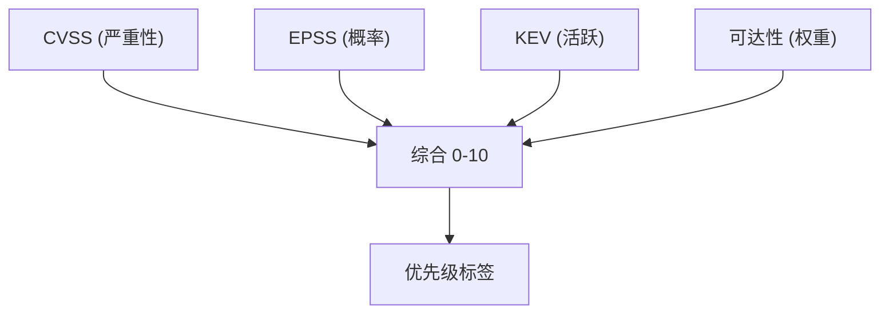
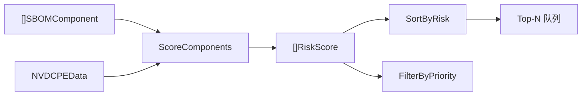
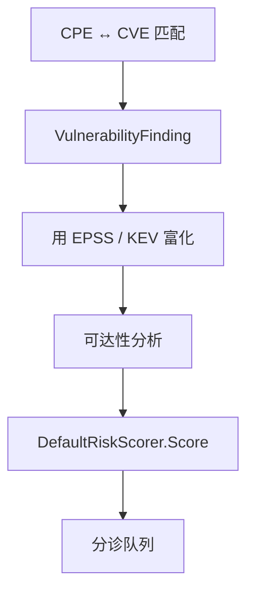

# 📊 漏洞风险评分

并非每个漏洞都值得同等关注。一个位于不可达传递依赖里、CVSS 9.0 的 bug，远不如一个你直接调用且已有公开利用的 CVSS 7.0 bug 紧急。cpe-skills 的风险评分包将**三个正交信号**——CVSS、EPSS、KEV——加上**可达性**，融合为一个 0–10 分数和五档优先级标签。

## 三个信号

| 信号 | 它回答的问题 | 来源 | 范围 |
|------|--------------|------|------|
| CVSS | *理论上有多严重？* | NVD / CVE 记录 | 0.0–10.0 |
| EPSS | *野外被利用的概率？* | [EPSS](/zh/api/modules/epss) | 0.0–1.0 |
| KEV | *是否已知被主动利用？* | CISA KEV 目录 | 布尔 |

三者度量不同事物，因此组合优于单一。CVSS 度量*严重性*，EPSS 度量*概率*，KEV 度量*已确认的活跃度*。



## 可达性加权

位于你从不调用的依赖里的漏洞就是噪声。[`reachability`](/zh/api/modules/reachability) 包将每个发现分为五级之一：`direct`、`transitive`、`conditional`、`not_reachable`、`unknown`。`DefaultRiskScorer` 把它折入最终分数——`direct` 发现全额计入，`transitive` 发现计较少少，不可达的则降权。这就是为何可达性*改变优先级*，而非仅作装饰。

## DefaultRiskScorer 模型

[`DefaultRiskScorer`](/zh/api/modules/risk-scoring) 暴露可调权重，产出携带各贡献因子的 `RiskScore`：

```go
scorer := cpeskills.NewDefaultRiskScorer()
// 默认权重：CVSS 0.5、EPSS 0.2、KEV 0.2、Reachability 0.1
score := scorer.Score(findings, component)

fmt.Println(score.OverallScore) // 0-10
fmt.Println(score.CVSSMax)      // 发现中的最高 CVSS
fmt.Println(score.EPSSScore)    // 0.0-1.0
fmt.Println(score.KEVListed)    // 若任一发现属 KEV 则为 true
fmt.Println(score.Priority)     // critical / high / medium / low / none
```

`Factors` 映射记录每个信号的单独贡献，便于解释组件*为何*得此分。

## 优先级分层

`determinePriority` 将数值分数（及 KEV 标志）映射为 [`RiskPriority`](/zh/api/modules/risk-scoring) 字符串。KEV 收录可在原始分数之外提升等级，因为主动利用优先于理论严重性：

| 优先级 | 含义 |
|--------|------|
| `critical` | 立即修复——高分和/或 KEV 收录 |
| `high` | 强分，尽快排期 |
| `medium` | 值得关注但不紧急 |
| `low` | 轻微，择机修复 |
| `none` | 无发现 |

## 大规模排序与过滤

对整个 SBOM，`ScoreComponents` 在 `NVDCPEData` 快照上为每个组件评分，辅助函数帮你排优先队列：

```go
scores := cpeskills.ScoreComponents(components, nvdData)
cpeskills.SortByRisk(scores)                                  // 分数从高到低
criticalOnly := cpeskills.FilterByPriority(scores, cpeskills.RiskPriorityCritical)
```



## 与本项目的关系

风险评分是点睛之笔，把原始 CVE/CPE 匹配转化为*已排优先级*的修复清单：



## 小结

- CVSS、EPSS、KEV 回答三个不同问题（严重性、概率、活跃度）——应组合而非依赖单一。
- 可达性对不可达发现降权，故改变的是优先级而非仅是分数显示。
- `DefaultRiskScorer` 是默认加权模型；`Score`、`ScoreComponents`、`SortByRisk`、`FilterByPriority` 覆盖常见工作流。
- 优先级为 `critical`/`high`/`medium`/`low`/`none`。完整 API 见 [risk-scoring](/zh/api/modules/risk-scoring) 与 [reachability](/zh/api/modules/reachability) 模块。
