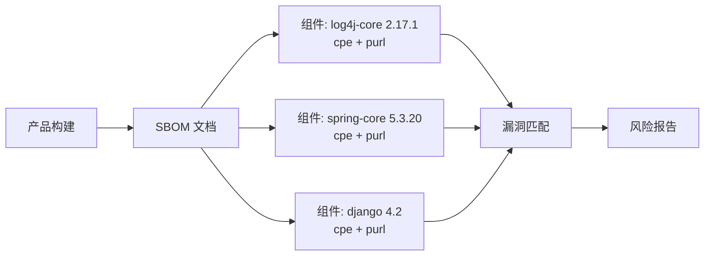

# 🗂️ SBOM 标准

**软件物料清单（SBOM，Software Bill of Materials）** 是一份组成软件产品的组件正式清单，包括传递依赖、版本和标识符。有两种规范占据主流：**CycloneDX**（OWASP）和 **SPDX**（Linux Foundation）。两者都能为每个组件携带 CPE 和 PURL 标识符，这正是让 SBOM 可用于漏洞匹配的原因。

## SBOM 为何存在

无法防御你看不见的东西。现代软件由数百个第三方包组装而成；当一个 CVE 爆发，"我们用的是 log4j-core 2.14 吗"应该在几秒内能答，而不是几天。SBOM 就是让这个答案成为可能的产物。



## CycloneDX 与 SPDX

| 方面            | CycloneDX                          | SPDX                              |
|-----------------|------------------------------------|-----------------------------------|
| 维护方          | OWASP                              | Linux Foundation                  |
| 重点            | 漏洞 / 供应链                      | 许可证合规                        |
| 格式            | JSON、XML、Protobuf                | JSON、RDF、XSD、tag-value         |
| 组件 ID         | `bom-ref`、CPE、PURL               | `SPDXRef`、CPE、PURL              |
| 依赖图          | 一等公民                           | 一等公民                          |
| VEX 支持        | 原生                               | 经外部引用 / SPDX 3.x             |

两者都能干；CycloneDX 在安全工具中更受青睐，SPDX 在合规与嵌入式场景更常见。

## NTIA 最小元素

美国 **NTIA** 定义了任何 SBOM 都应包含的"最小元素"基线：

1. **供应商** —— 谁做的组件
2. **组件名**
3. **版本字符串**
4. **唯一标识符** —— CPE 和/或 PURL
5. **依赖关系** —— 谁依赖谁
6. **SBOM 作者**
7. **时间戳**
8. 其他可选但推荐的字段

CPE 直接出现在元素 #4。这就是 `cpe-skills` 关心 SBOM 的原因：给每个组件附上 CPE，才能把 NVD 数据应用到 SBOM。

## cpe-skills 支持哪些

库定义了一个中立内存 `SBOM` 模型，并为两种格式都提供解析器：

```go
package main

import (
    "fmt"
    "github.com/scagogogo/cpe-skills"
)

func main() {
    // 任一格式都解析进中立 SBOM 模型
    sbom, err := cpeskills.ParseCycloneDXJSON(cycloneDXBytes)
    if err != nil { panic(err) }
    fmt.Println(sbom.ComponentCount(), sbom.DependencyCount())

    // 或从零构建
    doc := cpeskills.NewSBOM(cpeskills.SBOMFormatCycloneDX, "my-product")
    comp := cpeskills.NewSBOMComponent("log4j-core", "2.17.1")
    doc.AddComponent(comp)
}
```

`NewSBOM` 接受一个 `SBOMFormat`（`SBOMFormatCycloneDX`、`SBOMFormatSPDX` 或 `SBOMFormatUnknown`）；`ParseCycloneDXJSON` 和 `ParseSPDXJSON` 各自返回同一中立 `*SBOM`，所以下游富化逻辑与格式无关。

## 富化

解析后，SBOM 可被漏洞数据*富化*——库遍历组件，按每个 CPE/PURL 查 NVD，并标记受影响组件。这就是把标识符挂上去的运营回报。

## 与各模块的关系

- [SBOM](../api/modules/sbom.md) —— 中立 `SBOM` 模型、`NewSBOM`、`EnrichWithVulnerabilities`。
- [SBOM CycloneDX](../api/modules/sbom-cyclonedx.md) —— `ParseCycloneDXJSON`。
- [SBOM SPDX](../api/modules/sbom-spdx.md) —— `ParseSPDXJSON`。

## 小结

CycloneDX 和 SPDX 是业界已收敛的两种 SBOM 格式；两者都为每个组件携带 CPE 和 PURL。NTIA 最小元素把 CPE 列为必需标识符，这是 SBOM 与 NVD 漏洞数据之间的连接组织。
