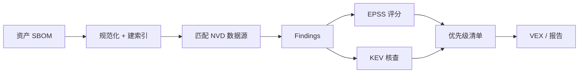

# 🛡️ 安全用例

`cpeskills` SDK 旨在回答四个安全问题：*我有什么？什么有漏洞？多严重？怎么办？* 下面每个用例都对应到具体 API 路径。

## 漏洞管理

拿资产清单，逐项匹配 NVD 已知受影响 CPE 列表，产出 finding。`DownloadAllNVDData` 一次性载入数据源；`FindCVEsForCPE` 离线查询。

```go
import "github.com/scagogogo/cpe-skills"

opts := cpeskills.DefaultNVDFeedOptions()
opts.CacheDir = "/var/cache/nvd"
data, err := cpeskills.DownloadAllNVDData(opts) // 一次
for _, c := range inventory {
    for _, cve := range data.FindCVEsForCPE(c) {
        fmt.Printf("%s 受 %s 影响\n", c.Cpe23, cve)
    }
}
```

## SBOM 合规

合规 SBOM 要以可移植方式命名组件。`ParseCycloneDXJSON` / `ParseSPDXJSON` 读取 SBOM；`ValidateCPE` 与 `NormalizeCPE` 在发布前清洗其中的 CPE。

```go
sbom, err := cpeskills.ParseCycloneDXJSON(raw)
for _, comp := range sbom.Components {
    if comp.CPE != "" {
        c, err := cpeskills.Parse(comp.CPE)
        if err == nil {
            comp.CPE = cpeskills.FormatCpe23(cpeskills.NormalizeCPE(c))
        }
    }
}
```

## 供应链安全

跨生态供应链工具说 PURL，NVD 说 CPE。`CPEToPURL` 与 `PURLToCPE` 在两者间架桥，并返回置信度，便于把低置信映射标记为待人工复核。

```go
purl, conf, err := cpeskills.CPEToPURL(c)
// 反向:
c, conf, err := cpeskills.PURLToCPE(purl)
if conf < 0.5 {
    alertManualReview(purl)
}
```

## 事件响应

CVE 一公布，就要快速定位所有受影响资产。为资产清单构建一次 `CPEIndex`；事件发生时按披露的 CPE 模式查询。

```go
idx := cpeskills.NewCPEIndex(inventoryCPes)
pattern, _ := cpeskills.ParseCpe23("cpe:2.3:a:apache:log4j:2.0:*:*:*:*:*:*:*")
affected := idx.Lookup(pattern) // 即时
```

`KEVClient.IsListed` 判断某 CVE 是否在 CISA 已知被利用漏洞（KEV）清单上，以此提升优先级。

```go
kev := cpeskills.NewKEVClient()
listed, _ := kev.IsListed("CVE-2021-44228")
```

## 合规报告

生成 VEX（Vulnerability Exploitability eXchange）文档，声明哪些产品*未*受影响；并附加 EPSS 分数以排定修复优先级。

```go
epss := cpeskills.NewEPSSClient()
entry, _ := epss.GetScore("CVE-2021-44228")
fmt.Printf("EPSS %f, 级别 %s\n", entry.Score, entry.GetRiskLevel())
```



## 小结

SDK 的安全价值来自链式调用：解析 → 匹配 → 富化 → 报告。NVD 给出受影响集合，EPSS 与 KEV 排序，VEX/SBOM 导出让状态向下游传递。
