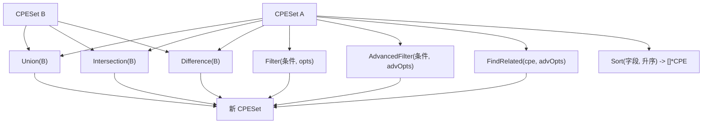

# 📦 CPE 集合示例集

`CPESet` 是一个有序、按 URI 去重的 CPE 集合，支持集合代数与过滤操作。当你持有一份产品清单、某厂商的目录或一次扫描的结果，需要与另一份做交集/并集/差集时，它就是合适的结构。类型定义在 [`set`](/zh/api/modules/set) 模块。

## 创建与填充

`NewCPESet` 接受 name 和 description（用于序列化）；`Add` 插入 CPE，按 URI 去重：

```go
package main

import (
    "fmt"

    "github.com/scagogogo/cpe-skills"
)

func main() {
    ms := cpeskills.NewCPESet("Microsoft 产品", "Windows + Office")
    ms.Add(cpeskills.MustParse("cpe:2.3:a:microsoft:windows:10:*:*:*:*:*:*:*"))
    ms.Add(cpeskills.MustParse("cpe:2.3:a:microsoft:office:2019:*:*:*:*:*:*:*"))
    ms.Add(cpeskills.MustParse("cpe:2.3:a:microsoft:windows:10:*:*:*:*:*:*:*")) // 去重
    fmt.Println("大小:", ms.Size()) // 2
}
```

`FromArray` 是为已有切片准备的便捷构造器：

```go
cpes := cpeskills.StringsToCPEs([]string{
    "cpe:2.3:a:microsoft:windows:10:*:*:*:*:*:*:*",
    "cpe:2.3:a:microsoft:windows:11:*:*:*:*:*:*:*",
})
winSet := cpeskills.FromArray(cpes, "Windows", "10 和 11")
```

## Union、Intersection、Difference

三者都返回一个**新的** `CPESet`，不修改任何操作数。

```go
a := cpeskills.FromArray(cpeskills.StringsToCPEs([]string{
    "cpe:2.3:a:apache:log4j:2.14.0:*:*:*:*:*:*:*",
    "cpe:2.3:a:apache:tomcat:9.0.0:*:*:*:*:*:*:*",
}), "A", "")

b := cpeskills.FromArray(cpeskills.StringsToCPEs([]string{
    "cpe:2.3:a:apache:log4j:2.14.0:*:*:*:*:*:*:*",
    "cpe:2.3:a:apache:log4j:2.15.0:*:*:*:*:*:*:*",
}), "B", "")

fmt.Println("并集大小:", a.Union(b).Size())            // 3
fmt.Println("交集大小:", a.Intersection(b).Size())      // 1
fmt.Println("差集大小:", a.Difference(b).Size())        // 1（tomcat）
```

## Filter 与 AdvancedFilter

`Filter` 接收一个条件 CPE 和 `MatchOptions`，保留匹配的成员；`AdvancedFilter` 接收 `AdvancedMatchOptions`，支持正则/版本范围：

```go
all := cpeskills.FromArray(cpeskills.StringsToCPEs([]string{
    "cpe:2.3:a:apache:log4j:2.14.0:*:*:*:*:*:*:*",
    "cpe:2.3:a:apache:log4j:2.15.0:*:*:*:*:*:*:*",
    "cpe:2.3:a:apache:tomcat:9.0.0:*:*:*:*:*:*:*",
}), "All", "")

crit := cpeskills.MustParse("cpe:2.3:a:apache:log4j:*:*:*:*:*:*:*:*")
log4js := all.Filter(crit, &cpeskills.MatchOptions{})
fmt.Println("log4j 数量:", log4js.Size()) // 2

adv := cpeskills.NewAdvancedMatchOptions()
adv.MatchMode = "exact"
related := all.AdvancedFilter(crit, adv)
fmt.Println("高级过滤后:", related.Size())
```

## Sort

`Sort` 返回按某字段（`"part"`、`"vendor"`、`"product"`、`"version"`）排序的 `[]*CPE` 切片：

```go
sorted := all.Sort("version", false) // 降序
for _, c := range sorted {
    fmt.Println(c.Version)
}
```

## FindRelated

`FindRelated` 返回在给定高级选项下与指定 CPE 相关的成员子集（例如与某通配模式有重叠的所有项）：

```go
pat := cpeskills.MustParse("cpe:2.3:a:apache:*:*:*:*:*:*:*:*")
opts := cpeskills.NewAdvancedMatchOptions()
opts.MatchMode = "exact"
related := all.FindRelated(pat, opts)
fmt.Println("相关 apache 产品:", related.Size())
```

## 包含与子集判定

```go
fmt.Println("包含 tomcat:", all.Contains(
    cpeskills.MustParse("cpe:2.3:a:apache:tomcat:9.0.0:*:*:*:*:*:*:*"))) // true
fmt.Println("a 是 a+b 的子集:", a.IsSubsetOf(a.Union(b))) // true
fmt.Println("a 等于 a:", a.Equals(a))                      // true
```

## 导出

`ToString` 序列化整个集合（名称、描述、成员）；`ToSlice` 返回原始切片用于遍历。

```go
fmt.Println(all.ToString())
for _, c := range all.ToSlice() {
    fmt.Println(c.Cpe23)
}
```



## 小结

- `NewCPESet` / `FromArray` 创建集合；`Add` 按 URI 去重。`Union`、`Intersection`、`Difference` 不修改操作数，返回新集合。
- `Filter` 用 `MatchOptions`；`AdvancedFilter` 和 `FindRelated` 用 `AdvancedMatchOptions`。`Sort(字段, 升序)` 返回有序切片；`Contains`/`IsSubsetOf`/`IsSupersetOf`/`Equals` 判定成员关系。
完整 API 参考见 [`set`](/zh/api/modules/set) 模块页。
