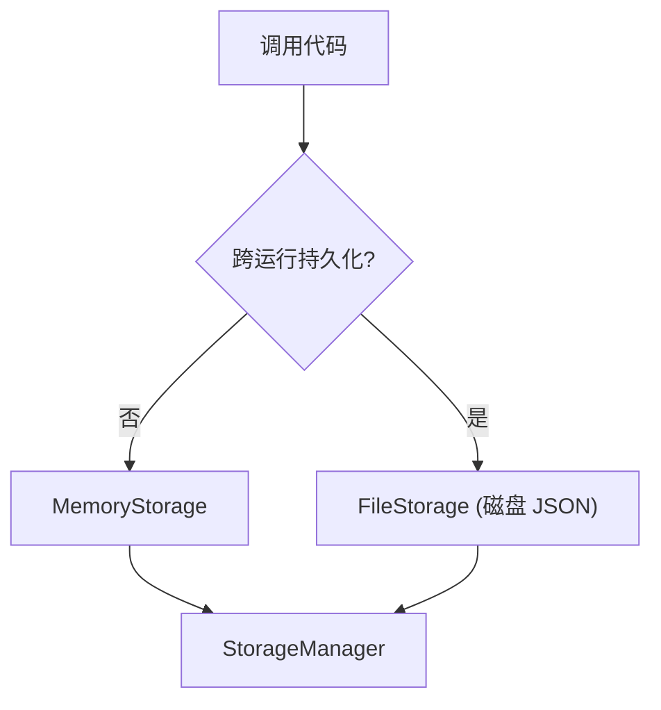
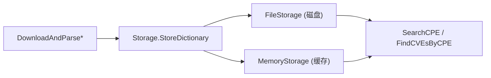

# 💾 存储后端

解析完 CPE、下载完 NVD feed 后，你需要地方存放它们。cpe-skills 用统一的 [`Storage`](/zh/api/modules/storage) 接口抽象持久化，内置两个实现——[`MemoryStorage`](/zh/api/modules/memory-storage) 与 [`FileStorage`](/zh/api/modules/file-storage)——以及在其上叠加缓存的 [`StorageManager`](/zh/api/modules/storage)。接口统一，区别仅在于字节*存于何处*与*存活多久*。

## Storage 接口

每个后端实现同一个 `Storage` 接口，故调用代码无论数据存于何处都一致：

```go
type Storage interface {
    Initialize() error
    Close() error
    StoreCPE(cpe *CPE) error
    RetrieveCPE(id string) (*CPE, error)
    UpdateCPE(cpe *CPE) error
    DeleteCPE(id string) error
    SearchCPE(criteria *CPE, options *MatchOptions) ([]*CPE, error)
    AdvancedSearchCPE(criteria *CPE, options *AdvancedMatchOptions) ([]*CPE, error)
    StoreCVE(cve *CVEReference) error
    RetrieveCVE(cveID string) (*CVEReference, error)
    FindCVEsByCPE(cpe *CPE) ([]*CVEReference, error)
    FindCPEsByCVE(cveID string) ([]*CPE, error)
    StoreDictionary(dict *CPEDictionary) error
    RetrieveDictionary() (*CPEDictionary, error)
    StoreModificationTimestamp(key string, t time.Time) error
    RetrieveModificationTimestamp(key string) (time.Time, error)
}
```

因为一切都经此契约，换后端只需改一个构造调用。

## 内存存储 vs 文件存储

| 维度 | `MemoryStorage` | `FileStorage` |
|------|-----------------|---------------|
| 生命周期 | 仅进程内 | 跨重启存活 |
| 速度 | 最快 | 较慢（JSON 读写） |
| 容量 | 受 RAM 限制 | 受磁盘限制 |
| 创建 | `NewMemoryStorage()` | `NewFileStorage(baseDir, useCache)` |
| 最适合 | 缓存、测试、临时扫描 | 持久本地字典 |



```go
// 内存，临时
mem := cpeskills.NewMemoryStorage()
mem.Initialize()
defer mem.Close()

// 磁盘持久化
file, err := cpeskills.NewFileStorage("/var/lib/cpe-skills", true) // useCache=true
if err != nil { log.Fatal(err) }
file.Initialize()
defer file.Close()
```

## 何时用哪个

- **`MemoryStorage`** — 短命 CLI 运行、单元测试，或作为 `StorageManager` 下的*缓存*层。进程退出时无可损失，因为数据重建成本低。
- **`FileStorage`** — 长驻服务或重复扫描，不想每次重下 CPE 字典。`useCache` 标志把解析对象保留在内存加速读，同时写持久化到 JSON。
- **两者并用** — 想要持久又想要速度：以 `FileStorage` 为主、`MemoryStorage` 为热缓存，经 `StorageManager` 组合。

## StorageManager 缓存层

`StorageManager` 包装一个主 `Storage` 和可选的缓存 `Storage`。读（`GetCPE`、`GetCVE`）时先查缓存；写（`StoreCPE`）时同时写入两者。缓存 TTL 默认 3600 秒。`InvalidateCache(id)` 淘汰单条，`ClearCache()` 清空全部，`GetStats()` 经 `StorageStats` 报告命中/未命中计数。

```go
primary, _ := cpeskills.NewFileStorage("/var/lib/cpe-skills", true)
primary.Initialize()
defer primary.Close()

mgr := cpeskills.NewStorageManager(primary)
mgr.SetCache(cpeskills.NewMemoryStorage()) // 启用 CacheEnabled，TTL=3600s

cpe, err := mgr.GetCPE("cpe:2.3:a:apache:log4j:2.14:*:*:*:*:*:*:*")
mgr.StoreCPE(cpe)
stats, _ := mgr.GetStats() // 命中/未命中比
```

## 与本项目的关系

存储层是 NVD 下载、匹配、CVE 查询共同依赖的持久化边界：



## 小结

- 统一 `Storage` 接口贯穿两个后端；切换只需改一行。
- `MemoryStorage` 快但短命；`FileStorage` 把 JSON 持久化到目录并支持进程内读缓存。
- `StorageManager` 在主存储之上叠加缓存，含 TTL、失效与统计。
- 按生命周期与速度需求选择：临时用内存，重复扫描用文件，两者兼得用 manager 加缓存。完整 API 见 [storage](/zh/api/modules/storage)、[memory-storage](/zh/api/modules/memory-storage) 与 [file-storage](/zh/api/modules/file-storage) 模块。
