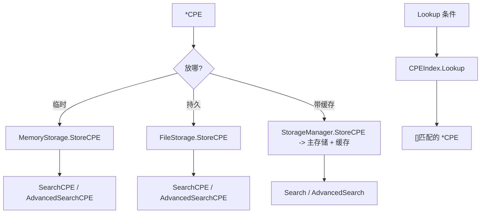

# 💾 CPE 存储示例集

CPE 解析完，得有个地方放它们——并能在之后快速查回来。cpe-skills 把持久化抽象成统一的 [`Storage`](/zh/api/modules/storage) 接口，内置两个实现（[`MemoryStorage`](/zh/api/modules/memory-storage) 与 [`FileStorage`](/zh/api/modules/file-storage)），外加一个在主存储之上叠缓存层的 [`StorageManager`](/zh/api/modules/storage)，以及一个用于快速查找的内存 [`CPEIndex`](/zh/api/modules/cpe-index)。本页示范各自用法。

## MemoryStorage：增、删、查

`MemoryStorage` 把所有数据放在 map 里——快、临进程、适合测试和单次扫描。

```go
package main

import (
    "fmt"
    "log"

    "github.com/scagogogo/cpe-skills"
)

func main() {
    ms := cpeskills.NewMemoryStorage()
    if err := ms.Initialize(); err != nil {
        log.Fatal(err)
    }
    defer ms.Close()

    cpe := cpeskills.MustParse("cpe:2.3:a:apache:log4j:2.14.0:*:*:*:*:*:*:*")
    if err := ms.StoreCPE(cpe); err != nil {
        log.Fatal(err)
    }

    got, err := ms.RetrieveCPE(cpe.GetURI())
    if err != nil {
        log.Fatal(err)
    }
    fmt.Println("取回:", got.Cpe23)

    if err := ms.DeleteCPE(cpe.GetURI()); err != nil {
        log.Fatal(err)
    }
}
```

`UpdateCPE` 按 URI 替换已有条目；`SearchCPE(条件, &MatchOptions{})` 对整库做匹配查询。

## FileStorage：持久化到磁盘

`FileStorage` 把每个 CPE 写成 base 目录下的一个 JSON 文件。传 `useCache=true` 可同时维护一份内存镜像以加速读取。

```go
fs, err := cpeskills.NewFileStorage("/tmp/cpe-store", true)
if err != nil {
    log.Fatal(err)
}
if err := fs.Initialize(); err != nil {
    log.Fatal(err)
}
defer fs.Close()

win := cpeskills.MustParse("cpe:2.3:a:microsoft:windows:10:*:*:*:*:*:*:*")
if err := fs.StoreCPE(win); err != nil {
    log.Fatal(err)
}
got, err := fs.RetrieveCPE(win.GetURI()) // 进程重启后仍存在
if err != nil {
    log.Fatal(err)
}
fmt.Println("来自磁盘:", got.Cpe23)

adv := cpeskills.NewAdvancedMatchOptions() // 支持正则/版本范围
adv.MatchMode = "exact"
hits, err := fs.AdvancedSearchCPE(
    cpeskills.MustParse("cpe:2.3:a:microsoft:windows:*:*:*:*:*:*:*:*"), adv)
if err != nil {
    log.Fatal(err)
}
fmt.Println("命中:", len(hits))
```

## StorageManager：缓存层

`StorageManager` 包裹一个主存储和一个可选缓存。读时先查缓存、再回退到主存储；写时双向传播。当主存储是较慢的 `FileStorage`、又想要热读时，就用它。

```go
primary, _ := cpeskills.NewFileStorage("/tmp/cpe-store", false)
sm := cpeskills.NewStorageManager(primary)
sm.SetCache(cpeskills.NewMemoryStorage()) // 热层

cpe := cpeskills.MustParse("cpe:2.3:a:google:chrome:120.0.6099.109:*:*:*:*:*:*:*")
_ = sm.StoreCPE(cpe) // 同时写入主存储与缓存

got, err := sm.GetCPE(cpe.GetURI()) // 命中缓存
if err != nil {
    log.Fatal(err)
}
fmt.Println("经管理器:", got.Cpe23)

sm.InvalidateCache(cpe.GetURI()) // 失效单条
sm.ClearCache()                  // 清空全部

stats, _ := sm.GetStats()
fmt.Printf("统计: %+v\n", stats)
```

## CPEIndex：快速查找

`CPEIndex` 不是 `Storage`——它是一个由切片构建的纯查找结构。`Lookup` 返回所有匹配条件的 CPE（用同一套 `CPE.Match` 规则）；`GetByVendor` / `GetByProduct` / `GetByPart` 是 O(1) 助手。

```go
cpes := cpeskills.StringsToCPEs([]string{
    "cpe:2.3:a:apache:log4j:2.14.0:*:*:*:*:*:*:*",
    "cpe:2.3:a:apache:tomcat:9.0.0:*:*:*:*:*:*:*",
    "cpe:2.3:a:google:chrome:120:*:*:*:*:*:*:*",
})
idx := cpeskills.NewCPEIndex(cpes)

pat := cpeskills.MustParse("cpe:2.3:a:apache:*:*:*:*:*:*:*:*")
for _, c := range idx.Lookup(pat) {
    fmt.Println("apache:", c.Cpe23)
}
fmt.Println("按产品 log4j:", len(idx.GetByProduct("log4j")))
fmt.Println("按厂商 google:", len(idx.GetByVendor("google")))
fmt.Println("按 part a:", len(idx.GetByPart("a")))
fmt.Println("已索引:", idx.Size())
```

`Add` 与 `Remove` 保持索引同步；`LookupByPURL` / `IndexPURL` 与 PURL 世界打通。



## 小结

- `MemoryStorage` —— 进程内、快、随进程消亡；适合测试和临时扫描。`FileStorage` —— 每个 CPE 一个 JSON 文件，重启不丢，可带内存缓存。
- `StorageManager` —— 主存储 + 缓存层（`SetCache`）。`CPEIndex` —— 不是持久化，但要在预加载切片里找匹配 CPE 时最快；`BatchMatchCPEs` 就靠它。所有存储读操作共享 `SearchCPE` / `AdvancedSearchCPE` 签名。
完整 API 参考见 [`memory-storage`](/zh/api/modules/memory-storage)、[`file-storage`](/zh/api/modules/file-storage)、[`storage`](/zh/api/modules/storage) 和 [`cpe-index`](/zh/api/modules/cpe-index) 模块页。
