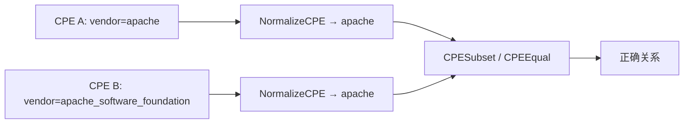
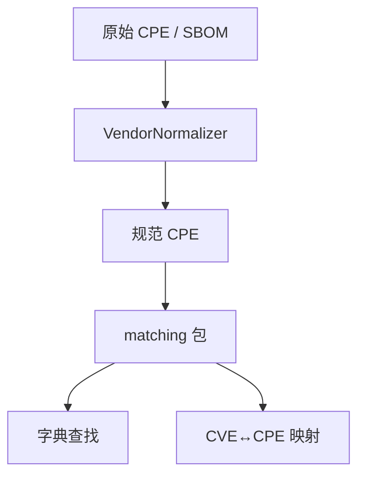

# 🏷️ 厂商名规范化

CPE 厂商名**并不**统一。同一家公司在不同 feed、公告、SBOM 中可能写作 `microsoft`、`Microsoft`、`microsoft_corporation` 或 `msft`。若按字面匹配，仅因厂商字符串差一个下划线或后缀就会漏掉真实漏洞。cpe-skills 的 [`vendor-normalization`](/zh/api/modules/vendor-normalization) 包将这些变体归约为单一规范形式，使匹配更健壮。

## 为何 CPE 厂商名不统一

CPE 字典是策展过的，但 CVE 记录与厂商公告由多方撰写。研究者提交 CVE 可能写 `apache`，而官方 CPE 字典用 `apache_software_foundation`，SBOM 生成器又依包管理器吐出另一种拼写。这些都不是"错的"——它们只是同一实体的不同表示。下表展示野外常见的漂移：

| 规范形式 | 野外所见变体 |
|---------|--------------|
| `apache` | `apache_software_foundation`、`apache software foundation`、`the apache software foundation`、`apache.org` |
| `microsoft` | `microsoft_corporation`、`microsoft corp`、`ms`、`msft` |
| `google` | `google_inc`、`google_llc`、`google inc.`、`alphabet`、`google_chrome` |
| `oracle` | `oracle_corporation`、`oracle corporation`、`oracle_corp` |
| `redhat` | `red_hat`、`red hat, inc.`、`red_hat_software`、`rhel` |

## 别名机制

`VendorNormalizer` 持有两张别名映射：厂商别名与产品别名。`RegisterVendorAlias(canonical, aliases...)` 声明这些别名都指向规范厂商；`RegisterProductAlias` 对某厂商下的产品做同样事。包内置覆盖上述主要厂商的目录（见 `registerBuiltinAliases`），并可在运行时扩展：

```go
n := cpeskills.NewVendorNormalizer()
n.RegisterVendorAlias("mycompany", "my_company", "my company", "my-company")
n.RegisterProductAlias("mycompany", "myapp", "my_app", "my-app")
```

所有比较都大小写不敏感且忽略分隔符，故 `Microsoft Corp` 与 `microsoft_corp` 解析为同一键。你可不必显式规范化两边就询问两个名字是否为同一实体：

```go
n.AreSameVendor("microsoft_corporation", "msft") // true
n.AreSameProduct("microsoft", "windows_10", "windows") // true
```

## 规范化如何影响匹配

[`matching`](/zh/api/modules/matching) 包比较 CPE 属性以推导关系（`Equal`、`Subset`、`Superset`、`Disjoint`）。若厂商名未规范化，对同一产品分别列为 `apache` 与 `apache_software_foundation`，`CPESubset` 会错误返回 `Disjoint`，悄无声息地丢掉一个脆弱匹配。匹配前运行 `NormalizeCPE` 把两边塌缩为规范形式，比较才能成功。



## 规范化整个 CPE

`NormalizeCPE(cpe)` 返回一个厂商与产品都已规范化、其余字段不动的新 `CPE`。另有包级便捷函数 `NormalizeVendorName`、`NormalizeProductName`、`NormalizeCPEVendorProduct`，适用于你只有字符串的场景：

```go
n := cpeskills.NewVendorNormalizer()
canonicalCPE := n.NormalizeCPE(rawCPE)        // 结构感知
vendor := n.NormalizeVendorName("MSFT")       // "microsoft"
```

## 与本项目的关系

规范化是让下游每次比较都可信的预处理步骤：



## 小结

- CPE 厂商名跨 feed 漂移（`apache` vs `apache_software_foundation`）；字面匹配会漏掉真实漏洞。
- `VendorNormalizer` 通过厂商/产品别名表将变体映射到单一规范形式，内置覆盖主要厂商。
- 匹配前运行 `NormalizeCPE`，使 `CPESubset`/`CPEEqual` 看到相同厂商字符串。
- `AreSameVendor`/`AreSameProduct` 无需修改数据即可回答实体同一性问题。完整 API 见 [vendor-normalization](/zh/api/modules/vendor-normalization) 与 [matching](/zh/api/modules/matching) 模块。
