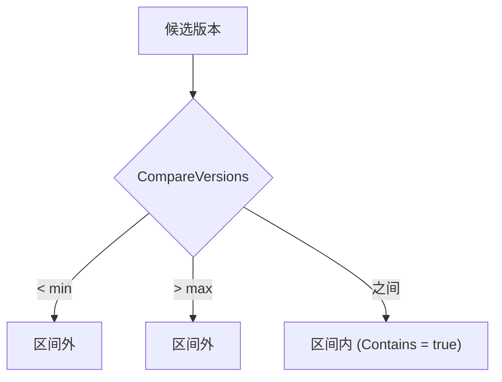
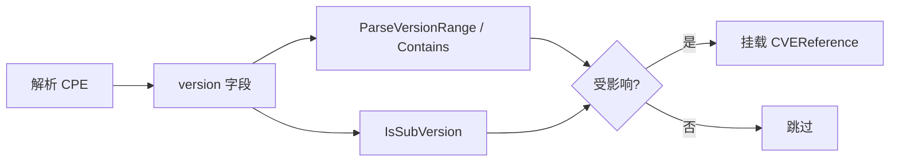

# 🔢 版本语义

"`2.0` 受影响吗？那 `2.0.1-beta` 呢？" 正确回答这类问题，是把有用的扫描器与噪声扫描器区分开的关键。cpe-skills 的 [`version-compare`](/zh/api/modules/version-compare) 包处理语义化版本比较、区间检查、子版本检测，以及 CPE 漏洞记录中通用的区间语法。

## 语义化版本比较

`CompareVersions(v1, v2)` 返回 `-1`、`0` 或 `1`（小于、等于、大于）。它委托给 `github.com/scagogogo/versions` 库，后者解析数字段与可选后缀（预发布/构建元数据），使 `2.0` < `2.0.1` < `2.1` 且 `2.0.0-alpha` < `2.0.0`。

```go
cpeskills.CompareVersions("2.0", "2.0.1")   // -1
cpeskills.CompareVersions("2.14", "2.14")    // 0
cpeskills.CompareVersions("3.0", "2.14")     // 1
```

## 版本区间

漏洞公告很少只点名单一版本——它们描述一个*区间*。`VersionRange` 用 `MinVersion` 与 `MaxVersion`（均含端点）建模闭区间。`ParseVersionRange` 接受三种形式：

| 语法 | 含义 | 示例 |
|------|------|------|
| `1.0` | 精确版本（min == max） | 仅 `1.0` |
| `1.0-2.0` | 闭区间 | `1.0` ≤ v ≤ `2.0` |
| `1.0+` | 半开，上无界 | v ≥ `1.0` |
| `-2.0` | 半开，下无界 | v ≤ `2.0` |

`IsVersionInRange(version, min, max)` 是更底层的检查（空边界表示该侧无界），`VersionRange.Contains(version)` 是面向对象的封装：

```go
vr, _ := cpeskills.ParseVersionRange("2.0-2.14.1")
vr.Contains("2.10")   // true — 在区间内
vr.Contains("2.15")   // false — 超过上限

cpeskills.IsVersionInRange("2.10", "2.0", "2.14.1") // true
cpeskills.IsVersionInRange("2.10", "2.0+", "")       // 错误："2.0+" 是区间语法，不是版本
```

下图展示候选版本如何对解析后的区间分类：



## 子版本概念

有时公告说"所有 2.x 版本"而不逐一点名补丁。`IsSubVersion(parentVersion, subVersion)` 检测一个版本是否是另一个的更具体子代——例如 `2.0.1` 是 `2.0` 的子版本。它要求子版本的数字段共享父版本完整前缀且至少等长，（长度相等时）还要求后缀匹配。

```go
cpeskills.IsSubVersion("2.0", "2.0.1")  // true
cpeskills.IsSubVersion("2.0", "2.1")    // false — 前缀不同
cpeskills.IsSubVersion("2.0", "2.0.0")  // true — 数字段更长且共享前缀
```

## CPE 中的通配与区间

在 CPE 2.3 中，`version` 字段可含通配符（`*` = 任意，`-` = 未定义），这是 WFN（Well-Formed Name）语义的一部分。[`matching`](/zh/api/modules/matching) 包在比较时解释它们：通配版本匹配任意，而具体版本则按上文区间检查。这就是版本比较与 CPE 匹配既分离又协作的原因——匹配决定*是否*比较，版本逻辑决定*如何*比较。

## 与本项目的关系

版本语义位于 CPE 解析与漏洞匹配之间：



## 小结

- `CompareVersions` 给出语义顺序；`IsVersionInRange` 做闭区间检查。
- `ParseVersionRange` 处理精确（`1.0`）、闭区间（`1.0-2.0`）、半开（`1.0+`、`-2.0`）形式。
- `IsSubVersion` 检测父子版本关系，用于"所有 2.x"式公告。
- CPE 版本字段的通配符由匹配层处理；版本逻辑负责具体比较。完整 API 见 [version-compare](/zh/api/modules/version-compare) 模块。
