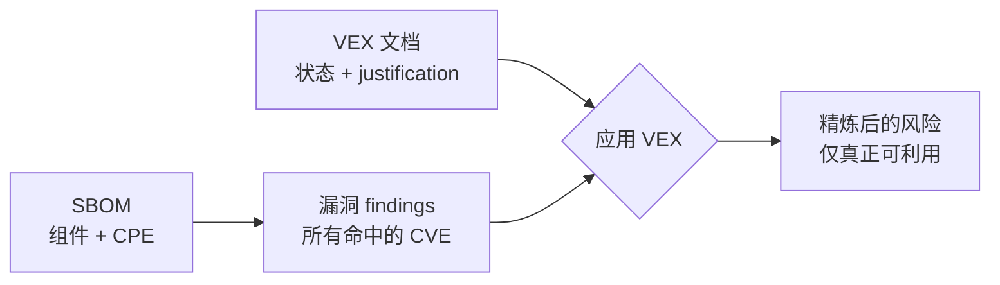

# ✅ VEX (Vulnerability Exploitability eXchange)

**VEX 文档**是 SBOM 的伴生件，针对某个产品声明：一个特定漏洞是否真的可利用。SBOM 说"本产品含 log4j-core 2.14"，CVE 数据说"CVE-2021-44228 影响 log4j-core 2.14"，VEX 则是那层说"但在*我们*产品里，那条代码路径不可达——**not_affected**"的层。

## VEX 解决的问题

朴素的漏洞扫描会把每个版本命中 CVE 的组件都标记出来。实践中大多数被标记的漏洞在给定部署中并不可利用：漏洞函数从不被调用、特性被禁用、或缓解措施已就位。VEX 的存在是把这些专家判断记录下来，使其可在供应商与客户之间、团队之间、工具之间共享，而不是每次重新推导。

## 四种状态

| 状态                 | 常量                       | 含义                                                |
|----------------------|----------------------------|-----------------------------------------------------|
| `affected`           | `VEXAffected`              | 产品受影响且可利用                                  |
| `not_affected`       | `VEXNotAffected`           | 产品不可利用（须附 justification）                  |
| `fixed`              | `VEXFixed`                 | 产品已发布修复版本                                  |
| `under_investigation`| `VEXUnderInvestigation`    | 仍在排查                                            |

一条 `not_affected` 语句必须携带**justification**说明为何不受影响。库暴露了 CSAF/CycloneDX 的 justification 词汇表：

| Justification 常量                                   | 为何不受影响                                |
|------------------------------------------------------|---------------------------------------------|
| `VEXComponentNotPresent`                             | 该组件未随本产品发布                        |
| `VEXVulnerableCodeNotPresent`                        | 组件在，但漏洞代码不在                      |
| `VEXVulnerableCodeNotInExecutePath`                  | 代码存在但永不被执行                        |
| `VEXVulnerableCodeCannotBeControlledByAdversary`     | 输入不可被攻击者控制                        |
| `VEXInlineMitigationsExist`                          | 已有缓解措施                                |

## VEX 与 SBOM

VEX 不替代 SBOM——它标注 SBOM。典型流程：构建 SBOM，运行漏洞匹配得到 findings，再产出一份 VEX 文档，把不可利用的 findings 从 affected 降级为 not_affected。



## CISA SBOM/VEX 协同

美国 **CISA** 推动了 SBOM 与 VEX 的联合采用：SBOM 回答"里面有什么"，VEX 回答"那又怎样"。两者意在配套流通，使消费者能把供应商的 SBOM、公开 CVE 数据和供应商的 VEX 声明对账成单一可信的风险图景。

## 产出与应用 VEX

```go
package main

import (
    "fmt"
    "github.com/scagogogo/cpe-skills"
)

func main() {
    // 编写一条语句：CVE 在本产品中不可利用
    stmt := cpeskills.NewVEXStatement(
        "CVE-2021-44228",
        "cpe:2.3:a:mycorp:myproduct:1.0:*:*:*:*:*:*:*",
        cpeskills.VEXNotAffected,
    )
    stmt.Justification = cpeskills.VEXVulnerableCodeNotInExecutePath

    doc := cpeskills.NewVEXDocument("cyclonedx", "myproduct", "My Product", "security-team")
    doc.Statements = append(doc.Statements, stmt)

    // 把 VEX 文档应用到 findings 列表，过滤掉不受影响的
    refined := cpeskills.ApplyVEXToFindings(allFindings, doc)
    fmt.Println(len(refined), "条真正可利用的 findings 剩余")
}
```

`GenerateVEXFromFindings` 直接从 SBOM 组件上匹配到的 findings 产出一份 VEX 草稿——每条 finding 初始为 affected，由人编辑其中不受影响的。`MergeVEXDocuments` 合并来自多个源的语句，`ParseVEXDocument` 读取已有 VEX 文件。

## 与各模块的关系

- [VEX](../api/modules/vex.md) —— `VEXDocument`、`VEXStatement`、状态/justification 常量、generate/apply/merge/parse。

## 小结

VEX 是 SBOM 之上的"那又怎样"层。它的四种状态——affected、not_affected、fixed、under_investigation——把原始的 CVE/SBOM 命中清单变成可操作的风险声明，而必需的 justification 让推理可审计。
