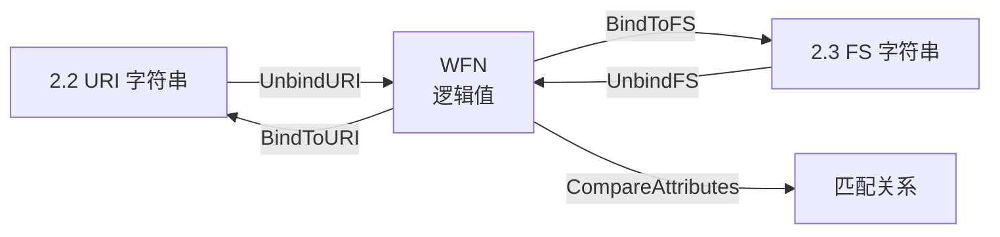

# 🔗 Well-Formed Name (WFN)

**Well-Formed Name（WFN，良构名称）** 是由 **NISTIR 7695** 定义的 CPE 抽象逻辑表示。2.2 URI 和 2.3 格式化字符串是文本*序列化*，而 WFN 是规范用于定义匹配的规范形式。每个字符串先*解绑定*（unbind）成 WFN，以 WFN 形式比较，再*绑定*（bind）回字符串用于展示。

## 为什么需要 WFN

像 `cpe:2.3:a:apache:http_server:2.4.58` 这样的 CPE 字符串看起来很精确，但真实数据有缺口：有些字段为空，有些是通配符，有些"不适用"。WFN 给每个属性一个定义良好的逻辑值，使比较不必猜测空字段的含义。

## 两种特殊逻辑值

| 值    | 常量       | 含义                                                |
|-------|------------|-----------------------------------------------------|
| `*`   | `ValueANY` | ANY —— 匹配该字段的一切可能值                       |
| `-`   | `ValueNA`  | NA —— 该字段对本产品不适用                          |
| (文本)| (字面量)   | 具体值，可能带通配符                                |

`ANY` 是核心概念：WFN 用它说"此字段未指定，这里接受任何值"。解析一个省略了 `language` 字段的 2.2 URI 时，该属性在 WFN 中就变成 `ANY`。



## 绑定与解绑定

NISTIR 7695 把*绑定*定义为把 WFN 序列化成字符串，*解绑定*是其逆操作：

- `BindToFS(w)` —— 生成 2.3 格式化字符串。
- `BindToURI(w)` —— 生成 2.2 URI。
- `UnbindFS(s)` / `UnbindURI(s)` —— 把字符串解析回 WFN。

在 `cpe-skills` 中通常用更高层的 `CPE` 结构体，但绑定函数被暴露出来，因为它们是规范定义的两种语法之间的桥梁。

## WFN 作为匹配的基础

两个 CPE 的匹配是按其 WFN 属性定义的，而非按字符串。原因很简单：字符串比较无法表达 `ANY`。考虑：

```
source: cpe:2.3:a:apache:http_server:*:*:*:*:*:*:*   (version = ANY)
target: cpe:2.3:a:apache:http_server:2.4.58:*:*:*:*:*:*:*
```

按字符串相等会得到"不相等"。按 WFN 比较，source 的 `ANY` 版本匹配 target 的 `2.4.58`——source 是 target 的*超集*。这个区别正是 WFN 存在的全部理由。

## 构造 WFN

可以直接构建 WFN，或从解析的 CPE 派生：

```go
package main

import (
    "fmt"
    "github.com/scagogogo/cpe-skills"
)

func main() {
    cpe, err := cpeskills.ParseCpe23("cpe:2.3:a:apache:http_server:2.4.58:*:*:*:*:*:*:*")
    if err != nil { panic(err) }

    wfn := cpeskills.FromCPE(cpe)         // CPE -> WFN
    fmt.Println(wfn.Vendor, wfn.Product, wfn.Version)
    // apache http_server 2.4.58

    // 绑定回任一语法
    fmt.Println(cpeskills.BindToFS(wfn))
    fmt.Println(cpeskills.BindToURI(wfn))
}
```

`NewWFN()` 返回一个空 WFN，其属性默认为 `ANY`，这是构建"匹配一切"准则的正确起点。

## 与各模块的关系

- [WFN](../api/modules/wfn.md) —— `WFN` 结构体、`FromCPE`、`NewWFN`。
- [Binding](../api/modules/binding.md) —— `BindToFS`、`BindToURI`、解绑定与转换函数。
- [Matching](../api/modules/matching.md) —— `CompareAttributes`，WFN 比较的消费者。

## 小结

WFN 是两种 CPE 语法之下的逻辑层。它的 `ANY` 和 `NA` 值为比较赋予了原始字符串无法提供的精确语义，这就是为什么规范——以及 `cpe-skills`——中的每个匹配器都基于 WFN 操作。
