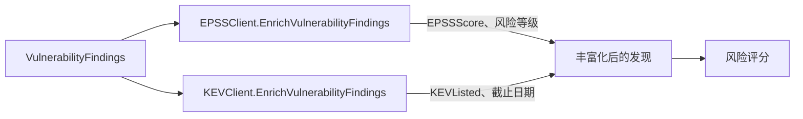

# 📊 EPSS 与 KEV

两份外部威胁情报用于锐化优先级。**EPSS**（漏洞利用预测评分系统）给出某 CVE 被野外利用的概率；**CISA KEV**（已知被利用漏洞目录）收录已确认被主动利用的漏洞。`cpeskills` 同时拉取两者并附加到你的发现上。

## 概念

两个客户端都带缓存。EPSS 给发现附上 0.0–1.0 的评分与风险等级；KEV 标记被收录的发现，可选附上截止日期与要求措施。丰富化后的字段会被风险评分器消费。



## 用 EPSS 与 KEV 丰富化发现

```go
package main

import (
    "fmt"
    "log"

    cpeskills "github.com/scagogogo/cpe-skills"
)

func main() {
    epss := cpeskills.NewEPSSClient()
    if err := epss.EnrichVulnerabilityFindings(findings); err != nil {
        log.Fatal(err)
    }
    for _, f := range findings {
        fmt.Printf("%s epss=%.4f\n", f.CVE.CVEID, f.EPSSScore)
    }

    kev := cpeskills.NewKEVClient()
    if err := kev.EnrichVulnerabilityFindings(findings); err != nil {
        log.Fatal(err)
    }
}
```

## 直接查询

```go
entry, err := epss.GetScore("CVE-2021-44228")
if err == nil && entry.IsCriticalRisk() {
    fmt.Println("利用概率高")
}

listed, err := kev.IsListed("CVE-2021-44228")
if err == nil && listed {
    ke, _ := kev.GetEntry("CVE-2021-44228")
    due, _ := kev.GetDueDate("CVE-2021-44228")
    fmt.Printf("KEV 已收录，截止 %s，要求措施: %s\n", due, ke.RequiredAction)
}
```

## 最佳实践

- **EPSS 与 KEV 一并丰富化** —— 风险评分器同时用这两个信号；只丰富化一半会让发现权重偏低。
- **评分前先丰富化**，使 `DefaultRiskScorer` 看到每条发现的 `EPSSScore` 与 `KEVListed`。
- **把 KEV 收录视为硬截止** —— `GetDueDate` 返回 CISA 修复截止日期，应推送到任务跟踪系统。

## 相关模块

- [风险评分](./risk-scoring.md) —— 把 EPSS/KEV 字段纳入优先级桶位。
- [SBOM](./sbom.md) —— 待丰富化发现的来源。
- [导出格式](./export.md) —— 丰富化后的发现可干净地序列化为 SARIF。
