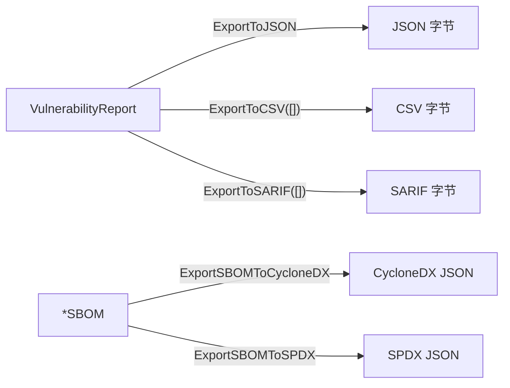

# 📤 导出格式

有了漏洞报告或 SBOM 之后，需与下游工具共享——CI 看板、工单系统、审计方。`cpeskills` 把漏洞报告序列化为 JSON、CSV、SARIF，并把 SBOM 序列化回 CycloneDX 与 SPDX。

## 概念

存在两条并行的导出路径。**报告导出**接收 `*VulnerabilityReport`（或批量）与 `ExportFormat`（`json`、`csv`、`sarif`）。**SBOM 导出**接收 `*SBOM`，产出 CycloneDX 或 SPDX JSON。CSV 与 SARIF 是批量导向的（接收切片），因为单条发现通常没有独立价值。



## 导出漏洞报告

```go
package main

import (
    "fmt"
    "os"

    cpeskills "github.com/scagogogo/cpe-skills"
)

func main() {
    comp := cpeskills.NewSBOMComponent("log4j-core", "2.14.0")
    report := cpeskills.NewVulnerabilityReport(comp)

    // SARIF 与 GitHub Code Scanning 集成。
    sarifBytes, err := cpeskills.ExportToSARIF([]*cpeskills.VulnerabilityReport{report})
    if err != nil {
        panic(err)
    }
    _ = os.WriteFile("results.sarif", sarifBytes, 0644)

    csvBytes, err := cpeskills.ExportToCSV([]*cpeskills.VulnerabilityReport{report})
    if err != nil {
        panic(err)
    }
    fmt.Printf("CSV: %d 字节\n", len(csvBytes))
}
```

## 把 SBOM 导出为 CycloneDX / SPDX

```go
sbom := cpeskills.NewSBOM(cpeskills.SBOMFormatCycloneDX, "my-app")
// ... 添加组件 ...

cdx, err := cpeskills.ExportSBOMToCycloneDX(sbom)
if err != nil {
    panic(err)
}
_ = os.WriteFile("bom.cdx.json", cdx, 0644)

spdx, err := cpeskills.ExportSBOMToSPDX(sbom)
if err != nil {
    panic(err)
}
_ = os.WriteFile("bom.spdx.json", spdx, 0644)
```

## 最佳实践

- **CI 用 SARIF** —— GitHub/GitLab 原生消费 SARIF，把发现呈现为评审注解。
- **人工研判用 CSV** —— 电子表格是修复迭代的通用语言。
- **不确定时 SBOM 两种格式都导出** —— CycloneDX 在安全上更丰富；SPDX 更受某些许可证审计工具链青睐。

## 相关模块

- [SBOM](./sbom.md) —— SBOM 导出器消费的 `*SBOM` 类型。
- [VEX](./vex.md) —— 导出报告前先应用 VEX 剔除 `not_affected` 噪声。
- [风险评分](./risk-scoring.md) —— 导出前先排优先级，报告便以最严重项打头。
