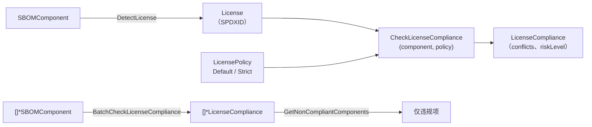

# 📜 许可证合规

掌握每个组件的许可证是法律要求，不只是安全要求。`cpeskills` 检测 SBOM 组件的许可证、按允许/禁止策略校验，并在整个 SBOM 上批量合规检查——在 copyleft 与非 OSI 批准组件出货前就暴露出来。

## 概念

`LicensePolicy` 定义允许/禁止的 SPDX ID 列表，以及 copyleft 与 OSI 批准的开关。`CheckLicenseCompliance` 返回 `*LicenseCompliance`，描述检测到的与声明的许可证、冲突及风险等级。库内置两套现成策略：`DefaultLicensePolicy`（宽松）与 `StrictLicensePolicy`（禁 copyleft、仅 OSI 批准）。



## 检测与校验单个组件

```go
package main

import (
    "fmt"

    cpeskills "github.com/scagogogo/cpe-skills"
)

func main() {
    comp := cpeskills.NewSBOMComponent("my-lib", "1.0")

    lic := cpeskills.DetectLicense(comp)
    fmt.Printf("检测到的许可证: %s\n", lic.SPDXID)

    result := cpeskills.CheckLicenseCompliance(comp, cpeskills.StrictLicensePolicy())
    if len(result.Conflicts) > 0 {
        fmt.Printf("冲突: %v（风险=%s）\n", result.Conflicts, result.RiskLevel)
    }
}
```

## 跨 SBOM 批量合规

```go
policy := cpeskills.DefaultLicensePolicy()

results := cpeskills.BatchCheckLicenseCompliance(allComponents, policy)
for _, bad := range cpeskills.GetNonCompliantComponents(results) {
    fmt.Printf("不合规: %s — %s\n", bad.Component.Name, bad.Conflicts)
}
```

## 最佳实践

- **对外发布的产品用 `StrictLicensePolicy` 起步** —— copyleft 许可证可能强制开源披露，要尽早发现。
- **仅内部使用的工具用 `DefaultLicensePolicy`**，此时 copyleft 可接受。
- **每次构建 SBOM 都跑批量合规** —— 许可证违规在引入时修复成本远低于发布时。

## 相关模块

- [SBOM](./sbom.md) —— 组件携带的 `Licenses` 供检测读取。
- [清单转 SBOM](./manifest.md) —— 清单解析器保留声明的许可证文本。
- [导出格式](./export.md) —— 把合规报告序列化给审计方。
