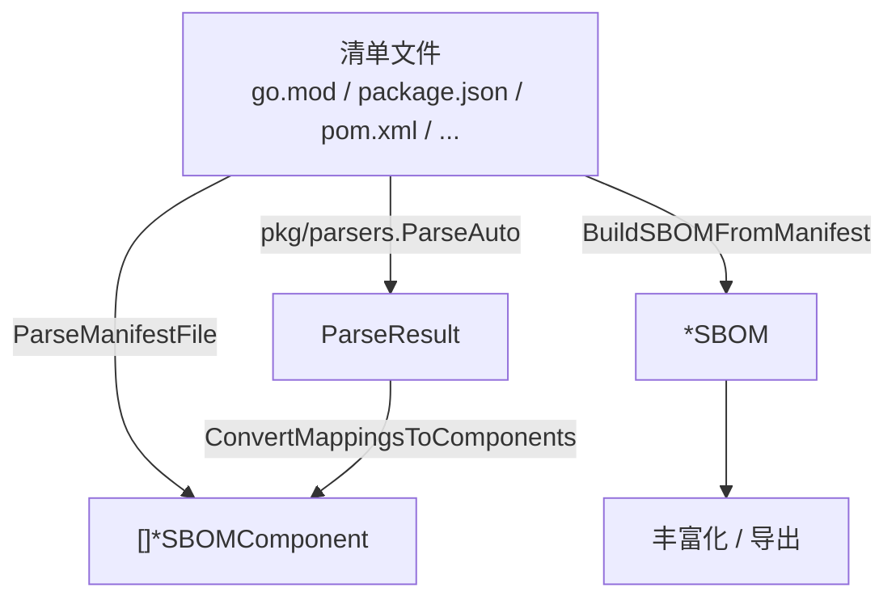

# 🧾 清单转 SBOM

多数项目已在清单文件中声明依赖——`go.mod`、`package.json`、`pom.xml`、`Cargo.toml`、`requirements.txt` 等。`cpeskills` 直接把这些清单解析成 SBOM 组件，让你从源码生成 SBOM 而无需逐个组件手工构建。

## 概念

`BuildSBOMFromManifest` 接收文件名及其内容，返回可直接使用的 `*SBOM`；`ParseManifestFile` 只返回组件。`pkg/parsers` 子包暴露各单独解析器（`ParseGoMod`、`ParsePackageJSON`……）以及按文件名自动选择的 `ParseAuto`。



## 从 go.mod 构建 SBOM

```go
package main

import (
    "fmt"
    "os"

    cpeskills "github.com/scagogogo/cpe-skills"
)

func main() {
    content, err := os.ReadFile("go.mod")
    if err != nil {
        panic(err)
    }

    sbom, err := cpeskills.BuildSBOMFromManifest("go.mod", string(content), "my-app")
    if err != nil {
        panic(err)
    }
    fmt.Printf("SBOM 含 %d 个组件\n", sbom.ComponentCount())
}
```

## 通过 parsers 子包使用指定解析器

```go
import "github.com/scagogogo/cpe-skills/pkg/parsers"

// 直接解析 go.mod。
result, err := parsers.ParseGoMod(strings.NewReader(goModContent))
if err != nil {
    log.Fatal(err)
}

// 或按文件名自动检测。
auto, err := parsers.ParseAuto("package.json", strings.NewReader(jsonContent))
```

## 最佳实践

- **有锁文件时优先解析锁文件** —— `package-lock.json`、已解析的 `go.sum`、`composer.lock` 携带精确解析版本，SBOM 更准确。
- **构建后丰富化** —— 把所得 SBOM 喂给 `EnrichWithVulnerabilities` 附加 CVE。
- **异构仓库用 `ParseAuto`** —— 按文件名分发，单一代码路径即可处理所有清单类型。

## 相关模块

- [SBOM](./sbom.md) —— 这些构建器的产出类型。
- [PURL 与生态系统](./purl.md) —— 解析出的组件按生态携带 PURL。
- [导出格式](./export.md) —— 把生成的 SBOM 序列化为 CycloneDX/SPDX。
