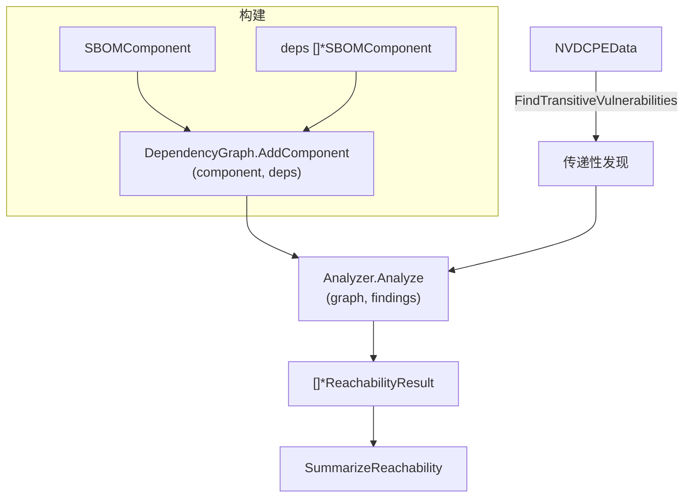

# 🕸️ 依赖图与可达性

依赖树里的漏洞并非都能从应用代码触达。可达性分析遍历依赖图，把每条发现标记为 `direct`、`transitive` 或 `unknown`，让你把修复精力集中在真正可被调用的漏洞上。

## 概念

构建 `DependencyGraph` 时，逐个加入组件及其直接依赖。可达性分析器随后对照一组发现遍历该图，按发现报告受影响组件是否从根可达。



## 构建图并分析

```go
package main

import (
    "fmt"

    cpeskills "github.com/scagogogo/cpe-skills"
)

func main() {
    graph := cpeskills.NewDependencyGraph()

    app := cpeskills.NewSBOMComponent("my-app", "1.0")
    lib := cpeskills.NewSBOMComponent("log4j-core", "2.14.0")
    transitive := cpeskills.NewSBOMComponent("jackson-databind", "2.9.0")

    graph.AddComponent(app, []*cpeskills.SBOMComponent{lib})
    graph.AddComponent(lib, []*cpeskills.SBOMComponent{transitive})

    analyzer := cpeskills.NewDependencyGraphReachabilityAnalyzer()
    results, err := analyzer.Analyze(graph, findings)
    if err != nil {
        panic(err)
    }

    summary := cpeskills.SummarizeReachability(results)
    fmt.Printf("direct=%d transitive=%d\n", summary.Direct, summary.Transitive)
}
```

## 传递性漏洞与快速检查

```go
// 对照 NVD，发现从图根传递可达的漏洞。
transitiveFindings := graph.FindTransitiveVulnerabilities(nvdData)

// 不跑完整分析，针对单条发现做快速检查。
result := cpeskills.QuickReachabilityCheck(graph, lib, singleFinding)
if result.Level == cpeskills.ReachabilityDirect ||
    result.Level == cpeskills.ReachabilityTransitive {
    fmt.Println("漏洞可从根组件触达")
}
```

## 最佳实践

- **把应用作为图的根** —— 可达性从根开始计算；没有根，每个组件都被视作孤立。
- **分析前先跑 `FindTransitiveVulnerabilities`** —— 用以填充分析器消费的发现集合。
- **用 `SummarizeReachability` 出报告**，用 `GetActionableFindings(results)` 抽取可达发现喂给风险评分。

## 相关模块

- [SBOM](./sbom.md) —— 组件与 `AddDependency` 关系喂给图。
- [风险评分](./risk-scoring.md) —— 可达的发现评分更高。
- [EPSS 与 KEV](./epss-kev.md) —— 在排优先级前丰富化可达发现。
