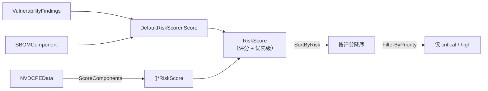

# 🎯 风险评分

风险评分把一份扁平的漏洞清单转化为按优先级排序的可操作队列。`cpeskills` 综合考量 CVSS 严重度、EPSS 利用概率、KEV 收录情况与可达性，输出单一数值评分与 `RiskPriority` 桶位，让工程师明确先修什么。

## 概念

`DefaultRiskScorer` 对每条发现加权多种信号并产出 `*RiskScore`。可逐组件评分，也可针对整个 SBOM 批量评分（对照 NVD 数据集）。结果可排序、可按优先级过滤。



`RiskPriority` 桶位：`critical`、`high`、`medium`、`low`、`none`。

## 单组件评分

```go
package main

import (
    "fmt"

    cpeskills "github.com/scagogogo/cpe-skills"
)

func main() {
    scorer := cpeskills.NewDefaultRiskScorer()
    // findings 来自 sbom.FindVulnerableComponents(cves)[i].Vulnerabilities
    score := scorer.Score(findings, comp)
    fmt.Printf("评分=%.2f 优先级=%s\n", score.OverallScore, score.Priority)
}
```

## 批量评分与过滤

```go
nvdData, err := cpeskills.DownloadAllNVDData(&cpeskills.NVDFeedOptions{Years: []int{2024}})
if err != nil {
    log.Fatal(err)
}

scores := cpeskills.ScoreComponents(allComponents, nvdData)
cpeskills.SortByRisk(scores) // 风险最高者居前

// 本迭代只处理 critical，其余暂缓。
critical := cpeskills.FilterByPriority(scores, cpeskills.RiskPriorityCritical)
fmt.Printf("需修复 %d 项 critical\n", len(critical))
```

## 最佳实践

- **先丰富化再评分** —— 先用 EPSS 与 KEV（见 [EPSS 与 KEV](./epss-kev.md)）丰富化发现；评分器消费的就是这些信号。
- **结合 VEX 使用** —— 在评分前应用 VEX 剔除 `not_affected` 发现，否则不可利用项仍可能冒到顶部。
- **用 `FilterByPriority` 规划迭代** —— 排一次序，再按桶位切片，量力而行地安排修复工作量。

## 相关模块

- [SBOM](./sbom.md) —— 喂给评分器的组件与发现。
- [EPSS 与 KEV](./epss-kev.md) —— 丰富化发现以支撑更丰满的评分。
- [可达性](./reachability.md) —— 可达的发现评分更高。
