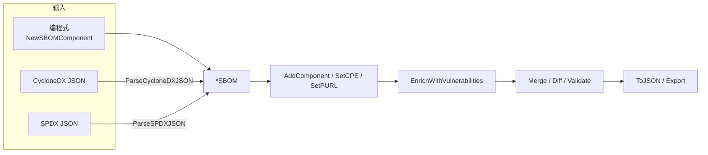

# 📦 SBOM（软件物料清单）

SBOM 是一份机器可读的组件清单，记录软件产品中每个组件的名称、版本、标识符（CPE / PURL）以及依赖关系。在 `cpeskills` 中，`*SBOM` 是中心对象——解析、漏洞丰富化、风险评分、VEX 与导出都围绕它展开。

## 概念

库支持两种行业标准 SBOM 格式——**CycloneDX** 与 **SPDX**——并统一封装为 `*SBOM` 类型。你既可以编程式地从组件构建 SBOM，也可以解析已有的 CycloneDX/SPDX 文档。构建完成后，可以用 NVD 漏洞数据丰富化、与其他 SBOM 合并、做差异对比，以及校验。



## 编程式构建 SBOM

```go
package main

import (
    "fmt"

    cpeskills "github.com/scagogogo/cpe-skills"
)

func main() {
    sbom := cpeskills.NewSBOM(cpeskills.SBOMFormatCycloneDX, "my-app")

    cpe := cpeskills.MustParse("cpe:2.3:a:log4j:log4j:2.14.0:*:*:*:*:*:*:*")
    purl, _ := cpeskills.ParsePURL("pkg:maven/org.apache.logging.log4j/log4j-core@2.14.0")

    comp := cpeskills.NewSBOMComponent("log4j-core", "2.14.0")
    comp.SetCPE(cpe)
    comp.SetPURL(purl)
    sbom.AddComponent(comp)

    data, err := sbom.ToJSON()
    if err != nil {
        panic(err)
    }
    fmt.Printf("SBOM 含 %d 个组件，JSON %d 字节\n", sbom.ComponentCount(), len(data))
}
```

## 解析已有的 CycloneDX / SPDX

```go
cdxData, _ := os.ReadFile("bom.cdx.json")
sbom, err := cpeskills.ParseCycloneDXJSON(cdxData)
if err != nil {
    log.Fatal(err)
}

spdxData, _ := os.ReadFile("bom.spdx.json")
spdxSbom, err := cpeskills.ParseSPDXJSON(spdxData)
if err != nil {
    log.Fatal(err)
}
```

## 丰富化、合并、差异、校验

```go
// 拉取 NVD 数据源，把漏洞发现附加到匹配的组件上。
nvdData, err := cpeskills.DownloadAllNVDData(&cpeskills.NVDFeedOptions{Years: []int{2021}})
if err != nil {
    log.Fatal(err)
}
if err := sbom.EnrichWithVulnerabilities(nvdData); err != nil {
    log.Fatal(err)
}

// 合并多个 SBOM（例如应用 + 基础镜像）。
merged, err := cpeskills.MergeSBOMs([]*cpeskills.SBOM{sbom, spdxSbom},
    cpeskills.SBOMFormatCycloneDX, "merged-bom")
if err != nil {
    log.Fatal(err)
}

// 对比两个 SBOM 以跟踪变更（新增 / 移除 / 变更）。
diff := cpeskills.DiffSBOMs(oldSBOM, merged)
fmt.Printf("变更: %s\n", diff.Summary())

// 校验可捕获缺失标识符、重复引用等问题。
for _, problem := range cpeskills.ValidateSBOM(merged) {
    fmt.Println("校验问题:", problem)
}
```

## 最佳实践

- **同时设置 CPE 与 PURL** —— CPE 用于匹配 NVD，PURL 用于匹配包生态，丰富化流程两者并用。
- **解析外部 SBOM 或合并后务必校验** —— 第三方 SBOM 常出现版本缺失或 `bomRef` 重复。
- **缓存 `*NVDCPEData`** 跨多次运行复用 —— 下载数据源代价高，丰富化、风险评分、可达性分析都能复用同一份数据。

## 相关模块

- [VEX](./vex.md) —— 在 SBOM 发现之上声明可利用性状态。
- [风险评分](./risk-scoring.md) —— 对 SBOM 上的发现排序。
- [清单转 SBOM](./manifest.md) —— 直接从 `go.mod` / `package.json` 生成 SBOM。
- [导出格式](./export.md) —— 把 SBOM 序列化回 CycloneDX / SPDX。
