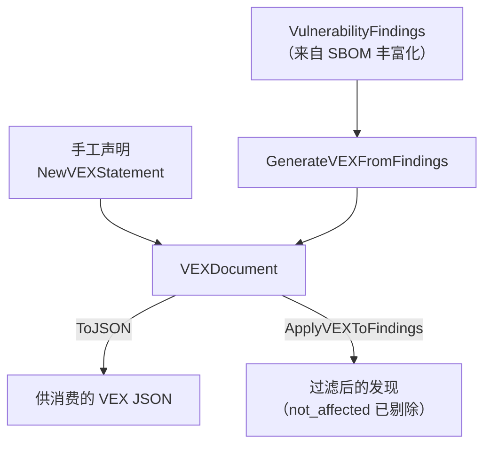

# 🛡️ VEX（漏洞可利用性交换）

VEX 文档针对某个具体产品回答一个问题：*"CVE-XXXX-YYYY 在我的构建中到底能不能被利用？"* 它让你以权威声明的形式，剔除组件中并不受影响的漏洞噪声，而不必让下游重新分析一遍。

## 概念

VEX 文档是一组**声明**的集合。每条声明将一个漏洞 ID 与一个产品 ID 用四种状态之一绑定。`cpeskills` 既支持手工构建 VEX 文档，也支持从 SBOM 组件上的发现自动生成——后者更实用，随后可把该文档反向应用到发现集合上完成过滤。



四种 `VEXStatus` 取值：

| 状态 | 含义 |
|---|---|
| `not_affected` | 漏洞代码路径不存在或不可达。 |
| `affected` | 产品可被利用。 |
| `fixed` | 产品已包含修复。 |
| `under_investigation` | 仍在分析中。 |

## 手工创建 VEX 文档

```go
package main

import (
    "fmt"

    cpeskills "github.com/scagogogo/cpe-skills"
)

func main() {
    doc := cpeskills.NewVEXDocument("cyclonedx", "my-app:1.0", "My App", "security-team")
    doc.AddStatement(cpeskills.NewVEXStatement(
        "CVE-2021-44228", "my-app:1.0", cpeskills.VEXNotAffected,
    ))
    doc.AddStatement(cpeskills.NewVEXStatement(
        "CVE-2023-1234", "my-app:1.0", cpeskills.VEXAffected,
    ))

    data, err := doc.ToJSON()
    if err != nil {
        panic(err)
    }
    fmt.Printf("VEX 含 %d 条声明，%d 字节\n", doc.StatementCount(), len(data))
}
```

## 从发现生成 VEX 并回应用用

这是典型流水线：丰富化 SBOM、为发现生成 VEX，再在出报告前应用 VEX 过滤掉 `not_affected` 项。

```go
// findings 可通过 sbom.FindVulnerableComponents(cves) 获取，
// 返回的 []*VulnerableComponent 每个带 .Vulnerabilities 字段。
var findings []*cpeskills.VulnerabilityFinding
doc := cpeskills.GenerateVEXFromFindings(comp, findings, "my-app:1.0")

// 人工研判：更新已调查的声明。
if stmt := doc.FindStatement("CVE-2021-44228"); stmt != nil {
    stmt.Status = cpeskills.VEXNotAffected // 代码路径不可达
}

// 回应用用：not_affected 的发现从结果集中移除。
actionable := cpeskills.ApplyVEXToFindings(findings, doc)
fmt.Printf("剩余 %d 条可操作发现\n", len(actionable))
```

## 最佳实践

- **VEX 文档须按产品隔离** —— `my-app:1.0` 的 `not_affected` 声明不能迁移到另一个构建配置。
- **先生成、后研判** —— `GenerateVEXFromFindings` 把每条发现初始化为 `under_investigation`，由团队逐条更新，而非一律默认 `not_affected`。
- **每次刷新 SBOM 都要重新应用 VEX** —— 状态绑定具体版本；降级会使 `fixed` 声明失效。

## 相关模块

- [SBOM](./sbom.md) —— VEX 声明所注解的发现来源。
- [风险评分](./risk-scoring.md) —— VEX 过滤后的发现喂给评分器以准确排优先级。
- [导出格式](./export.md) —— 把应用 VEX 后的发现序列化为 SARIF/CSV。
