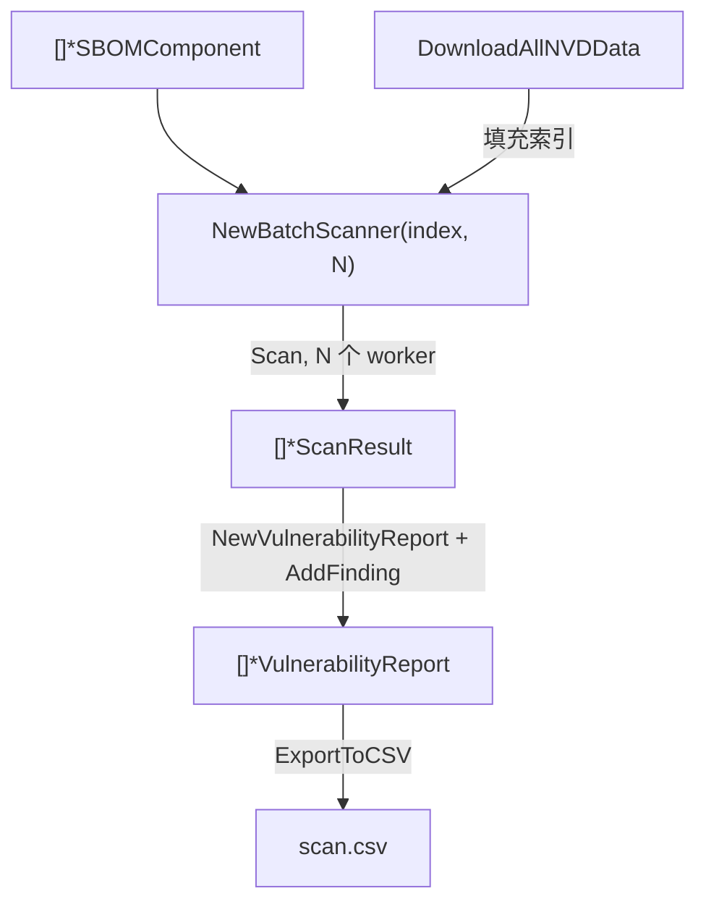

# ⚡ 教程：批量并发扫描大量 CPE

当组件数量达数百上千时，逐个扫描太慢。`NewBatchScanner` 基于 `CPEIndex` 与一组漏洞数据源并发扫描，返回可直接导出的 `[]*ScanResult`。

## 目标

并发扫描一批组件，收集每个组件的发现与风险评分，并写一份 CSV 汇总。

## 前置条件

- Go 1.25+
- `go get github.com/scagogogo/cpe-skills`
- 一份 `*SBOMComponent` 列表（最好每个都带 CPE）

## 步骤

### 1. 组装组件与索引

```go
package main

import (
	"fmt"
	"os"

	cpeskills "github.com/scagogogo/cpe-skills"
)

func main() {
	comps := []*cpeskills.SBOMComponent{
		cpeskills.NewSBOMComponent("log4j", "2.14.0"),
		cpeskills.NewSBOMComponent("spring-core", "5.3.0"),
		cpeskills.NewSBOMComponent("openssl", "1.1.1k"),
	}
	comps[0].SetCPE(cpeskills.MustParse("cpe:2.3:a:apache:log4j:2.14.0:*:*:*:*:*:*:*"))
	comps[1].SetCPE(cpeskills.MustParse("cpe:2.3:a:pivotal_software:spring_framework:5.3.0:*:*:*:*:*:*:*"))
	comps[2].SetCPE(cpeskills.MustParse("cpe:2.3:a:openssl:openssl:1.1.1k:*:*:*:*:*:*:*"))

	index := cpeskills.NewCPEIndex(nil) // 已知 CPE 索引；nil = 空，用于匹配
```

### 2. 创建批量扫描器并接入数据源

```go
	scanner := cpeskills.NewBatchScanner(index, 8) // 8 个并发 worker
	nvdData, err := cpeskills.DownloadAllNVDData(nil)
	if err != nil {
		fmt.Printf("下载 nvd: %v\n", err)
		os.Exit(2)
	}
	ds := cpeskills.NewVulnDataSource("nvd", "NVD", "NVD CPE/CVE 数据源", "")
	_ = ds
	scanner.SetDataSources(nil) // CVE 查询数据源；NVD 匹配数据通过 index/nvdData 提供
```

> 批量扫描器把索引（用于 CPE 匹配）与可选的 `VulnDataSource`（用于 CVE 详情查询）配合使用。实际中，把 NVD CPE 匹配数据填入索引，让每个 worker 本地解析 CVE，避免重复下载。

### 3. 扫描并收集结果

```go
	results, err := scanner.Scan(comps)
	if err != nil {
		fmt.Printf("扫描: %v\n", err)
		os.Exit(2)
	}
	for _, r := range results {
		fmt.Printf("- %s@%s  发现=%d  耗时=%s\n",
			r.Component.Name, r.Component.Version, len(r.Vulnerabilities), r.Duration)
	}
```

### 4. 导出为 CSV

为每个组件构建 `VulnerabilityReport`，按批写 CSV。

```go
	var reports []*cpeskills.VulnerabilityReport
	for _, r := range results {
		rep := cpeskills.NewVulnerabilityReport(r.Component)
		for _, f := range r.Vulnerabilities {
			rep.AddFinding(f)
		}
		reports = append(reports, rep)
	}
	csv, err := cpeskills.ExportToCSV(reports)
	if err != nil {
		fmt.Printf("导出: %v\n", err)
		os.Exit(2)
	}
	_ = os.WriteFile("scan.csv", csv, 0o644)
	fmt.Println("已写入 scan.csv")
}
```

## 批量流程



## 预期输出

```
- log4j@2.14.0  发现=2  耗时=12ms
- spring-core@5.3.0  发现=1  耗时=9ms
- openssl@1.1.1k  发现=3  耗时=11ms
已写入 scan.csv
```

CSV 每行一条发现，含组件、CVE、EPSS、KEV、修复版本等列。

## 注意事项

- 并发度是 `NewBatchScanner` 第二个参数；CPU 密集型取接近 CPU 核数，远程 I/O 密集型可取更大。
- `Scan` 阻塞到所有组件完成；每个 `ScanResult` 自带 `Duration` 与 `Error`，单个失败不会中断整批。
- 对 SBOM 级（数千组件）扫描，建议从 NVD 数据构建一次 `CPEIndex` 并跨运行复用。

## 小结

你并发扫描了一批组件，收集了每个组件的发现与耗时，并导出了 CSV。这是企业级每夜扫描的基础构件。
