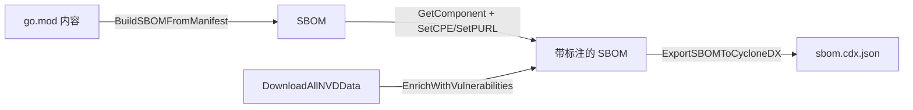
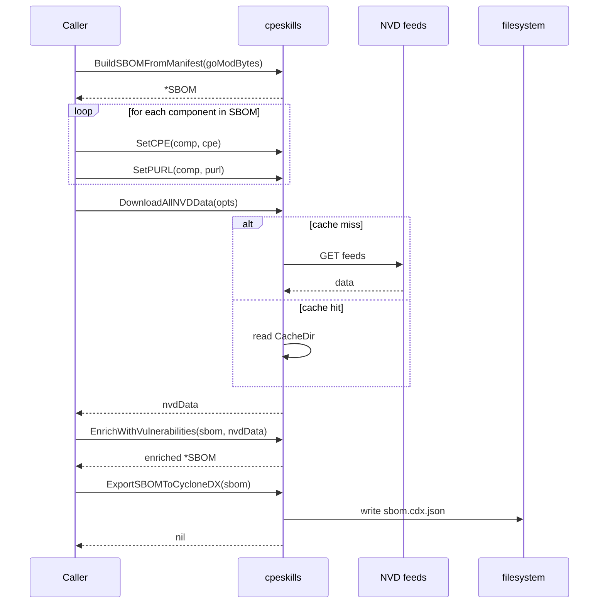

# 🏗️ 教程：从代码构建 SBOM

直接从 `go.mod` 清单生成 CycloneDX SBOM，为每个组件附加 CPE/PURL 标识，再用漏洞数据丰富后导出。把产物放进发布物，或交给下游扫描器。

## 目标

读取 `go.mod` 内容，产出一份 CycloneDX JSON 文档，其中组件带有 PURL、CPE，以及（可选的）漏洞发现。

## 前置条件

- Go 1.25+
- `go get github.com/scagogogo/cpe-skills`
- 一份可读入为字符串的 `go.mod`

## 步骤

### 1. 从清单构建 SBOM

`BuildSBOMFromManifest` 根据文件名扩展名选择解析器（go.mod、package.json、requirements.txt 等），解析后把每个依赖包装成 `SBOMComponent`。

```go
package main

import (
	"fmt"
	"os"

	cpeskills "github.com/scagogogo/cpe-skills"
)

func main() {
	content, err := os.ReadFile("go.mod")
	if err != nil {
		panic(err)
	}
	sbom, err := cpeskills.BuildSBOMFromManifest("go.mod", string(content), "my-app")
	if err != nil {
		panic(err)
	}
	fmt.Printf("SBOM 含 %d 个组件\n", sbom.ComponentCount())
```

### 2. 为组件附加 CPE 与 PURL

按引用取出组件，打上显式 CPE + PURL。对于那些启发式映射器难以确信的生态，正是这样手动桥接的。

```go
	if comp := sbom.GetComponent("pkg:golang/github.com/apache/log4j@v2.14.0"); comp != nil {
		comp.SetCPE(cpeskills.MustParse("cpe:2.3:a:apache:log4j:2.14.0:*:*:*:*:*:*:*"))
		purl, _, _ := cpeskills.CPEToPURL(comp.CPE)
		if purl != nil {
			comp.SetPURL(purl)
		}
	}
```

### 3. 用漏洞数据丰富

若已下载 NVD 数据（见《识别漏洞》教程），一次调用即可把发现附加到所有组件。

```go
	nvdData, _ := cpeskills.DownloadAllNVDData(nil)
	if err := sbom.EnrichWithVulnerabilities(nvdData); err != nil {
		fmt.Printf("丰富步骤跳过: %v\n", err)
	}
```

### 4. 导出为 CycloneDX

```go
	out, err := cpeskills.ExportSBOMToCycloneDX(sbom)
	if err != nil {
		panic(err)
	}
	if err := os.WriteFile("sbom.cdx.json", out, 0o644); err != nil {
		panic(err)
	}
	fmt.Println("已写入 sbom.cdx.json")
}
```

## 流程总览



## 构建时序

流程图隐藏了逐组件循环。时序图把迭代显式画出来：



## 预期输出

```
SBOM 含 23 个组件
已写入 sbom.cdx.json
```

生成的 `sbom.cdx.json` 是一份合法的 CycloneDX BOM，可用 `cyclonedx validate` 校验。

## 注意事项

- `BuildSBOMFromManifest` 委托给 `pkg/parsers` 子包；解析器按文件名选择，所以请传入真实文件名（如 `"package.json"`，不要用占位符）。
- `EnrichWithVulnerabilities` 只为带 CPE 的组件填充发现——没有 CPE 的组件会被静默跳过。
- 对你确知的产品，优先用显式 `SetCPE` 而非启发式映射器；映射器的置信度分（`CPEToPURL` 第二个返回值）就是是否信任它的信号。

## 小结

你把清单变成了 SBOM，为组件标注了 CPE/PURL，用 NVD 发现做了丰富，并导出了 CycloneDX。同一个 SBOM 对象也可通过 `ExportSBOMToSPDX` 序列化为 SPDX。
