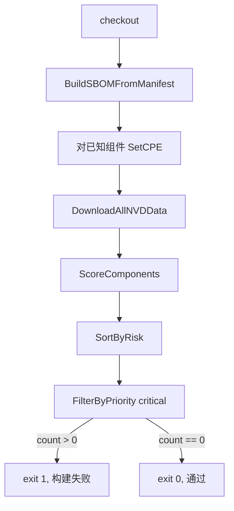

# 🤖 教程：在 CI 中扫描漏洞

把 `cpeskills` 接入 CI 任务，让构建在出现 critical 级风险组件时失败。任务构建 SBOM、用 NVD 给每个组件打分、过滤出 critical 优先级、若有则非零退出。

## 目标

一个 Go 程序：当项目含至少一个 `critical` 优先级漏洞时返回退出码 1，否则返回 0。直接放进 GitHub Actions / GitLab CI 当闸门。

## 前置条件

- Go 1.25+
- `go get github.com/scagogogo/cpe-skills`
- 构建时能访问项目的 `go.mod`

## 步骤

### 1. 构建 SBOM 并拉取 NVD

```go
package main

import (
	"fmt"
	"os"

	cpeskills "github.com/scagogogo/cpe-skills"
)

func main() {
	content, _ := os.ReadFile("go.mod")
	sbom, err := cpeskills.BuildSBOMFromManifest("go.mod", string(content), "ci-build")
	if err != nil {
		fmt.Printf("构建 sbom: %v\n", err)
		os.Exit(2)
	}
	nvdData, err := cpeskills.DownloadAllNVDData(nil)
	if err != nil {
		fmt.Printf("下载 nvd: %v\n", err)
		os.Exit(2)
	}
```

### 2. 给每个组件打分

`ScoreComponents` 遍历 SBOM，对每个组件 CPE 用 `FindCVEsForCPE` 查 CVE，再用默认风险评分器（CVSS + EPSS + KEV + 可达性）逐个评分。无 CPE 的组件记零分，返回 `[]*RiskScore`。

```go
	// 组件必须带 CPE，评分器才能查到 CVE。
	// 在此处为你确知的组件显式 SetCPE（见《构建 SBOM》教程）。

	scores := cpeskills.ScoreComponents(componentsOf(sbom), nvdData)
	cpeskills.SortByRisk(scores)
```

### 3. 过滤 critical 并设闸门

```go
	critical := cpeskills.FilterByPriority(scores, cpeskills.RiskPriorityCritical)
	for _, s := range critical {
		fmt.Printf("阻断: %s priority=%s score=%.1f\n",
			s.ComponentID, s.Priority, s.OverallScore)
	}
	if len(critical) > 0 {
		os.Exit(1)
	}
	fmt.Println("无 critical 漏洞，构建通过")
}

// componentsOf 把 SBOM 摊平为组件切片给评分器用。
// 用 BuildSBOMFromManifest 返回的切片，或在添加组件时自行记录。
func componentsOf(sbom *cpeskills.SBOM) []*cpeskills.SBOMComponent {
	var out []*cpeskills.SBOMComponent
	for i := 0; i < sbom.ComponentCount(); i++ {
		// 实际中请保留构建 SBOM 时得到的 []*SBOMComponent 切片直接传入。
	}
	return out
}
```

> `componentsOf` 仅为占位——请保留构建 SBOM 时组装的 `[]*SBOMComponent` 切片直接传入。`ScoreComponents` 自行查 CVE，无需你预先丰富发现。

## CI 流水线



## 预期输出（失败运行）

```
阻断: pkg:golang/github.com/apache/log4j@v2.14.0 priority=critical score=9.4
exit status 1
```

## 注意事项

- 让此任务按计划运行（如每夜），而不只在 PR 上跑——新披露的 CVE 会影响未改动的代码。
- `ScoreComponents` 在 `determinePriority` 中参考 KEV 标记：KEV 收录且分数 ≥ 7.0 直接升为 `critical`。但 `ScoreComponents` 构造的是不含 EPSS/KEV 的最小化发现，要拿到 KEV 标记请改用 `NewDefaultRiskScorer().Score` 自行丰富后评分。
- 用 `NewFileStorage` 在运行间缓存 NVD 下载（见《存储策略》教程），让 CI 更快。

## 小结

你构建了 SBOM、打分、过滤 critical，并把结果变成了通过/失败闸门。配合存储与批量教程，可扩展到大型 monorepo。
