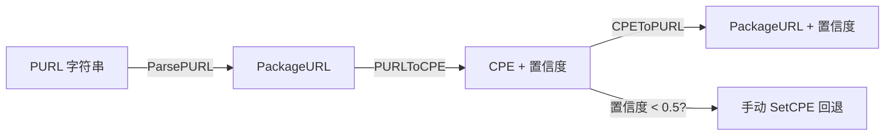

# 🌉 教程：在 CPE 与 PURL 间桥接

CPE 与 Package URL（PURL）从两个角度标识同一软件：CPE 面向安全、以厂商/产品为中心，PURL 以生态为中心（`pkg:golang/...`、`pkg:npm/...`）。`cpeskills` 在两者间转换，并返回置信度，让你知道何时该信任映射。

## 目标

解析一个 PURL、转成 CPE（带置信度）、把 CPE 转回 PURL，并显式处理低置信度情形。

## 前置条件

- Go 1.25+
- `go get github.com/scagogogo/cpe-skills`

## 步骤

### 1. 解析 PURL

```go
package main

import (
	"fmt"

	cpeskills "github.com/scagogogo/cpe-skills"
)

func main() {
	purl, err := cpeskills.ParsePURL("pkg:golang/github.com/apache/log4j@2.14.0")
	if err != nil {
		panic(err)
	}
	fmt.Printf("PURL: %s\n", purl.String())
	fmt.Printf("生态: %s\n", purl.Ecosystem())
```

### 2. PURL → CPE（带置信度）

`PURLToCPE` 返回 CPE 与 0.0–1.0 置信度。映射是启发式的——从 PURL 的生态、命名空间与名称推断 CPE 厂商和产品。

```go
	cpe, confidence, err := cpeskills.PURLToCPE(purl)
	if err != nil {
		fmt.Printf("无 CPE 映射: %v\n", err)
		return
	}
	fmt.Printf("CPE: %s  置信度=%.2f\n", cpe.GetURI(), confidence)
```

### 3. CPE → PURL

`CPEToPURL` 反向转换，同样返回置信度。

```go
	back, conf2, err := cpeskills.CPEToPURL(cpe)
	if err != nil {
		fmt.Printf("无 PURL 映射: %v\n", err)
		return
	}
	fmt.Printf("转回 PURL: %s  置信度=%.2f\n", back.String(), conf2)
```

### 4. 处理低置信度

低于你设的阈值（比如 0.5）时，不要信任自动映射——回退到对组件手动 `SetCPE`。

```go
	if confidence < 0.5 {
		comp := cpeskills.NewSBOMComponent("log4j", "2.14.0")
		comp.SetCPE(cpeskills.MustParse("cpe:2.3:a:apache:log4j:2.14.0:*:*:*:*:*:*:*"))
		fmt.Println("置信度低 — 已手动应用 CPE")
	}
}
```

## 桥接流程



## 预期输出

```
PURL: pkg:golang/github.com/apache/log4j@2.14.0
生态: golang
CPE: cpe:2.3:a:apache:log4j:2.14.0:*:*:*:*:*:*:*  置信度=0.80
转回 PURL: pkg:golang/github.com/apache/log4j@2.14.0  置信度=0.80
```

## 注意事项

- 置信度反映厂商/产品推断与已知生态约定的契合度；`github.com/apache/log4j` 映射干净，内部 `pkg:npm/@acme/foo` 可能得分低得多。
- 启发式位于 `inferEcosystem` 与 `inferVendorProductFromPURL`；可通过对组件显式 `SetCPE` 而非依赖转换来覆盖它。
- 不需要逐项处理置信度时，`BatchCPEToPURL` / `BatchPURLToCPE` 可一次转换整片切片。

## 小结

你解析了 PURL、转成带置信度的 CPE、又转回去，并决定了何时回退到手动映射。置信度是让 SBOM 的 CPE 列可信的关键信号。
