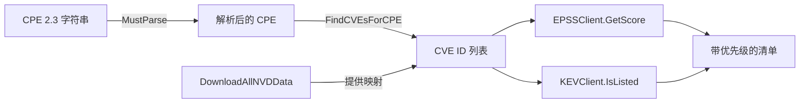

# 🔍 教程：识别产品的已知漏洞

走通完整流程：解析 CPE → 下载 NVD 数据 → 查找 CVE → 用 EPSS 与 KEV 丰富。完成后，你能为任意可命名 CPE 的产品生成一份带优先级的漏洞清单。

## 目标

给定一个产品 CPE（例如 `log4j`），产出影响它的 CVE 列表，每条都附带 EPSS 被利用概率分数与 CISA KEV「正被利用」标记。

## 前置条件

- Go 1.25+
- 已初始化模块：`go mod init example.com/vulnscan`
- 已添加依赖：`go get github.com/scagogogo/cpe-skills`
- 可访问外网（NVD、EPSS、KEV 数据源需实时拉取）

## 步骤

### 1. 解析 CPE

从 CPE 2.3 字符串开始。`MustParse` 在字符串格式错误时会 panic，对硬编码值没问题。

```go
package main

import (
	"fmt"
	"log"

	cpeskills "github.com/scagogogo/cpe-skills"
)

func main() {
	cpe := cpeskills.MustParse("cpe:2.3:a:apache:log4j:2.14.0:*:*:*:*:*:*:*")
	fmt.Println("解析:", cpe.GetURI())
```

### 2. 下载 NVD CPE/CVE 映射数据

`DownloadAllNVDData` 拉取官方 CPE 字典与双向 CPE↔CVE 匹配数据。传 `nil` 使用默认数据源选项。

```go
	data, err := cpeskills.DownloadAllNVDData(nil)
	if err != nil {
		log.Fatalf("下载 NVD: %v", err)
	}
```

### 3. 查找影响该 CPE 的 CVE

```go
	cveIDs := data.FindCVEsForCPE(cpe)
	fmt.Printf("找到 %d 个 CVE\n", len(cveIDs))
```

### 4. 用 EPSS 与 KEV 丰富每条 CVE

EPSS 给出 0.0–1.0 的被利用概率分；KEV 告诉你 CISA 是否已确认其在野外被利用。

```go
	epss := cpeskills.NewEPSSClient()
	kev := cpeskills.NewKEVClient()
	for _, id := range cveIDs {
		entry, _ := epss.GetScore(id)
		listed, _ := kev.IsListed(id)
		level := "n/a"
		if entry != nil {
			level = entry.GetRiskLevel() // "high" | "critical" | ...
		}
		fmt.Printf("- %s  EPSS=%s  KEV=%v\n", id, level, listed)
	}
}
```

## 流程总览



## 预期输出

```
解析: cpe:2.3:a:apache:log4j:2.14.0:*:*:*:*:*:*:*
找到 2 个 CVE
- CVE-2021-44228  EPSS=critical  KEV=true
- CVE-2021-45046  EPSS=high  KEV=true
```

## 注意事项

- 首次运行 NVD 下载体量数百 MB；后续运行会按数据源选项的缓存设置复用缓存。
- `GetScore` 与 `IsListed` 内部都有缓存，所以循环大量 CVE 时首调之后开销很小。
- 标记 `KEV=true` 的 CVE 无论 CVSS 高低，都应视为需立即打补丁的紧急项。

## 小结

你解析了 CPE、下载了 NVD 映射、枚举了 CVE，并用 EPSS + KEV 排定优先级。接下来可以把 CVE ID 喂给 `VulnerabilityReport`（见下一篇教程），或用风险评分器排序。
