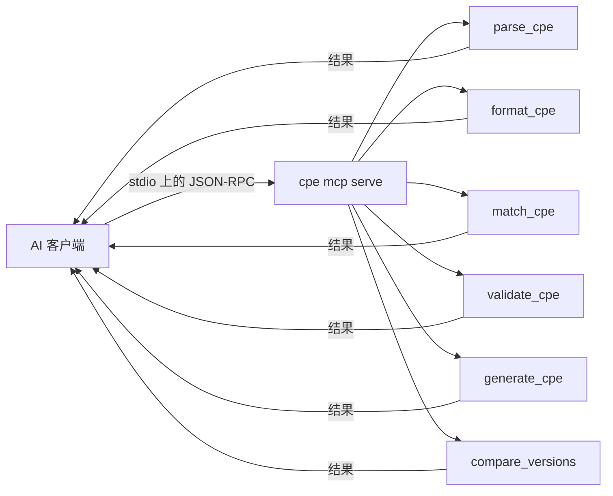

# 🧠 教程：用 MCP 把 cpe-skills 接入 AI 客户端

`cpe mcp serve` 子命令把 cpe-skills 作为 Model Context Protocol (MCP) 服务在 stdio 上运行。任何支持 MCP 的客户端——Claude Desktop、Continue、自定义 agent——即可直接调用 CPE 解析、匹配与校验工具，无需你写胶水代码。

## 目标

配置 Claude Desktop，使其能解析 CPE、校验 CPE、比较两个版本——全部通过调用 cpe-skills MCP 服务完成。

## 前置条件

- `cpe` 二进制已在 `PATH`（在仓库根目录 `go install ./cmd/cpe` 构建）
- 已安装 Claude Desktop，或任意能读 `mcpServers` 配置的 MCP 客户端

## 步骤

### 1. 验证服务可启动

```bash
cpe mcp serve
```

它从 stdin 读取、向 stdout 写 JSON-RPC。在客户端发请求前没有交互输出；按 Ctrl-C 停止。

### 2. 在 Claude Desktop 注册服务

打开 Claude Desktop 配置文件：

- macOS：`~/Library/Application Support/Claude/claude_desktop_config.json`
- Windows：`%APPDATA%\Claude\claude_desktop_config.json`

添加 `cpe-skills` 条目：

```json
{
  "mcpServers": {
    "cpe-skills": {
      "command": "cpe",
      "args": ["mcp", "serve"]
    }
  }
}
```

重启 Claude Desktop，工具会出现在 cpe-skills 服务下。

### 3. 在对话中使用工具

这样问 Claude：

> "解析 `cpe:2.3:a:apache:log4j:2.14.0:*:*:*:*:*:*:*`，然后告诉我 2.14.1 是否比 2.14.0 更新。"

Claude 会先调 `parse_cpe` 拆解字符串，再调 `compare_versions` 比较两者。工具调用会内联显示。

### 4. 确认工具已注册

重启后，打开 Claude Desktop 的连接器面板，展开 `cpe-skills`，应能看到全部六个工具。若面板显示连接错误，说明找不到 `cpe` 二进制——修正 `command` 路径后再次重启。

快速冒烟测试：让 Claude "validate `cpe:2.3:a:apache:log4j:2.14.0:*:*:*:*:*:*:*`"。它应调用 `validate_cpe` 并报告该 CPE 格式正确。

## 六个暴露的工具



| 工具 | 输入 | 返回 |
|------|------|------|
| `parse_cpe` | CPE 2.2/2.3 字符串 | part、vendor、product、version、update … |
| `format_cpe` | 各组件 + 目标格式（`2.2`/`2.3`/`wfn`） | 格式化后的 CPE 字符串 |
| `match_cpe` | 两个 CPE 字符串 | 是否匹配（NISTIR 7696） |
| `validate_cpe` | 一个 CPE 字符串 | 是否合法 + 错误信息 |
| `generate_cpe` | part、vendor、product、version | 一条 CPE 2.3 URI |
| `compare_versions` | 两个版本字符串 | 顺序（`-1`/`0`/`1`） |

## 预期行为

重启后，cpe-skills 服务会列在 Claude Desktop 的连接器面板。让它"为 Apache log4j 2.14.0 生成 CPE"，结果为：

```
generate_cpe(part="a", vendor="apache", product="log4j", version="2.14.0")
  → cpe:2.3:a:apache:log4j:2.14.0:*:*:*:*:*:*:*
```

## 注意事项

- 若 `cpe` 不在 PATH，请在 `command` 用绝对路径（如 `/home/me/go/bin/cpe`）。
- 服务在工具调用间无状态——每次调用相互独立，可大量并发。
- `cpe mcp serve` 实现于 `cmd/cpe/mcp.go`，基于官方 `modelcontextprotocol/go-sdk`。

## 小结

你把 cpe-skills 暴露为六个 MCP 工具，并让 Claude Desktop 指向它。AI 现在能解析、生成、校验、匹配、比较 CPE，而无需你交付包装层。
