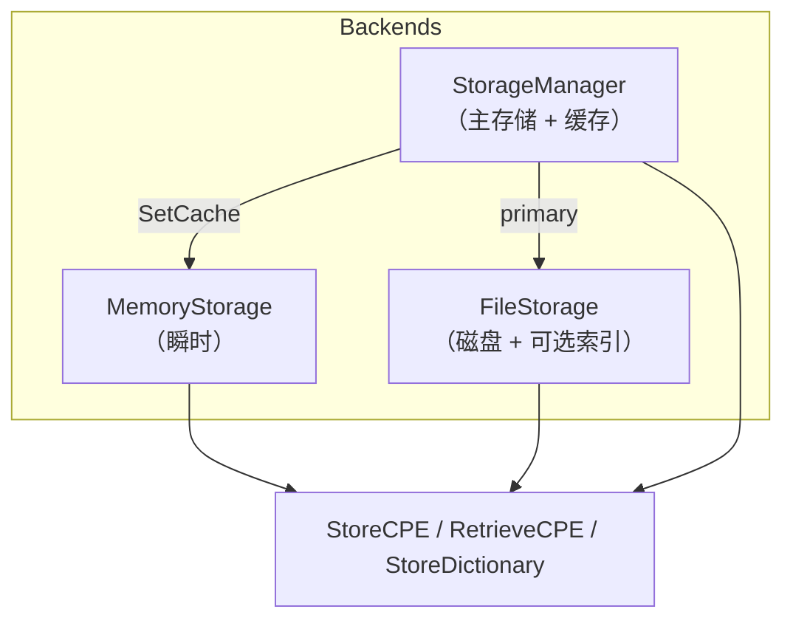

# 💾 教程：选择与配置存储

`cpeskills` 把持久化解耦在 `Storage` 接口背后，提供三个开箱即用的实现：内存（快、瞬时）、文件（磁盘持久化）、`StorageManager`（主存储 + 可选缓存层）。本教程展示何时各用其一，以及如何通过它们管理 CPE 字典。

## 目标

用每种存储后端存取 CPE 与 CPE 字典，并在持久存储前加一层缓存。

## 前置条件

- Go 1.25+
- `go get github.com/scagogogo/cpe-skills`

## 步骤

### 1. 内存存储（测试与临时任务）

`MemoryStorage` 仅存活于进程生命周期。单元测试与临时脚本中用它。

```go
package main

import (
	"fmt"
	"log"

	cpeskills "github.com/scagogogo/cpe-skills"
)

func main() {
	mem := cpeskills.NewMemoryStorage()
	if err := mem.Initialize(); err != nil {
		log.Fatal(err)
	}
	defer mem.Close()

	cpe := cpeskills.MustParse("cpe:2.3:a:apache:log4j:2.14.0:*:*:*:*:*:*:*")
	_ = mem.StoreCPE(cpe)
	got, _ := mem.RetrieveCPE(cpe.GetURI())
	fmt.Println("内存:", got.GetURI())
```

### 2. 文件存储（持久化）

`FileStorage` 把 CPE、CVE 与字典写入基础目录。传 `useCache=true` 可在内存中维护磁盘内容的索引以加速查询。

```go
	file, err := cpeskills.NewFileStorage("./.cpe-store", true)
	if err != nil {
		log.Fatal(err)
	}
	if err := file.Initialize(); err != nil {
		log.Fatal(err)
	}
	defer file.Close()
	_ = file.StoreCPE(cpe)
```

### 3. 带缓存层的 StorageManager

`StorageManager` 包裹一个主存储与可选缓存。读操作先查缓存，未命中再回落到主存储；写操作写入主存储（并失效对应缓存项）。当主存储较慢（远程 DB）而你需要快速本地缓存时，正是这种结构。

```go
	primary := cpeskills.NewMemoryStorage()   // 代替远程/DB 存储
	_ = primary.Initialize()

	mgr := cpeskills.NewStorageManager(primary)
	mgr.SetCache(mem) // 复用内存存储作为读穿透缓存
	_ = mgr.StoreCPE(cpe)
	got, _ := mgr.GetCPE(cpe.GetURI())
	fmt.Println("manager:", got.GetURI())
```

### 4. 管理 CPE 字典

`CPEDictionary`（所有 CPE 条目的官方清单）可被任何支持它的存储存取。

```go
	// 从 reader（如 NVD 数据文件）解析字典后持久化。
	// dict, _ := cpeskills.ParseDictionary(fileReader)
	// _ = mem.StoreDictionary(dict)
	// 之后：
	// dict, _ = mem.RetrieveDictionary()
	fmt.Println("存储演示完成")
}
```

## 存储后端



## 预期输出

```
内存: cpe:2.3:a:apache:log4j:2.14.0:*:*:*:*:*:*:*
manager: cpe:2.3:a:apache:log4j:2.14.0:*:*:*:*:*:*:*
存储演示完成
```

## 注意事项

- `MemoryStorage` 是唯一无需外部资源 `Initialize`/`Close` 的后端，但调用它们无害，且能让代码跨后端可移植。
- `FileStorage` 的 `useCache` 标志用内存换速度——读多场景开启，体量超过内存的大存储关闭。
- `StorageManager.InvalidateCache(id)` 可在写入后逐出单条；`ClearCache()` 清空全部。

## 小结

你用内存存储做临时任务、文件存储做持久化、`StorageManager` 在主存储前置缓存，并通过同一接口存取了 CPE 字典。按生命周期与速度需求选后端，API 是一致的。
