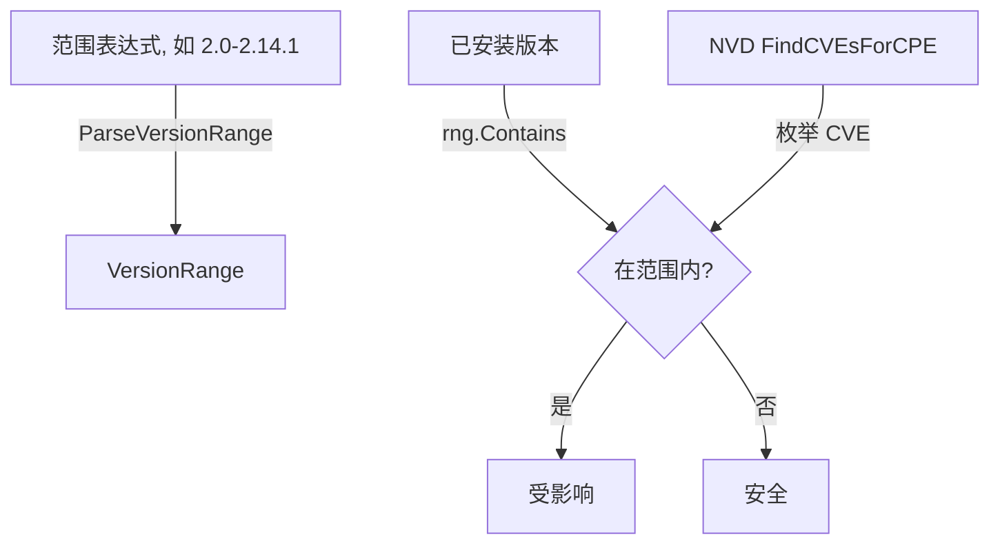

# 🎚️ 教程：用版本范围过滤受影响组件

一个 CVE 很少影响某产品的所有版本。`ParseVersionRange` 把 `2.0-2.14.1` 或 `1.2+` 这类范围表达式变成 `VersionRange`，再用 `Contains` 测试，从而判断你的组件是否真正受影响。

## 目标

给定一个 CVE 的受影响版本范围与已安装组件列表，只打印版本落在范围内的组件。

## 前置条件

- Go 1.25+
- `go get github.com/scagogogo/cpe-skills`

## 步骤

### 1. 解析范围表达式

`ParseVersionRange` 接受三种形式：单一精确版本（`1.2.3`）、闭区间（`1.2-2.0`）、开下界（`1.2+`）。

```go
package main

import (
	"fmt"

	cpeskills "github.com/scagogogo/cpe-skills"
)

func main() {
	rng, err := cpeskills.ParseVersionRange("2.0.0-2.14.1")
	if err != nil {
		panic(err)
	}
	fmt.Printf("min=%s max=%s\n", rng.MinVersion, rng.MaxVersion)
```

### 2. 用已安装版本测试范围

```go
	installed := []string{"1.7.0", "2.0.0", "2.10.0", "2.14.1", "2.15.0"}
	for _, v := range installed {
		fmt.Printf("%s 受影响=%v\n", v, rng.Contains(v))
	}
```

### 3. 结合 NVD 数据找出受影响组件

拉取 NVD 匹配数据，列出某 CPE 的 CVE，再对每条 CVE 把已安装版本与该 CVE 报告的范围比较。下例用 `FindCVEsForCPE` 枚举 CVE，并用已知范围过滤。

```go
	cpe := cpeskills.MustParse("cpe:2.3:a:apache:log4j:2.14.0:*:*:*:*:*:*:*")
	data, err := cpeskills.DownloadAllNVDData(nil)
	if err != nil {
		fmt.Printf("下载 nvd: %v\n", err)
		return
	}
	cves := data.FindCVEsForCPE(cpe)
	myVersion := "2.14.0"
	for _, id := range cves {
		// 用 CVE 公布的受影响范围（此处复用已解析范围作占位；
		// 生产中应从 CVE 的 CPE 匹配数据读取范围）。
		if rng.Contains(myVersion) {
			fmt.Printf("受影响: %s 影响我的版本 %s\n", id, myVersion)
		}
	}
}
```

## 决策流程



## 预期输出

```
min=2.0.0 max=2.14.1
1.7.0 受影响=false
2.0.0 受影响=true
2.10.0 受影响=true
2.14.1 受影响=true
2.15.0 受影响=false
受影响: CVE-2021-44228 影响我的版本 2.14.0
```

## 注意事项

- 开下界形式 `1.2+` 会让 `MinVersion="1.2"`、`MaxVersion=""`；此时 `Contains` 只检查下界。
- `Contains` 委托给 `IsVersionInRange`，后者用 `CompareVersions`——它支持点分数字版本，但对任意 semver 预发布后缀处理方式不同，必要时先规范化再解析。
- 真实的 CVE 到范围的映射，应从 NVD CPE 匹配数据（`CPEMatchData`）读取受影响范围，而非硬编码。

## 小结

你解析了版本范围、用版本测试，并结合 NVD 的 CVE 列表，只标记你真正在跑的版本。这样让发现更诚实，而不是过度上报。
