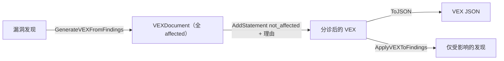

# ✅ 教程：生成 VEX 声明非受影响

漏洞可利用性交换（VEX）文档让你声明某 CVE 并不适用于你的产品——因为漏洞代码不存在、不在执行路径上，或已被缓解。`cpeskills` 能从发现自动生成 VEX，再反向应用以过滤误报。

## 目标

取一个带漏洞发现的组件，自动生成 VEX 文档，手动把某条发现标记为 `not_affected` 并附理由，再过滤发现，只留下真阳性。

## 前置条件

- Go 1.25+
- `go get github.com/scagogogo/cpe-skills`
- 一个至少含一条 `VulnerabilityFinding` 的 `*SBOMComponent`（见前序教程）

## 步骤

### 1. 从发现自动生成 VEX

`GenerateVEXFromFindings` 为每条发现创建一条 VEX 声明，默认状态为 `affected`。这是起点——你再把已分诊的翻转为非受影响。

```go
package main

import (
	"fmt"

	cpeskills "github.com/scagogogo/cpe-skills"
)

func main() {
	comp := cpeskills.NewSBOMComponent("log4j", "2.14.0")
	comp.SetCPE(cpeskills.MustParse("cpe:2.3:a:apache:log4j:2.14.0:*:*:*:*:*:*:*"))
	findings := []*cpeskills.VulnerabilityFinding{
		{CVE: &cpeskills.CVEReference{CVEID: "CVE-2021-44228"}},
		{CVE: &cpeskills.CVEReference{CVEID: "CVE-2021-45046"}},
	}

	doc := cpeskills.GenerateVEXFromFindings(comp, findings, "product-42")
	fmt.Printf("VEX 含 %d 条声明\n", doc.StatementCount())
```

### 2. 手动标记某发现为非受影响

假设你的审计认定 `CVE-2021-45046` 不适用，因为你的构建移除了 JNDI 查找代码路径。添加一条显式声明覆盖自动生成的那条。

```go
	stmt := cpeskills.NewVEXStatement("CVE-2021-45046", "product-42", cpeskills.VEXNotAffected)
	stmt.Justification = cpeskills.VEXVulnerableCodeNotPresent
	stmt.ImpactStatement = "我们的构建移除了 JNDI 查找；代码路径不可达"
	doc.AddStatement(stmt)
```

### 3. 导出 VEX 文档

```go
	out, err := doc.ToJSON()
	if err != nil {
		panic(err)
	}
	fmt.Printf("VEX JSON: %d 字节\n", len(out))
```

### 4. 反向应用 VEX 过滤发现

`ApplyVEXToFindings` 只返回 VEX 状态为 `affected` 的发现——丢弃你标记为 `not_affected` 的那些。

```go
	remaining := cpeskills.ApplyVEXToFindings(findings, doc)
	fmt.Printf("应用 VEX 后: 剩 %d 条发现\n", len(remaining))
	for _, f := range remaining {
		fmt.Printf("- %s\n", f.CVE.CVEID)
	}
}
```

## VEX 工作流



## 预期输出

```
VEX 含 2 条声明
VEX JSON: 412 字节
应用 VEX 后: 剩 1 条发现
- CVE-2021-44228
```

## 注意事项

- `GenerateVEXFromFindings` 初始把每条声明都设为 `affected`；价值在于你随后手动覆盖的那些。
- `not_affected` 声明应始终带 `Justification`（取自 `VEX...` 常量之一）——审计方与下游工具都期望有理由。
- 反向应用 VEX 是幂等的：`ApplyVEXToFindings` 跑两次得到相同的过滤集合。

## 小结

你从发现生成了 VEX 文档，用理由把某 CVE 标记为不可利用，导出了 JSON，并把发现过滤为真阳性。把 VEX 与 SBOM 一起交付，让消费方可以抑制同样的 CVE。
